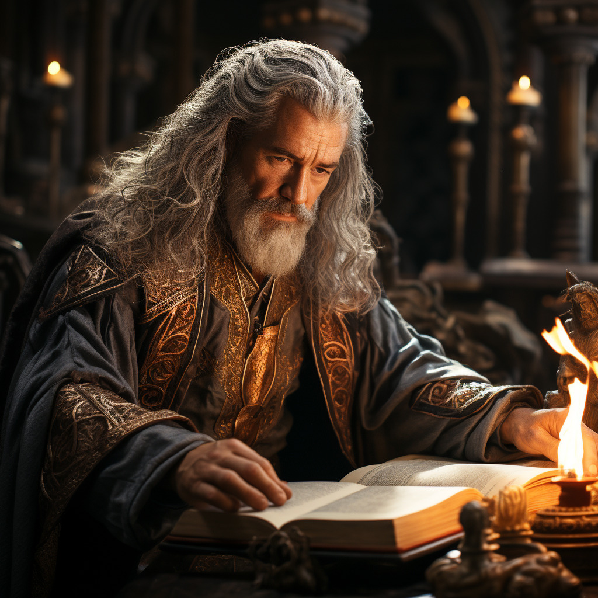
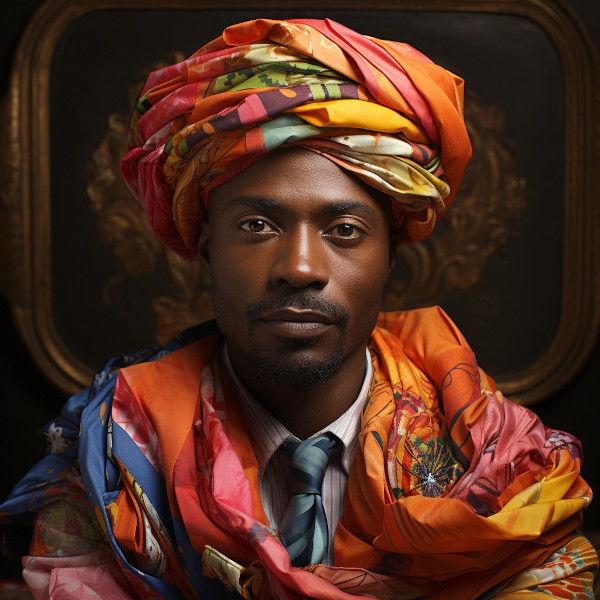
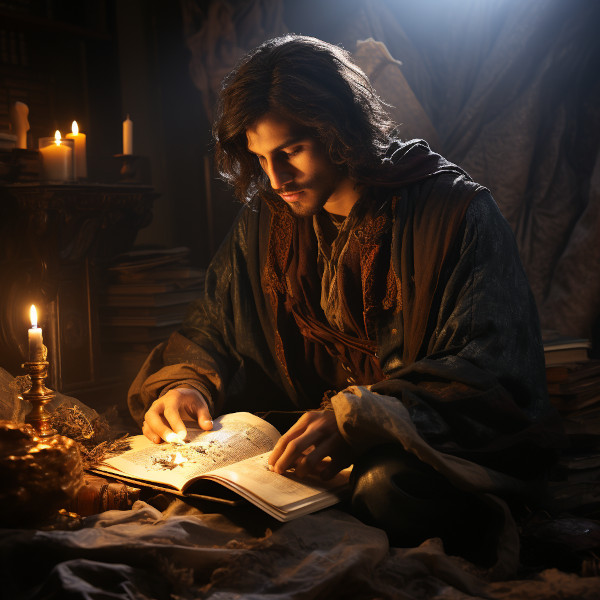
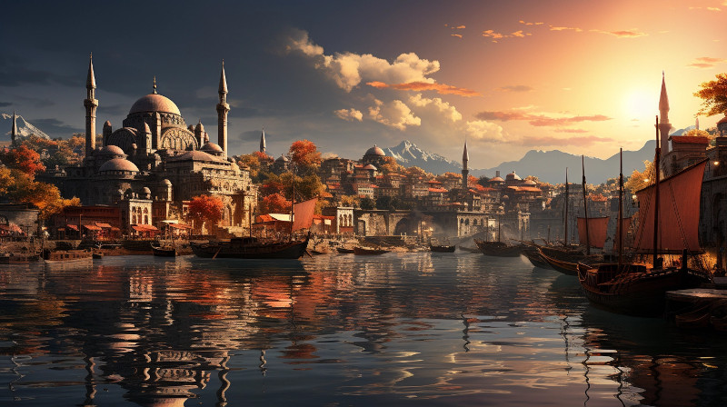
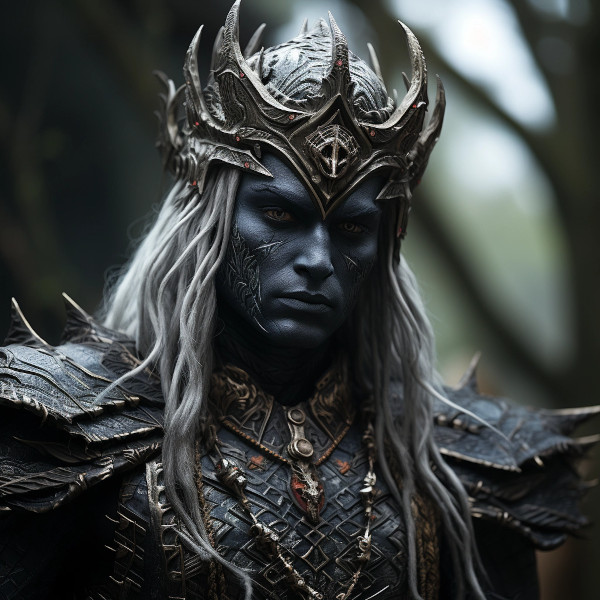

# Naurrnen Master Feeder File 1

## Intro

### The World of Naurrnen

1.  History

    1.  Eras
    
        1.  First Era &#x2026;. -  1999
        
            1.  Pre-recorded History to the first histories
            
                This is Naurrnen&rsquo;s pre-history. It is often referred to in reference to histories and oral traditions that date earlier than when the first recorded era began. Some time, during this era, was the time of the Amearans, or &ldquo;the ancient ones&rdquo;. A civilization that is believed to have been far more advanced technologically and magically than any civilization after it. So much so, that many believe they were gods or sent from the gods. No one knows what became of them. Many believe they were swooped up into the seventh heaven, upon completing their bidding for the gods. They left what remains of their ancient civilization to teach the people of Naurrnen wisdom and the nature of the gods. But they wrote in a script not familiar to anyone.
        
        2.  Second Era 2000 - 4000
        
            1.  Eleven Empire(s)
            
                The Second Era in the annals of Naurrnen&rsquo;s history is often seen as a transformational period. Known as the Age of Hallashim Ascendancy, it was a time when High Aelves of Áyliaremma rose to unparalleled heights of intellectual, magical, and martial prowess. The High Aelves of Áyliaremma united the various tribes into nation states, and then into mighty empires. The early years, the Áyliaremma Aelves were primarilly concerned with law. If they could find hints of the law of the Amearans, and decipher them, it was thought, they could build a great and just empire.
                
                Because of their obsession with civil law, the Áyliaremma Aelves became masterful linguists, pursuing the elusive Amearan tongue with a level of scholarly intensity unmatched in the realms of Naurrnen. With no existing Rosetta Stone to guide them, their efforts were nevertheless considerable. They spent decades poring over fragmented manuscripts, lost carvings, and puzzling artifacts, managing to develop the most detailed understanding of the ancient language ever achieved.
                
                One of the &ldquo;discoveries&rdquo; of the second era, was an etched stone, found in one of the Amearan ruins, that pictured Anashim with an enscription that was translated &ldquo;Aelves&rdquo;. The name stuck for scholars of the third era. Anashim are &ldquo;Aelves&rdquo; according to the translation of the etched stone. There is ongoing debate on validity of that translation.
                
                While the Áyliaremma Aelves were scholars and linguists, they were also explorers and archaeologists, driven by an insatiable curiosity to uncover the forgotten treasures of the Amearan civilization. Several notable archaeological finds were attributed to their expeditions. Among them were mysterious relics of magic and lore, some of which hinted at levels of advancement far beyond the grasp of even the most enlightened Hallashim minds.
                
                The most dominant of the Anashim empires was Aerithia. It arose at first with its dedication to designing just laws. The law held special religious importance as well. A great society, it was thought, could arise, if it held its laws, as imperfect as they might be, in the highest regard for all. This also meant that a ruler was, like his subjects, under the law. If the ruler broke the law, he/sh was no longer a legitimate ruler for the realm. It is held by many scholars that this primacy of law by the Aeritha empire is what led it to greatness.
            
            2.  Absolutism
            
                A clever and well connected statesman, by the name of Eldacar, began endorsing and employing his closest friends and allies, most of whom where his closest childhood friends. He created government positions for these friends, and slowly started to replace the current senate with them. They were young, ambitious, and cruel. The Aeritha laws encouraged, and even demanded that they share their discoveries with their brethren and the other races. At some uncertain point in time, it was decided by the senate that this sharing was no longer going to happen. The rulers of Aeritha became obsessed with discovery, and began forfeiting their regard for its laws. Eldacar, with the senate that had then become mostly populated by his childhood friends, became an absolute monarch of Aeritha. Eldacar, with support of his senate, began enslaving non-Aelven races.
                
                The result was devastating. The discoveries that were found, were treated with the utmost secrecy, sheltered in hidden vaults and elite academic circles to prevent other races from gleaning their secrets. This form of academic elitism was symptomatic of a broader societal stratification that pervaded the mid-Second Era.
                
                Militarily and politically, Aerithia stood as the zenith of Hallashim civilization during this age. Rooted in its rich academic tradition and fueled by its archaeological discoveries, Aerithia developed magical technologies that were instrumental in its eventual dominion over other Hallashim empires. Its armies were legendary, its magicians unparalleled, and its rulers both cunning and visionary. Under Aerithian rule, the disparate Hallashim nation-states were welded into a single, formidable empire. The capital, resplendent in its grandeur, became the heart of Naurrnen, a seat of power, wisdom, and unfortunately, inequality.
            
            3.  The Great Apostasy
            
                The fall of the great empire is said to have begun around the last three hundred years of the second era. The age of the Great Apostasy. The infamous, and paranoid monarch, Serinwe, rose to power, and begun enslaving the other Anashim. It was also around this time that the great Justicier Eolande Altherion challenged the courts and the corrupt rulers of Aeritha. He was exiled for his trouble, but Altherion was extremely resourceful, as he became a key component of the beginnings of solid resistance. He tought one of his slaves, Thalion Veyreth, how to read and write. He taught him in all the ancient laws of the Aelves, and then freed him on his death bed. Thalion Veyreth was the founder of the Moonlight Path, the famous underground resistance that helped fuel the Naethanor revolution a few hundred years later.
            
            4.  Decline of a mighty empire
            
                Elira Naethanor, an esteemed Hallashim of the Eärendelion lineage in Áyliaremma, and Cormac Naethanor, an Adama slave under Aerithia&rsquo;s reign, both served pivotal roles in the downfall of the Anashim Empire. Their clandestine relationship, which blossomed at Laurië Citime, led them to question the empire&rsquo;s oppressive ethics. Risking persecution, they united their intellectual and revolutionary passions, joining a larger movement aimed at emancipating slaves and political prisoners. Their combined defiance and strategies not only labeled them as traitors but also spearheaded the rise of the Gran Imperio, a pluralistic realm that replaced the Anashim hegemony and reshaped Naurrnen&rsquo;s historical trajectory.
        
        3.  Third Era 4000 - 5000+
        
            1.  Empire of man
            
                The beginning of the reign of man. Men superseded elves, and in doing so, try to build a more pluralistic society, incorporating all races, but unifying them under man&rsquo;s religion.

2.  Races

    1.  Primary Races
    
        The races within Naurrnen are fairly equal. Although Aelves are known for their skills in magic, music, and crafting instruments and enchanted items, that does not mean one will find elves doing hard labor, exercising what strength they have. Orcs are generally favored for that sort of labor, as they tend to be more physically suited for the task. But not every Orc is physically built for this task, as not every Aelf is well suited to the arts. Their are Orcs who take an interest in magic or music, as well. They are generally not as well suited as the Aelves, but that is not to say, their are not Orcs that have better ears, or eyes than many Aelves, or better minds for magic. These exceptions are generally blamed on half-breeds. Half-breeding has become so common in the age of man, no one really knows for sure who is a half-breed, or if one, who might think themselves as a pure-bred, is really a fourth or fifth generation mixed breed. What separates the races more than anything are their cultural identities.
        
        1.  Anashim or Aelf
        
            1.  Language
            
                Anashim language has several dialects. The most common being that of the Hallashim.
            
            2.  Anashim Sub-races
            
                1.  High Anashim: Hallashim
                2.  Wood Anashim: Taurashim
                3.  Dark Anashim: Durashim
                4.  Cavern Anashim: Gathashim
            
            3.  Strengths
            
                1.  Magic
                2.  Art
                3.  Architecture
                4.  Music
                5.  Crafts
                    -   Magical items
                    -   Musical instruments
            
            4.  Pantheon
            
                | **Anor**   | Highest father of vengeance.                    |
                | **Ithil**  | Highest mother of justice. The great protector. |
                | **Gladys** | Goddess of nature.                              |
                | **Gurth**  | God of the underworld. Friend of the dead.      |
                | **Nostia** | Goddess of fertility.                           |
    
    2.  Hallashim: Anor and Ithil
    
        Caretakers of the highest father and mother&rsquo;s temples and places of worship are taken very seriously among the Hallashim. What comes with this care, and stewardship, on behalf og the other Anashim, sometimes, and arrogant supremacy. The Hallashim are a proud and majestic race, but also one that must overcome some of the justifiable prejudice and bitterness that arose from their mighty empire in the second era. The god titles are also borne by the ruling Hallashim emperor or emperess.
    
    3.  Taurashim: Gladys and Nostia
    
        Nature and nurture. The Taurashim take as their own, the care and growth for the other Anashim races. The Taurashim are known for their annual festivals, where the three hordes of the Taurashim teach and train the other hordes in areas where their students, by the cultural limitations, are in need of training. They see this their duty to offer these same services to their neighboring Anashim. Others do come, but rarely, are these &ldquo;others&rdquo; noblemen or women or anyone of high social status within their own home nation.
    
    4.  Durashim: Gurth and Nostia
    
        The cult of Gurth and Nostia, is a recognition of the cycle of life and death. Unlike their Anashim brothers, the Durashim take ancestral recognition above and beyond the other races. Fear of death is seen as almost sacreligious. But so is the fear of life. The Durashim hold bravery, and loyalty very highly. At least for all those within the mainline cult of Gurth and Nostia.
        
        1.  Adama or Man
        
            1.  Language
            
                Men&rsquo;s language had been historically Hallashim, as man had been the slaves of certain High Aelf empires. But they did have a language of their own that differentiated them from their captors. That slave language evolved into a full-blown Adaman language or language of man. That language became known by the early third era as Malairt or &ldquo;trade&rdquo; language.
            
            2.  Sub-races
            
                1.  Dark man: Durama
                2.  Red man: Edama
                3.  Pale man: Palama
            
            3.  Strengths
            
                1.  Multi-purpose
                2.  Rational
            
            4.  Pantheon
            
                | **Dagda**     | Highest father vengeance and justice.     |
                | **Morrigaan** | Highest mother, nuture and nature.        |
                | **Orown**     | God of the underworld.                    |
                | **Brigid**    | Goddess of art, beauty, and fertility.    |
                | **Bres**      | Man king who was exalted to the pantheon. |
        
        2.  Orpa
        
            Known in Hallashim as Osunus, and to the humans as Orpas.
            
            1.  Strengths
            
                1.  Fighters
                2.  Manual labor
                3.  Crafts
                    -   Blacksmithing
                    -   Metal/ore work
            
            2.  Pantheon
            
                | **Gadajok**  | Highest god. God of vengeance.                   |
                | **Hann**     | Highest mother. Goddess of nature and fertility. |
                | **Vras**     | God of the dead.                                 |
                | **Beatrice** | Goddess of fertility.                            |
                | **Nadgaj**   | God of war. God of combat.                       |
    
    5.  Secondary Races
    
        1.  Mochveneba
        
            Mochveneba or &ldquo;ghost people&rdquo; are a minority ethnicity within Naurrnen. They are Aelf-like, in that they share many of the features that elven folk have, but they are well known for their physical prowness. Their skin is a deep red, with stripes. Similar to tiger stripes. In fact, legend outside the Mochveneba tribes, say they are crossbred elves with tigers. In reality, they are more than likely half-breeds. More than likely, half-Aelf, and half-something else. They have unusual stamina, so some speculate half-orc, though their uncommon beauty seems to indicate otherwise.
            
            The Mochveneba tribes are religious, and perhaps to most of the civilized world, somewhat superstitious. Mochveneba are spiritual and do not generally pursue material wealth. Those that do, are coveted for their beauty and brute strength.
            
            1.  Strengths
            
                1.  Enchanting weapons and items.
                2.  Known for physical strength.
                3.  Warlike, but peace-loving.
            
            2.  Pantheon
            
                Belief system comprises of the following
                
                1.  Animism: They believe spirit is in all things. But they also believe that consciousness is a higher form of spirit.
                2.  Believe in balance betweem &ldquo;pah&rdquo; and &ldquo;foh&rdquo;. Good/Evil. Hot/Cold, etc.
                3.  Believe their ancestors live beyond the vale, and they will one day join them in death.
                4.  Presence, meditation, seeking inner peace and clarity is essential. Past and future, do not matter. Only the present.
                5.  Cycle of life: spirit lives and dies, and is renewed again. Consciousness, on the other hand, goes to the ancestral grove, the spirit world, after death, and does not return.

3.  Languages

    1.  Adaman, the trade tongue
    
        Adaman is the (almost) universal tongue of Naurrnen. It is used amongst merchants, and mostly widely spoken in everyday communication within the Gran Imperio.
    
    2.  Hallashim, language of the Aelves

4.  Geography

    1.  Gran Imperio
    
        The human empire. Though many would argue that it is not purely human, but a truly pluralistic and inclusive society. It is an empire with a relatively strong monarchy.
    
    2.  Kingdom of Tanquende
    
        Anashim kingdom, primarilly the Hallashim (a.k.a. High Aelves). Territory to the far west of the known world.
    
    3.  Vulwin Horde
    
        Nomadic tribes of the Taurashim (Wood Aelves).
    
    4.  Tribes of Nigrumia
    
        Tribes of the Orpa (a.k.a the Orcs).
    
    5.  Dathakhian Empire
    
        Empire of the Durashim (a.k.a Dark Aelves).
    
    6.  Marches of Bounoshin
    
        Home of the Gathashim (the Cavern Aelves or Dwarves). Territory to the far east of the known world.
    
    7.  Commonwealth of Caria
    
        Home of the Palama (Pale men, or Nords).
    
    8.  Federation of Boignia
    
        Federation of Man (Adama).
    
    9.  Principality of Vilesia
    
        Principality of the Durama (a.k.a dark men).

### Literacy

1.  Libraries in Naurrnen

    1.  Printing Press
    
        The printing press in Naurrnen has been around for over a hundred years. Newspapers are printed and delivered throughout the Gran Imperio and the Kingdom of Tanquende.
    
    2.  Providential Libraries
    
        1.  Ornasion, Gran Imperio
        
            This is the largest library in Naurrnen. It consists of a large citidel, with a castle and towers. It is primarily run by the Gran Imperio&rsquo;s Archivist Guild. The citidel consists of thousands of rooms deep under the surface of the city, and far into the chambers above the ground. Most of the transcriptions of the ancient books in Laurië Citime have been purchased and stored at this library.
            
            1.  The Archivist Guild: Guardians of Knowledge
            
                The Archivist Guild is the esteemed institution that serves as the backbone of Ornasion, the Citadel of Wisdom. Established in antiquity, this guild is a collective of the realm&rsquo;s most distinguished scholars, librarians, and documentarians whose primary mission is to preserve, catalog, and disseminate the vast reserves of knowledge stored within the city. With a focus that transcends mere bookkeeping, the Archivist Guild is committed to the promotion of intellectual curiosity and scholarly exchange across all disciplines.
                
                Members of the guild undergo rigorous training in disciplines ranging from archival science to arcane arts, ensuring they possess the expertise required to maintain the complex web of knowledge housed in Ornasion. These archivists are more than just caretakers; they are mentors, guiding young scholars through the labyrinthine corridors of wisdom, and acting as mediators in intellectual debates and forums.
                
                Once a year, the guild organizes the &ldquo;Conclave of Quills,&rdquo; an international symposium that invites scholars, historians, and researchers from far and wide to present their work, fostering an environment of academic collaboration and groundbreaking discoveries.
                
                Additionally, the guild employs an elite force of mage-guards specially trained to safeguard the invaluable treasures of Ornasion. Utilizing a unique blend of martial skill and arcane knowledge, these mage-guards ensure the sanctity and security of one of Naurrnen&rsquo;s most invaluable resources.
                
                The Archivist Guild is not just an organization; it&rsquo;s a living testament to Naurrnen’s commitment to the pursuit of knowledge. Through its ceaseless efforts, the guild ensures that the flame of intellectual inquiry continues to burn bright for future generations.
    
    3.  Laurië Citime, Kingdon of Tanquende (Capital of Tanquende)
    
        One of the oldest libraries in Naurrnen. Contains some of the oldest volumes known to civilization. There is also the largest Transcript guild within the city. The Transcript guild tries to make exact copies of the most ancient books within the library in an effort to preserve the books. They also make copies available to the printing presses, but these are considered inferior to the original books. Symbols, pictures, and sketches are of equal value to the printed word, and a book with just the printed word, contains only half the worth of the original. Lithography has been strictly prohibited within the Kingdom of Tanquende, so mass producing images in these arcane books are not currently legally possible. This also artificially inflates the value of the book copies made by the Transcript guilds.
        
        1.  The Transcript Guild: Preservers of Ancient Wisdom
        
            > In the ink of the ancients, the state finds its roots; in the reverence of their spirit, it stands with unyielding bones. &#x2013; Valandur
            
            While the Adama make no qualms for mass producing texts with its printing and lithography presses, the Hallishim pride themselves in handcrafted texts. They belive there is a certain transfer of life or spirituality in hand crafted facsimiles of the most ancient texts in the history of Naurrnen.
            
            Headquarted in the [ancient Laurië Citime library](../Places/laurie-citime.md), the Transcript Guild serves as a vanguard for the conservation and duplication of some of the most ancient and irreplaceable texts known to civilization. This esteemed institution is a sanctuary for scribes, artists, and scholars dedicated to the meticulous art of transcribing ancient works. While many guilds focus on the creation of new knowledge, the Transcript Guild specializes in the preservation of old wisdom, ensuring that it survives the ravages of time and circumstance.
            
            Apprentices undergo years of stringent training, learning not only the art of exacting transcription but also mastering the antiquated languages and deciphering complex symbols and images. Among the Hallishim, it&rsquo;s a widely accepted notion that a text loses half its value when the rich tapestry of its original presentation is lost. Lithography may be forbidden within the Kingdom of Tanquende, but the hand-crafted volumes produced by the guild are considered invaluable, not just for their content but for their artisanal quality.
            
            The guild enjoys a special partnership with the Archivist Guild of Ornasion, often exchanging texts and discoveries to further the preservation of knowledge across Naurrnen. The Transcript Guild also holds a sacred duty to analyze the encrypted riddles and codes found in works like &ldquo;The Ameara&rdquo; by Bayetti Falasha, seeking keys to unlock the deep secrets of the past.
            
            In essence, the Transcript Guild is more than a guild; it is a living link between past and future, a bridge that allows the wisdom of ancient civilizations to enlighten the minds of generations yet unborn.
            
            1.  Purpose:
            
                To preserve and propagate the ancient art of handcrafted documentation, and to instill a spiritual connection with the art of writing.
            
            2.  History:
            
                Founded by Valandur, the guild finds its origins in the early days of the Laurië Citime library. Valandur, having been inspired by the indestructible ruins of the Amearans, wanted to ensure that the knowledge of Naurrnen wouldn&rsquo;t be as easily lost.
            
            3.  Training:
            
                Initiates undergo rigorous training not just in the art of writing but in understanding the spirituality of preservation. The final test to become a master scribe involves replicating a text in the ancient style, with the belief that part of the writer&rsquo;s spirit will imbue the document.
            
            4.  Guild Emblem:
            
                The emblem could be a stylized quill intertwined with an ancient Amearan rune or symbol, representing the unity of the new and the old.
            
            5.  Duties:
            
                Beyond just writing, the guild also takes on the responsibility of verifying the authenticity of ancient texts, ensuring they haven&rsquo;t been tampered with or modified over the years.
                
                1.  Beliefs:
                
                    Members of the guild believe that each piece of knowledge carries with it a part of the writer&rsquo;s spirit and that preserving this knowledge is akin to keeping the writer&rsquo;s spirit alive.

### Once Upon a Time

A long, long time ago&#x2026; or was that a long, long time from now? Anyways, in a universe far, far away&#x2026; or is it a paralell universe that is very near? Anyways, our story begins with an intergalactic civilization, the Setsafar Commonwealth, that has open trade between multiple galaxies, multiple star systems, and multiple intellegent species. The trade routes between galaxies are generally fixed, but every few centuries, there is an economic boom that makes traveling even further distances to further reaches of the universe to find resources for profitable trade.

Given the distance between galaxies and their solar systems, it became expedient to send space stations to un-inhabitable systems for the purpose of refueling, and maintenance of cargo ships. Initially, these stations were sent to orbit various planets in these systems. Profitable enterprises would build these stations, and sell fuel, maintenance and entertainment.

As demand grew for waypoints with lots of trade traffic, these stations would be expanded. Often, in many high traffic stations, these stations were expanded to the size of small moons. Life on a spacestation can be a bit constraining. and limiting in other ways, inspit of holographic enetertainment and virtual reality. There was big business in terraforming inhabitable planets in place of moon stations.

1.  Setsafar Commonwealth

    Setsafar is a commonwealth of multiple nations, tade guilds, and corporations that have been involved with intergalactic trade for well over two thousand years. The commonwealth structures itself around the problems of faster than light speed travel and the time dilations involved with traveling and communicating over vast distances. The coomonwealth has a scale they use to measure time, and they call this scale the Commonwealth timescale. All divergences from this scale are considered time dilations.

### The Terraform Projects

A less costly amd longer sustaining alternative was formed for creating way points along the trade routes. This gave way to terraforming planets to make them habitable. It was far more economic to start a populace on a terraformed planet using incubation pods. Where literally hundreds of thousands of fertilized human and alien embryos could, with the help of non-sentient automotons, be nurtured and grown.

The automotons only covered the biological care of the embryos. Prior to embryo hatching, tutors and educators would arrive and prepare for instructing the new life in how to build its own unique culture and participate in interstellar trade.

The alien races are what the high fantasy reader might identify as men, dwarves, elves, and orcs. There are no explicitly evil races, just very different species each with their own unique gifts, talents, and culture over time.

1.  Terraform in time

    Terraforming can be a long drawn out process, so once a terraform project was set in motion, and an ecological profile for the system to progress into was determined, the planet would be temporarilly displaced further from gravitational pull to increase the rate in which time passed. Once the planet had progressed far enough in time to begin trade, the planet would be pulled into a much closer time frame that matched the intergalactic standard.

2.  Terraform process

    1.  (re)create the planets electro-magnetic field. If this is not easily doable, the planet can be disqualified from being a terraform candidate.
    2.  Greenhouse domes embark to the planet and the first vegetation is grown in an extremely controlled and managed system.
    3.  Rocks are pulverized into rich mineral soil, and water is produced, provided the planet has a rich hydrogen atmosphere. Hydrogen can me imported from abroad as needed.
    4.  Carbon dioxiode from the automosphere is fed in to the plants within the domes, and the oxygen produced is released back into the atmosphere.
    5.  Plants are systematically replanted into the planets soil. Trees and shrubs soon follow.
    6.  Robo-insects are release, and begin the process of polinating the plants. Around the same time, the first insect and other animal embryos are brought to the planet and are released in generations, beginning with the smallest animals and moving on to the largest animals. This also includes fish and sea creatures.
    7.  Human embryos and structures of cities and homes are created on the newly terraformed planet. Non-sentient automotans care for and provide for the humanoid embryos, and even begin nurting, caring for them. The Commonwealth directive states that culture unique to each race should be honored and preserved. The first language of each humanoid must be of that unique to its own race.
    8.  Once the first humanoid embryos are hatched, senitient beings are sent to adopt and teach the new humanoids how to read, write in the trade tongue of the Commonwealth. As well as their history, and history of the Commonwealth.
    9.  Once the first humanoids are able to govern themselves, they will be asked to name their planet, as it is no longer a terraform planet. They can engage with trade with the rest of the commonwealth.

### Syscon 37221

Our story begins with the Trade company, Terconi Inc., based on the planet Mercatorma. Terconi named their planet&rsquo;s capital city after the company. They started a risky terraform project on a planet within a system of questionable stability. Terconi&rsquo;s terraform department was named &ldquo;Syscon&rdquo; and it was their practice to prefix Syscon to the number associated with the actual project. Thus the project was named &ldquo;Syscon 37221&rdquo;. The actual official naming of the planet would be left to its new inhabitants after they had matured to the point where they could conduct trade.

When the trade route dried up, the populace was relocated and the planet abandoned. Or so it was thought. Records indicate that there were numerous pods abandoned to the automotons to raise without any monitoring at all. It looks like a bureaucratic cover-up in order to avoid costly relocation of equipment. When the coverup was discovered, a recovery mission was sent in order to re-assume the hatched embryos into society, and possibly recover any equipment that might be salvageable. The system in which the planet was part of was no more. Swallowed up by a neighboring worm hole for sure, it would seem. If the planet still existed, it was unreachable, now.

1.  The Amearans

    When the first embryos from Syscon 37221 hatched, life sustanence and a language was given to them through non-sentient automotans. After the third generation of humanoids had been born, the automatons returned to their docking stations deep underground and shutdown. When the humanoids matured, the planet became known as Naurrnen. But its inhabitants have no idea who they are. They see the technology around them as alien. Some forgotten mysterious civilization that mysteriously disappeared without a trace. They called this civilization, &ldquo;the Amearans&rdquo; or &ldquo;ancient ones&rdquo;.

2.  Language

    Embryos from every known alien race was dispatched to this planet. Automotans gave each race its own cultural language, the common tongue, and a document called the &ldquo;Rule of Love&rdquo; or the &ldquo;Rahnami&rdquo;. The central automotan containing the common language was damaged in transit to the planet and never made it there. Thus the embryos who hatched and grew up only learned their cultural tonog, so there was a divide between races as a result.

3.  The Rahnami

    This Rhanami contained the essential truths common to all races, to begin their journey into symbiotic life. To the Naurrnens, the Rahnami is thought to be an ancient sacred text given to each race by the Amearans. Well, some argue that it was their own unique race that dispatched this truth and translated into the other tongues. Raging debates continue across Naurrnen regarding the Rahnami&rsquo;s origin.

## Books

### The Rahnami

Rahnami is the word &ldquo;first given&rdquo; to the first inhabitants of Naurrnen. The way the word is pronounced today in the languages of Naurrnen are all similar. But there was a copy of the Rahnami written in each of the indegeneous languages.

1.  Principles of the Rahnami

    1.  The first Rahnami is that for love. Love is Rahnami and Rahnami love.
    
    2.  Rahnami for others. Rahnami is something that multiplies as it is spent. So always give Rahnami, so that Rahnami will increase.
    
    3.  Rahnami for the world. Where there is no Rahnami, there is scarcity. Scarcity is overcome by Rahnami. Resources that cannot be made, must be preserved, and resources that can be made should be shared abundantly.
    
    4.  Rahnami is mercy. Before confronting the evil outside, confront the evil in inside. Fix the lack of Rahnami in yourself, and then, and only then can you confront the evil outside. If you want a second chance, give it freely. If you want third, fourth, fifth chance, give it freely. You cannot understand the poverty out there, without first confronting the poverty in here.
    
    5.  Rahnami is just. But it is mercy first, and foremost, or it is not just at all.

2.  King Tayfay&rsquo;s Commentary on the Principles

    1.  Principle of Reciprocity: &ldquo;Treat others as you would be treated, with respect and fairness, regardless of their race or origin.&rdquo;
    2.  Stewardship of Resources: &ldquo;Honor and preserve the bounty of our world, using its resources wisely and sustainably for the benefit of all.&rdquo;
    3.  Justice and Mercy: &ldquo;Seek justice that restores and heals, balancing retribution with compassion, and punishment with rehabilitation.&rdquo;
    4.  Seeking Knowledge and Wisdom: &ldquo;Pursue knowledge and wisdom diligently, for they light the path to understanding and peace among peoples.&rdquo;
    5.  Fair Exchange and Integrity in Trade: &ldquo;Engage in trade with honesty and integrity, ensuring that all dealings are fair and benefit all parties.&rdquo;
    6.  Rights and Responsibilities: &ldquo;Uphold the rights of all individuals, while also embracing the responsibilities we share to our community and world.&rdquo;
    7.  Peaceful Coexistence and Conflict Resolution: &ldquo;Strive for peaceful coexistence and resolve conflicts through wisdom and understanding, not through force or deceit.&rdquo;

### The Institutes of Civil Governance

During the first ten years of the reign of [King Tasfaye the Wise](../org/characters/king-tasfaye.md), the great King worked on compiling a commentary on [the Rahnami](../org/books/the-rahnami.md). Once completed, King Tasfaye the Wise summoned the best known scholars, lawysre, and judges throughout Naurrnen to begin compiling the INstitutes of Civil Governance. The idea was to incorporate, as much as possible the different traditions around [the Rahnami](../org/books/the-rahnami.md), and applying the principles to actual civil law. This magnum opus became widely known throughout Naurrnen as &ldquo;the Institutes&rdquo;.

1.  Influence in the Third Era

    [The Principality of Vilesia](../org/nations/principality-of-vilesia.md) in the [Third Era](../org/history/third-era.md) uses the Institutes as its law code for the principality. [The Gran Imperio](../org/nations/gran-imperio.md) still uses a good portion of the Institutes for its direct jurisprudence, but tolerates certain variations of its implementation outside the [capital city](../org/places/ponte-cidade.md).
    
    The Hallashim, after abandoning the Institutes, and anything else associated with the Rahnami late in the [Second Era](../org/history/second-era.md). the Hallashim of [Kingdom of Tanquende](../org/nations/kingdom-of-tanquende.md) re-embraced the Institutes at the start of the [Third Era](../org/history/third-era.md).
    
    Countries within Naurrnen, without a strong centralized government have little regard for the Institutes. Most notable would be the scholars from the [Federation of Boigna](../org/nations/federation-of-boigna.md). They have written voluminous scholarly books on jurisprudence that treat the Institutes with both passionate revere, and harsh criticism. The Federation has a Constitution which was crafted using much of King Tasfaye&rsquo;s commentary, but geared for a much more decentralized governing body.

### From Dusk to Dawn by [Luthien Dusksinger](../org/characters/luthien-dusksinger.md)

> From Dusk to Dawn was written late in the second era, nearly a generation after the Great Apostasy began (Hallashim enslavement of all other Anashim races, and takeover of all religious rights).

In the shadow of the towering statue of Gurth, the God of the Underworld, a group of Durashim whispered their ancient prayers, their voices barely louder than the rustle of leaves in the wind. This statue was a relic of a time when they could worship openly, grand and serene, depicting Gurth as the orthodox worshippers saw him—a mighty figure of reverence and power.

But now, under the yoke of the Hallashim&rsquo;s oppressive regime, these clandestine gatherings were all they had left to connect with their past. The Hallashim, in their thirst for power, had banned the Durashim from honoring their ancestors in the traditional ways, forcing them to abandon the vast temples and imposing their own sanitized rituals upon all Anashim races.

Yet the Durashim refused to let their heritage be stamped out. In the dead of night, they would venture into the wilderness, away from the prying eyes of their captors, to secluded groves where whispers of their ancestors seemed to echo through the trees. Here, they would conduct their ancient rites, paying homage to the dead and seeking the guidance of Gurth.

The rituals were a vital link to their identity. They believed that their ancestors&rsquo; spirits lingered, watching over them, and that Gurth himself would protect their secrets. The Durashim knew that to fear death was to dishonor those who had passed, and to fear life was to dishonor themselves. So they persisted, their ceremonies a quiet act of rebellion.

One such Durashim, named Malrin, had become a de facto leader of these secret congregations. He had once been a priest in the grand temples before they were desecrated and had dedicated his life to preserving the old ways. Malrin was old now, his skin etched with lines of sorrow and determination. His eyes, once a vibrant silver, had dulled, but they still burned with an unquenchable fire.

On one such night, as autumn leaves fell like embers around the base of Gurth&rsquo;s statue, Malrin and his fellow Durashim gathered. They painted their faces with ash and sang the mournful songs of their people, their melodies rising to the heavens, pleading for deliverance. They recited the names of their ancestors, each one a vow that they would not be forgotten.

As dawn approached, the Durashim dispersed, their ritual complete. They would return to their lives under the Hallashim&rsquo;s rule, their outward expressions stripped of defiance. But within their hearts, the flames of rebellion and pride burned fiercely. They knew that as long as they could honor their ancestors and worship Gurth in the old ways, even in secret, their spirits could never truly be enslaved.

And so, the tale of the Durashim&rsquo;s resistance continued, a quiet yet powerful testament to the resilience of faith and the indomitable spirit of a people who refused to let their heritage die, even as they walked in the shadow of oppression.

### In Áyliaremma&rsquo;s Footsteps by [Faelinoril Galathil](../org/characters/faelinoril-galathil.md)

&ldquo;In Áyliaremma&rsquo;s Footsteps&rdquo; stands as a testament to the unyielding pursuit of knowledge within the mystical realm of Naurrnen. Penned by the venerable Hallashim scholar [Faelinoril Galathil](../org/characters/faelinoril-galathil.md), this magnum opus is a beacon of enlightenment in a world shrouded in ancient mysteries.

Within the hallowed halls of [Laurië Citime](../org/places/laurie-citime.md), where wisdom flows like a river, [Faelinoril Galathil](../org/characters/faelinoril-galathil.md) dedicated his life to the unraveling of enigmatic riddles. His quest was twofold: to decipher the cryptic writings of [Bayetti Falasha](../org/characters/bayetti-falasha.md), an ancient Elven scholar, and to unearth the secrets buried beneath the sprawling [Athelorion ruins](../org/places/athelorion-ruins.md).

&ldquo;In Áyliaremma&rsquo;s Footsteps&rdquo; embarks on a journey of discovery, recounting Faelinoril&rsquo;s relentless pursuit of knowledge. Through years of tireless effort, he unveiled fragments of the long-forgotten [Amearan](../org/history/first-era.md), a key to unlocking the profound wisdom hidden in [Falasha&rsquo;s poems](../org/books/the-ancient-ones.md).

This monumental work serves as a bridge between the present and a forgotten past, providing a glimpse into the world&rsquo;s elusive origins and the elusive [Amearan](../org/history/first-era.md) civilization. Faelinoril&rsquo;s meticulous research and unwavering dedication have illuminated the path for future generations, beckoning them to follow &ldquo;In Áyliaremma&rsquo;s Footsteps&rdquo; into the heart of Naurrnen&rsquo;s deepest mysteries.

### Preface to &ldquo;In Áyliaremma&rsquo;s Footsteps&rdquo;

<button type="button" class="collapsible">

Preface to "In Áyliaremma's Footsteps"

</button>

In the esteemed halls of Laurië Citime, as I stand amidst the towering shelves of ancient tomes and scrolls, I find myself humbled by the weight of knowledge and the mysteries that lay hidden within the pages of time. It is here that I, Faelinoril Galathil, a humble scholar of the Hallashim, embark on a journey that has consumed the better part of my long years—an exploration into the enigmatic world of the Amearans and their elusive tongue.

What you now have in your hands is not just a culmination of research, but a testament to the relentless pursuit of understanding. The Amearans, those beings of myth and legend, have intrigued and eluded us for millennia. Their civilization, their knowledge, and their very existence have remained veiled in obscurity, leaving us with mere fragments of their legacy.

My quest, akin to the work of a linguist deciphering an ancient script or a philosopher unraveling the threads of thought, has led me to unlock the secrets of their language, a key to their world. The Amearan tongue, long considered an insurmountable barrier, has yielded its secrets, albeit in fragments. These fragments, like pieces of a grand puzzle, have allowed me to glimpse into the minds of the Amearans and understand their culture, their beliefs, and their aspirations.

In the pages of this magnum opus, I do not claim to have unraveled all the mysteries of the Amearans, for their legacy is vast and profound. Instead, I present to you a journey—a journey through the remnants of their language and the echoes of their thoughts. Through careful analysis and cross-referencing, I have reconstructed simple phrases, akin to the deciphering of cryptic poetry.

These phrases, embedded within the verses of the esteemed Falasha&rsquo;s works, offer us a glimpse into the Amearan way of life, their values, and perhaps even their hopes and fears. While we may never fully resurrect their civilization, we can, through these linguistic breadcrumbs, gain a deeper appreciation for their contributions to our world.

As I share these discoveries with you, dear reader, I implore you to approach them with the reverence they deserve. The Amearans were not mere legends; they were a people who touched the fabric of our world in ways we are only beginning to fathom. Their knowledge, their technology, and their wisdom hold the potential to reshape our understanding of history and culture.

In the spirit of intellectual pursuit, let us embark on this journey together. Let us follow in the footsteps of those who came before us, seeking to unravel the enigma of the Amearans. Through the lens of their language, let us glimpse the shadows of their civilization, and in doing so, illuminate the path to a richer, more profound understanding of our world&rsquo;s history.

In these pages, the past meets the present, and the whispers of the Amearans echo through the ages. Welcome, dear reader, to the exploration of Áyliaremma&rsquo;s secrets—a journey that will forever alter the course of our intellectual pursuit.

### Lament of the Divided Path by [Aranuir Xanaphia](../org/characters/aranuir-xanaphia.md)

> In shadows deep, where whispers dwell, Luthien walked, her tale to tell. With heart so pure, intentions bright, She sought to guide through darkest night.
> 
> Yet paths do twist, and stars do fade, Her vision lost in the shade she made. Gurth, our guide, our solemn friend, Her words did twist, did falsely bend.
> 
> In temples old, where silence reigns, Her legacy, a chain of pains. Once united, now apart, Her creed did tear our faith apart.
> 
> Oh Durashim, hear this plea, Let&rsquo;s bind our wounds, in unity. For Gurth is not just wrath and night, But also love, and guiding light.
> 
> So let us sing, a song of peace, For division and strife to cease. May Luthien&rsquo;s path, though astray, Lead us back to the dawn&rsquo;s first ray.

### The Ameara (or &ldquo;The Ancient Ones&rdquo;) by [Bayetti Falasha](../org/characters/bayetti-falasha.md)

In the annals of Naurrnen&rsquo;s history, few literary works hold the mystique and enigma that surrounds [Bayetti Falasha](../org/characters/bayetti-falasha.md)&rsquo;s magnum opus, &ldquo;The Ameara.&rdquo; This ancient tome, penned by the brilliant Elven scholar during the early second era, stands as a testament to her profound intellect and insatiable curiosity.

&ldquo;The Ameara,&rdquo; also known as &ldquo;The Ancient Ones,&rdquo; defies easy comprehension. It weaves together cryptic verses, obscure geography, and whispers of the past into a tapestry that has mystified scholars and seekers of knowledge for ages.

At first glance, it appears as an eccentric blend of tales and poetry. Yet, beneath this surface chaos lies the elusive wisdom of the Amearans, or so it is believed. Falasha&rsquo;s cryptic messages have confounded Elves, and indeed all the races of Naurrnen, as they grapple with the secrets concealed within.

[Bayetti Falasha](../org/characters/bayetti-falasha.md), the renowned court scholar of the Elven empire, left an indelible mark with her work on Naurrnen&rsquo;s ancient history. &ldquo;The Ameara&rdquo; invites the curious and the learned on a journey through time, beckoning them to uncover the greatest riddle in Naurrnen&rsquo;s history. It stands as a testament to Falasha&rsquo;s unquenchable thirst for knowledge in a world where history&rsquo;s twists surpass even the wildest tales.

### Excerpt from &ldquo;The Ameara&rdquo;: On Aeritha (Athalorion)

<button type="button" class="collapsible">

Excerpt from "The Ameara": On Aeritha (Athalorion)

</button>

> Beneath the starry skies, their secrets softly gleam, The Amearans, a faded memory it seems. In Valinor they dwelt, where light forever beams, Aiquentalë&rsquo;s song, in realms of wonder, dreams.
> 
> Amongst the ancient trees, their voices sweetly soar, In the twilight&rsquo;s grace, where mysteries they bore. Melmindar&rsquo;s haven, a land forevermore, The Amearans&rsquo; tale, in whispers we explore.
> 
> Deep within Athalorion&rsquo;s core, they did reside, A Descension Chalice, where secrets did abide. Unlock its mysteries, with singing as your guide, In ancient depths, where wonders yet inside.
> 
> In hushed tones, the words long lost to time, Whispered &rsquo;neath the stars, in rhythm and rhyme. With gentle echo, they beckon, so sublime, To realms unknown, through portals we&rsquo;ll climb.

### The Chronicles of Athalorion: Unveiling the Secrets of an Ancient Civilization

by Tadhg MacMurchadha

1.  Arriving at the gates of Athalorion

    <button type="button" class="collapsible">
    
    Preface to "In Áyliaremma's Footsteps"
    
    </button>
    
    

    
    Our journey had been relentless, stretching across the entire day, until exhaustion gnawed at our very bones. At the base of the hills, we found a momentary respite in a moonlit clearing. Dropping my sack to the ground, I wrestled off my shoes, eager to soothe my aching feet. The brief massage brought some relief, though it was but a fleeting balm for my weary soles.
    
    With a resigned sigh, I reluctantly encased my feet once more, fastening the laces securely. My sack swung back across my shoulder as a silent signal, and we resumed our arduous march into the unknown.
    
    As we crested the hill&rsquo;s zenith, an ethereal sight unveiled itself before our eyes. The gates of Athalorion, ancient and imposing, emerged from the landscape. They glistened like a precious metal, akin to white gold, their brilliance heightened by the shimmering tapestry of stars overhead. Veins of azure light coursed along the surface of each gate, revealing the arcane energies that lay concealed within. These were the gates of an Amearan city, enigmatic and captivating.
    
    Our party approached with a mix of reverence and trepidation, for the craftsmanship before us transcended the scope of our understanding. Elaborate carvings adorned the gates, depicting scenes that spoke of long-forgotten tales. Symbols and glyphs, foreign and enigmatic, danced across the surface, hinting at a language that eluded our comprehension.
    
    Passing beneath the colossal archways, we ventured deeper into the heart of Athalorion. Time seemed to lose its grasp on us as the city unfurled its secrets. Structures of unknown purpose soared into the heavens, standing as silent sentinels of a bygone era. Vast plazas, now devoid of life, whispered of gatherings and celebrations buried in the sands of time. Despite the passage of countless years, the city remained untouched by the ravages of decay.
    
    The further we delved, the more we encountered artifacts that defied rational explanation. Relics of a civilization that had harnessed the intricate dance between magicka and technology, forging an unparalleled harmony. It was as if the Ameara had glimpsed the very fabric of the cosmos and then vanished, leaving behind tantalizing fragments of their profound knowledge.
    
    The legends of the Ameara, the ancient ones, had always shrouded their existence in an impenetrable veil of enigma. Some whispered of their ascension to celestial realms upon fulfilling their divine mission, while others posited a quieter withdrawal from the mortal plane, leaving behind the remnants of their creative genius. Whatever the truth, it was unmistakable that the vestiges of their existence held the key to unparalleled wisdom.
    
    Yet, as we ventured deeper into the heart of Athalorion, a haunting realization began to settle upon us. This was not a place of solitude; it was a realm where whispers clung to the air like specters and echoes of laughter danced on the breeze. We sensed a spectral presence, ever-watchful, ever-patient, as we tread the path into the unknown.
    
    

2.  Whispers in the moonlit city

    <button type="button" class="collapsible">
    
    Whispers in the moonlit city
    
    </button>
    
    

    
    As we delved deeper into the heart of Athalorion, the ancient city of the Ameara, a sense of awe and unease clung to our party like an ethereal shroud. Our footsteps echoed in the vast, empty streets, and the towering structures of the city loomed above us like silent sentinels guarding untold mysteries.
    
    The whispers that had haunted us since our arrival grew more persistent, as if the very stones and echoes of the past sought to share their secrets. I had heard of such phenomena in the annals of history, but to experience it firsthand was an entirely different matter.
    
    The elusive mechanical elevator, a device of great intrigue mentioned in the writings of Bayetti Falasha, beckoned us further into the enigma that was Athalorion. Our party moved cautiously, guided by the verses and clues woven into Falasha&rsquo;s poems. It was as if the great Elven poet and scholar had anticipated our arrival, leaving breadcrumbs of knowledge to be unraveled.
    
    The intricate carvings on the elevator&rsquo;s surface hinted at a complex mechanism designed by a masterful hand. We gathered around, eyes tracing the symbols and inscriptions that adorned its frame. The very air seemed to hum with anticipation as I examined the ancient device, knowing that our next actions would determine the course of our expedition.
    
    Falasha&rsquo;s poems had guided us to this moment, revealing that the key to unlocking the elevator lay hidden within her verses. With trembling hands, I recited the lines that had eluded scholars for generations, deciphering their cryptic meaning.
    
    &ldquo;In moonlit hours when shadows wane, Beneath starry tapestry&rsquo;s soft domain, Seek the path that lies concealed, Where ancient secrets are revealed.&rdquo;
    
    As the final words left my lips, the elevator&rsquo;s surface shimmered with a pale, ethereal light. It responded to the poetic incantation, revealing hidden compartments and mechanisms. I hesitated for a moment, pondering the implications of our discovery. Would this enigmatic device transport us deeper into the subterranean depths of Athalorion?
    
    With a deep breath, I reached out and activated the ancient mechanism. The elevator hummed to life, its gears and pulleys creaking as if awakening from a millennia-long slumber. Slowly, it descended into the earth, carrying our party into the unknown.
    
    The journey was both exhilarating and unnerving. As we descended further into the depths, the city&rsquo;s secrets unfolded around us. We passed through subterranean chambers adorned with intricate murals and artifacts that defied explanation. Time seemed to lose its hold, and we felt as if we were stepping through the very pages of history.
    
    The elevator came to a stop deep below the city&rsquo;s surface, revealing a hidden realm of unparalleled wonder. The underground city of Athalorion stretched out before us, its grandeur and mysteries laid bare. It was a city frozen in time, preserved by the magicks and technology of a bygone era.
    
    Our party ventured forth, guided by the echoes of the past and the tantalizing clues left behind by Falasha&rsquo;s enigmatic poems. With each step, we unraveled the secrets of the Ameara, forging a path into the heart of Athalorion&rsquo;s hidden history.
    
    But even as we marveled at the wonders that surrounded us, a sense of foreboding lingered. The whispers of the city&rsquo;s spectral presence grew stronger, as if the Ameara themselves watched and waited for our every move. We had unlocked the elevator, and with it, the door to a world of mysteries and revelations. But what lay ahead in the depths of Athalorion remained a riddle yet to be unraveled.
    
    

    
    

### Trade Winds Of Prosperity A Treatise On The Dynamics Of Commerce by [Siobhán MacAuley](../org/characters/siobhan-macauley.md)

In the heart of Naurrnen, where bustling markets intersect with intellectual discourse, one name has emerged as a luminary amidst the cacophony of trade: [Siobhán MacAuley](../org/characters/siobhan-macauley.md). Her seminal work, &ldquo;Trade Winds of Prosperity: A Treatise on the Dynamics of Commerce,&rdquo; stands as a testament to her unrivaled expertise in both the practical and philosophical realms of market and trade.

Within these pages lies an exploration of commerce that transcends the mere exchange of goods and coin. Siobhán MacAuley invites readers on a voyage through the intricate tapestry of economic thought, where the threads of trade, ethics, and human society are interwoven. &ldquo;Trade Winds&rdquo; serves as a compass, guiding us through the currents of prosperity and the tempestuous seas of economic challenges.

MacAuley&rsquo;s treatise is more than a scholarly endeavor; it is a call to action. She challenges conventional wisdom and questions the status quo, urging us to rethink the boundaries of trade. Drawing from her experiences navigating the treacherous paths of bandit-infested trade routes and negotiating amidst the diverse cultures of Naurrnen, she unearths the hidden treasures of economic theory.

From the bustling markets of Saoirse, where her journey began, to the hallowed halls of the University of Naethanor, where she refined her ideas, MacAuley&rsquo;s voice resonates with wisdom honed through experience. &ldquo;Trade Winds&rdquo; is a testament to her unique ability to bridge the worlds of practical trade and philosophical contemplation.

&ldquo;Trade Winds of Prosperity&rdquo; is more than a scholarly work; it is a guiding compass for traders, merchants, and rulers alike. Siobhán&rsquo;s treatise challenges conventional wisdom, advocating for a world where commerce is a force for good, a means to elevate societies, and a bridge that transcends borders and races.

### Verbal Tapestry: Exploring The Philosophy Of Language by [Siobhán MacAuley](../org/characters/siobhan-macauley.md)

Nestled within the hallowed halls of academia, there exists a profound tapestry of wisdom that transcends the realms of practicality and soars into the lofty domains of philosophy and language. It is a tapestry woven not by the hands of ordinary scholars but by the extraordinary intellect of [Siobhán MacAuley](../org/characters/siobhan-macauley.md), a luminary whose thirst for knowledge knows no bounds.

&ldquo;Verbal Tapestry,&rdquo; as it has come to be known across the empires of Naurrnen, is a magnum opus that beckons readers to embark on a journey of intellectual exploration. Through Siobhán&rsquo;s eyes, we are transported to a world where the intricate threads of language are not mere tools of communication but gateways to the profound.

As we traverse the pages of this philosophical treatise, we witness Siobhán&rsquo;s personal odyssey, one that begins with a curiosity ignited by the languages spoken by the diverse peoples she encountered on the trade routes. It is an odyssey that takes us deep into the heart of linguistic diversity, where the words of different races weave a rich and intricate tapestry.

Siobhán&rsquo;s vantage point is unique, for she is not merely an observer but an active participant in the world of language. Her experiences negotiating trade deals, building bridges between cultures, and understanding the nuances of dialects have granted her insights that elude the confines of traditional philosophy.

&ldquo;Verbal Tapestry&rdquo; transcends the boundaries of linguistic theory, presenting a philosophical journey that is firmly rooted in the practical world of trade, governance, and diplomacy. It invites readers to ponder the profound questions of meaning, interpretation, and the role of language in shaping our perception of reality.

Through Siobhán&rsquo;s eloquent prose and unparalleled wisdom, &ldquo;Verbal Tapestry&rdquo; unveils a world where language is not merely a means of communication but a living entity, a tapestry woven from the collective experiences of races and cultures. It challenges us to rethink the way we perceive language and, in doing so, to gain a deeper understanding of the very essence of human existence.

## Characters

### Aranuir Xanaphia

-   **Age:** Young Adult
-   **Race:** Durashim
-   **Occupation:**
-   **Home:**
-   **Eneagram Scale:** Type 9: The Peacemaker

1.  Characteristics

    1.  **Diplomatic Insight:** Aranuir&rsquo;s natural ability to understand and mediate opposing viewpoints makes him an invaluable diplomat. His experiences with different cultures have honed his skill in finding common ground and fostering peace.
    2.  **Intellectual Curiosity:** With a thirst for knowledge and a love of learning, Aranuir is always seeking to deepen his understanding of the world around him. His intellectual pursuits have given him a broad perspective on various beliefs and customs.
    3.  **Spiritual Wisdom:** Aranuir&rsquo;s time spent in contemplation and his encounters with diverse religious practices have endowed him with a profound spiritual insight, allowing him to bridge the gap between conflicting religious views.
    4.  **Unassuming Leadership:** Although he does not seek power, Aranuir&rsquo;s presence commands respect. He leads not by imposition but by example, guiding others through his calm demeanor and steadfast principles.
    5.  **Cultural Empathy:** Living among the Mochveneba and other peoples of Naurrnen has instilled in Aranuir a deep empathy for various cultures. He values the diversity of the world&rsquo;s inhabitants and understands the importance of cultural heritage.
    
    1.  Background
    
        Born into a modest family in the Dathakhian Empire&rsquo;s mountainous outskirts, Aranuir&rsquo;s early life was marked by the simple rhythms of Durashim village life. His family, though not part of the religious elite, were devout followers of Gurth, honoring the traditions passed down through generations. From a young age, Aranuir showed an unusual serenity and a penchant for contemplation, often found in the local temple long after services had ended, lost in thought.
        
        As he grew, so did his reputation for wisdom and kindness. His village was a place where the orthodox and the Veiled Thaerith&rsquo;s followers coexisted, and Aranuir was often the mediator of their disputes, a role that came naturally to him. His ability to listen, understand, and find common ground made him a beloved figure.
        
        However, tranquility in the village was shattered when a zealous faction of the Veiled Thaerith accused a prominent orthodox family of blasphemy. The resulting conflict led to a violent skirmish, deeply scarring the community and taking the lives of Aranuir&rsquo;s closest friends. Devastated, he questioned the very tenets of his faith that could lead to such bloodshed.
        
        Seeking answers and solace, Aranuir embarked on a pilgrimage, traveling to various temples, libraries, and places of learning across Naurrnen. He sought out scholars, hermits, and even those of other faiths, striving to understand the essence of Gurth beyond the divisive dogmas that tore his people apart. His journey was as much about spiritual discovery as it was an internal quest to reconcile the peaceful deity he believed in with the wrathful god others revered.
        
        Through his travels, Aranuir compiled writings, stories, and philosophies about Gurth, shaping his own understanding of the deity. He witnessed the empire&rsquo;s changing landscape, the ebb and flow of trade, and the mingling of diverse cultures. These experiences broadened his worldview and deepened his conviction that unity could only be achieved through a shared pursuit of truth and understanding.
        
        During his pilgrimage across the diverse lands of Naurrnen, Aranuir found himself in the shifting sands of the Kauklatan Desert. It was here, under the relentless sun and amidst the endless dunes, that he encountered the Mochveneba — the &ldquo;ghost people.&rdquo; Their fierce independence and striking appearance immediately intrigued Aranuir, and he sought to understand their ways.
        
        Living with the Mochveneba, Aranuir observed their enchantment of weapons, a practice that seemed to bind the spirit of the desert itself into the very metal. He witnessed their rituals, their dances of war and celebration of peace, and he saw in them a mirror of his own people&rsquo;s struggles — a fight for balance and identity.
        
        Their belief in the cycle of life and the separation of spirit and consciousness resonated with Aranuir. He saw parallels with the Durashim&rsquo;s reverence for Gurth, but noted where his people&rsquo;s focus on the afterlife diverged from the Mochveneba&rsquo;s emphasis on the present. It was a transformative experience, one that taught him the value of being fully immersed in the now, even as he sought to heal the fractures of his faith.
        
        From the Mochveneba, Aranuir learned the importance of inner peace and clarity. The Mochveneba warriors, covered in their red and black stripes, did not fight for conquest but to maintain the delicate equilibrium of their existence. In their presence, Aranuir found a stillness of mind that eluded him in the temples and libraries of his youth.
        
        This chapter of his life deepened Aranuir&rsquo;s resolve to return to the Dathakhian Empire and use the insights gained from the Mochveneba to bridge the divides within his own people. Their simplicity, their connection to the land, and their profound spiritual presence influenced Aranuir&rsquo;s vision of a unified path for the Durashim — one where balance and the present moment were held in as high regard as the revered traditions of the past.
        
        Returning to the Dathakhian Empire as a young adult, Aranuir found his homeland on the cusp of significant change. The political leaders, aware of his pilgrimage and growing influence, saw in him a symbol of unity they could present to the court. Aranuir, though reluctant to engage in politics, recognized the opportunity to share his vision for a harmonious worship of Gurth.

### Aravenna Leafwhisper

-   **Age:** Middle Aged
-   **Race:** Taurashim
-   **Occupation:** Chief of the Horde Caelithra
-   **Home:** [Silvethra](../org/places/silvethra.md)
-   **Eneagram Scale:** Type 5: The Investigator

1.  Characteristics

    1.  **Intellectual and Curious:** Aravenna has a deep thirst for knowledge and is constantly seeking to expand her understanding of the world. She is known for her inquisitive nature and insatiable curiosity.
    2.  **Observant:** She has a keen eye for details and is skilled at observing her surroundings. Aravenna often notices things that others might overlook.
    3.  **Reserved and Independent:** While she values her tribe and community, Aravenna also cherishes her independence and enjoys spending time in solitude to pursue her intellectual interests.
    4.  **Calm and Collected:** She maintains a calm demeanor even in challenging situations. Aravenna&rsquo;s ability to stay composed is a source of reassurance for those around her.
    5.  **Analytical and Thoughtful:** Aravenna approaches problems with a methodical and analytical mindset. She thoroughly examines issues from multiple angles before making decisions.
    
    6.  **Background:** 
    
    Aravenna Leafwhisper was born into Hord Gwennath and displayed an early aptitude for learning and observation. As she grew, her insatiable curiosity led her to explore the depths of the Great Forest, gaining a profound knowledge of its flora and fauna.
    
    Her intellectual pursuits eventually drew her to the ancient texts and scrolls of the forest-dwelling tribes, where she delved into subjects ranging from herbalism to the lore of the woods. Aravenna became a self-taught naturalist and a repository of knowledge about the forest and its resources.
    
    As a respected member of Hord Gwennath, she plays a crucial role in providing valuable insights into the forest&rsquo;s bounty and sharing her expertise in foraging and survival. Aravenna&rsquo;s calm and thoughtful nature also makes her an ideal mediator in times of conflict within the tribe.
    
    While Aravenna is deeply connected to her tribe and its traditions, she values her independence and often embarks on solo expeditions into the Bellgrald Forest to further her understanding of its mysteries. Her dedication to learning and her unique perspective have earned her the admiration and trust of her fellow tribe members, who rely on her wisdom and knowledge in their nomadic way of life.

### Bayetti Falasha

-   **Age:** Deceased late Second Era
-   **Race:** Hallashim
-   **Occupation:** Court Scholar of Aeritha
-   **Home:** Second Era Capital City Aeritha
-   **Eneagram Scale:** Thought to be an odd mixture of the Individualist and the Loyalist

Bayetti Falasha was an elven scholar, dated as far back as the early second era. She was a court scholar of the great Elven empire. She wrote many books on philosophy and poetry that are still used extensively and held in the highest regard amongst Elven folk. Bayetti is, perhaps, the best known scholar of Naurnen&rsquo;s ancient history. Her most famous work was called &ldquo;[The Ameara](../org/books/the-ancient-ones.md)&rdquo; or &ldquo;[The Ancient Ones](../org/books/the-ancient-ones.md)&rdquo;.

 

### Caladhir Vaelora

-   **Age:** Died early second century of the third era
-   **Race:** Hallashim
-   **Occupation:** Emperor of the Hallashim
-   **Enneagram Scale:** Type 5 (the investigator) with a wing of 8 (defender of justice)

### Characteristics

1.  Quiet, deliberate, and highly intellectual, speaking only when fully confident in his position.
2.  Known for dismantling corrupt institutions, often by turning them against their leaders.
3.  Revered as both a scholar and a reformer, with unmatched knowledge of Hallashim law and history.
4.  Famously challenged opponents with the phrase &ldquo;Show me,&rdquo; demanding evidence and clarity.
5.  Valued inclusion, often appointing Rahnami scholars and common folk to key positions.

### Key Achievements

1.  Rediscovered King Tasfaye the Wise and revitalized the **Rahnami** and **Institutes of Civil Governance**.
2.  Transformed the Hallashim from an imperialist power to a collaborative, inclusive society.
3.  Prevented further wars by promoting diplomacy and restructuring the military as a defensive force.
4.  Established enduring cultural practices, such as the Kaukloutan Desert pilgrimage.
5.  Inspired reforms that shaped Hallashim governance and culture for centuries.

### Stories

For detailed narratives about Caladhir’s life and legacy, see:

-   [The Young Court Historian:](../org/stories/caladhir-vaelora-history.md) How Caladhir’s scholarly pursuits led to his rediscovery of King Tasfaye.
-   [The Five-Year Search:](../org/stories/caladhir-vaelora-history.md) The arduous journey to recover lost texts that redefined Hallashim governance.
-   [The Reluctant heir to the Thrown:](../org/stories/caladhir-vaelora-history.md) The dramatic events leading to his acceptance of the throne.
-   [The Mochveneba Shaman:](../org/stories/caladhir-vaelora-history.md) The story of his trusted advisor and their role in reshaping Hallashim culture.
-   [A Lasting Legacy:](../org/stories/caladhir-vaelora-history.md) How Caladhir’s reforms endured and influenced the Third Era.

### Chieftan Verenar

-   **Age:** Middle Aged
-   **Race:** Taurashim
-   **Occupation:** Chief of the Horde Gwennath
-   **Home:** Bellgrald Forest
-   **Eneagram Scale:** Type 3: Achiever, Performer

1.  Characteristics

    1.  **Ambitious and Driven:** Verenar is a highly ambitious individual who sets lofty goals for himself and his tribe. He is relentless in his pursuit of success and is not easily deterred by obstacles.
    
    2.  **Image-Conscious:** He pays great attention to the image and reputation of Hord Caelithra. Verenar strives to project an impressive and successful image to gain the respect and admiration of other hordes.
    
    3.  **Adaptable:** Verenar possesses a natural ability to adapt to different situations and environments. He is skilled at making quick decisions to ensure the prosperity of his tribe.
    
    4.  **Eloquent and Persuasive:** He is a skilled communicator and can persuade others effectively. Verenar often takes on the role of diplomat and negotiator on behalf of Hord Caelithra.
    
    5.  **Competitive:** Verenar thrives in competitive situations and enjoys the thrill of competition. He believes that healthy competition is a driving force for improvement.
    
    -   **Background:** 
    
    Verenar Darkthorn was born into Hord Caelithra and displayed leadership qualities from an early age. As he grew, his ambition and desire for success became evident to those around him. When the previous chieftain stepped down, Verenar was chosen to lead Hord Caelithra due to his charisma and determination.
    
    Under his leadership, Hord Caelithra has become a thriving and influential force within the Vulwin Horde. Verenar&rsquo;s adaptability and eloquence have allowed the tribe to establish beneficial alliances and trade agreements with neighboring hordes, contributing to their prosperity.
    
    Despite his competitive nature, Verenar values the well-being of his tribe and strives to maintain a harmonious balance between ambition and the welfare of his people. As Chieftain, he continues to set high standards for Hord Caelithra, ensuring that they achieve success and recognition in the challenging landscape of Naurrnen.
    
     

### Elenya Ilírely

-   **Age:** Middle Aged
-   **Race:** Hallashim
-   **Occupation:** Tanamil (High Matriarch) of Tanquende
-   **Home:** Tanquende (City of)
-   **Enneagram Scale:** Type 9: The Peace Maker

1.  Characteristics

    1.  Desire: Elenya&rsquo;s desire is to maintain inner and outer peace within Tanquende and among its people. She seeks harmony, unity, and tranquility in all aspects of her leadership.
    2.  Fear: She fears conflict, discord, and disruption in her kingdom. Her anxiety arises from the possibility of division or unrest among the Elven community.
    3.  Motivation: Elenya is driven by her desire to create a peaceful and harmonious environment for the Hallashim and to ensure their well-being. She is motivated to preserve Elven culture and traditions while fostering understanding with other races.
    4.  Strengths: Her strengths include being empathetic, patient, and an excellent mediator. She has a natural ability to see multiple perspectives and seeks consensus in decision-making.
    5.  Challenges: Elenya&rsquo;s challenges may include a tendency to avoid confrontation, which can sometimes lead to passive-aggressive behavior or reluctance to address difficult issues directly. She might also struggle with asserting her own needs.
    6.  Growth: In growth, Elenya can embrace her leadership role more assertively while maintaining her commitment to peace. She can learn to address conflicts openly and express her own desires and boundaries.
    
    -   **Background:** Elenya Ilírelya was born into a respected Hallashim family with a long lineage of leaders. Her upbringing was steeped in the traditions and responsibilities of the Matriarch role. From a young age, she demonstrated exceptional intelligence and empathy, traits that would serve her well in her future leadership.
    
    When she assumed the title of Tanamil (High Matriarch), Elenya took it upon herself to modernize certain aspects of Elven society while preserving the core values and traditions that have defined Tanquende for centuries. She has been a strong advocate for greater inclusivity and cooperation with other races in Naurrnen, believing that unity and understanding are key to a brighter future.
    
    Elenya&rsquo;s leadership has been marked by her dedication to preserving the natural beauty of Tanquende&rsquo;s forests and ensuring that the Hallashim remain stewards of their land. She is known for her commitment to peaceful diplomacy and her efforts to strengthen diplomatic ties with neighboring territories, including the Gran Imperio.
    
    As Tanamil, Elenya Ilírelya is a symbol of unity and tradition in Tanquende, respected not only by the Hallashim but also by the diverse communities that inhabit the Elven kingdom. Her leadership has guided Tanquende through both periods of tranquility and times of external challenges, earning her a place of honor and admiration among her people.
    
     

### Elias Vashdro

-   **Age:** Elderly
-   **Race:** Gathashim
-   **Occupation:** Merchant/Bounty Hunter
-   **Home:** [Ponet Cidade](../org/places/ponte-cidade.md)
-   **Eneagram Scale:** Enneagram Type: 7 - The Enthusiast

1.  Characteristics

    1.  **Optimistic:** Elias always finds a silver lining, no matter the situation.
    2.  **Adventurous:** There&rsquo;s no challenge too big or mystery too deep for him.
    3.  **Distractable:** With so many interests, Elias can sometimes lose focus on his current task.
    4.  **Generous:** Whether it&rsquo;s with his wealth or knowledge, Elias loves to share.
    5.  **Restless:** Rarely satisfied with the status quo, he&rsquo;s always looking for the next big thing.
    
    -   **Background:** 
    
    Elias&rsquo;s primary motivation is to experience life to its fullest. He is always on the lookout for new experiences and is afraid of missing out. This fear often drives him to take risks, which is evident in his dual occupation. Elias is spontaneous, versatile, and can often be scatterbrained due to his many interests. However, he has an acute ability to stay present, thanks to his merchant background that requires meticulous attention to details. Despite his joyous and adventurous demeanor, deep down, Elias is constantly battling a fear of confinement and pain, which is why he&rsquo;s always on the move.
    
    Elias was born deep within the heart of the caverns of Gathashim. The sonorous melodies of stalactites dripping onto stalagmites were the lullabies of his childhood. As he grew, he found himself drawn not to the confined beauty of the caves but to the world above, with its vast skies and uncharted territories.
    
    Despite coming from a lineage of miners and blacksmiths, Elias developed an insatiable curiosity and a knack for trade. He started with collecting unique gems from the caverns and trading them in the markets above, but soon his dealings expanded to a plethora of goods and services.
    
    Elias&rsquo;s life took a turn when, during one of his trade expeditions, he stumbled upon a wanted criminal. Using his wit and skills, he captured the outlaw and realized the thrill of the hunt. This incident marked the beginning of his career as a bounty hunter.
    
    Over the years, Elias became proficient in tracking down rare items for his merchant business and even rarer bounties for the right price. His journeys have taken him across Gran Imperio, from the dense forests of Hallashim to the vast Kaukloutan desert.
    
    Despite his adventures, Elias&rsquo;s heart found a home in Ponte Cidade. The city&rsquo;s intertwining bridges and bustling markets offered him a base to return to, a place to sell his acquired goods, and a hub of information for his next bounty. Yet, for all his successes, a part of Elias remained unfulfilled. The adoption of Lunara provided him a connection he didn&rsquo;t realize he missed, grounding him and giving him a renewed purpose.
    
    In Ponte Cidade, Elias&rsquo;s dual life is the stuff of legends. By day, he&rsquo;s a reputable merchant, but by night, he&rsquo;s a fearless bounty hunter who can track anyone or anything. His home is adorned with souvenirs from his adventures, each with a story of its own.
    
     

### Eolande Altherion

-   **Age:** Deceased late Second Era
-   **Race:** Hallashim
-   **Occupation:** Legal Advisor in the high court of Aeritha / Grounds Keeper of Turrenal Hall
-   **Home:** Second Era Capital City Aeritha / Turrenal Hall
-   **Eneagram Scale:** Enneagram scale 1: The Reformer

1.  Background

    -   Originally a scholar or legal advisor at the aelven court, Eolande fell from grace when his uncompromising interpretations of the law clashed with the more flexible ethics of the court.
    -   Exiled to a minor role as a groundskeeper at the eastern borders of the aelven empire, he retained only a small contingent of non-anashim slaves, one of whom was Thalion.
        
        > Justiciar, if you do not obey the law, why do you call on others to do so? If the law is grand, as you surmise, it is grand to observe it. If you do not obey the law, it is you who have become the law breaker, and it is the duty of those who obey the law to disregard your authority. You have demoted yourself, you are the rebel, the renegade, not I.
        
        And with these words, the ruling Elder banished Eolanda Altherion from the court.

2.  Influence on Thalion Veyreth

    -   Eolande taught Thalion how to read and write, starting with the aelven laws that he revered so much.
    -   He instilled in Thalion the concept that laws should be both respected and held as the highest authority, even above rulers.
    -   His philosophy was based on the ancient laws as moral imperatives. This would be the cornerstone of Thalion&rsquo;s future work and the founding principles of the Archivist Guild.
    -   Eolande had fought in a skirmish in attempt to overcome one hundred Mochveneba warriors who had huddled behind the mighty walls of the Ornasion citidel. Eolanda&rsquo;s troops of several thousand seasoned aelven warriors were no match against the maurading warriors behind Ornasion&rsquo;s indestructable walls (which were of Amearan make, even though the inner citidel was clearly post-Amearan). Eolande told his story to Thalion, and even suggested he carry his resistance there, rather than risk being resold as slaves upon Eolande&rsquo;s death.
    
     

### Eradan Dadhain

-   **Age:** Middle Aged
-   **Race:** Edama
-   **Occupation:** Emperor of the Gran Imperio
-   **Home:** Ponte Cidade
-   **Eneagram Scale:** 1 (Perfectionist)
-   **Background:** 

The current emperor of the Gran Imperio.

 

### Eryndra Vaelora

-   **Age:** Died early second century of the third era
-   **Race:** Hallashim
-   **Occupation:** Empress of the Hallashim
-   **Enneagram Scale:** Type 8 (defender of justice) with a wing of 7 (entertaining and spontaneity)

1.  Characteristics

    1.  A fiery and commanding presence, with rare but unforgettable displays of temper that instill respect and fear.
    2.  Charismatic and engaging, known for her humor and sharp wit, especially in public alongside Caladhir.
    3.  Fiercely protective of those she loves and of the vulnerable, with a deep sense of justice and loyalty.
    4.  Balances her bold assertiveness with graciousness, earning her a reputation as the merciful Empress.
    5.  Adventurous and energetic, bringing vibrancy and warmth to her role, both in the court and among the people.
    6.  Relentlessly practical and action-oriented, valuing results over empty gestures or excessive deliberation.
    7.  An exceptional judge of character, with an unerring ability to identify corruption and dishonesty.

2.  Key Achievements

    1.  **Rallied Local Leaders to Reform Governance:** Worked alongside Caladhir to empower local leaders, fostering accountability and autonomy at the regional level without relying on centralized imperial control.
    2.  **Negotiated Open Borders and Free Trade Agreements:** Used her charm and diplomatic prowess to negotiate open trade agreements, removing tariffs and creating opportunities for prosperity without sacrificing Hallashim independence.
    3.  **Advocated for Women in Leadership:** Pushed for the inclusion of women in court and community leadership roles, challenging traditional norms and leaving a lasting legacy of empowerment.
    4.  **Led Voluntary Relief Efforts During Crises:** Organized voluntary aid initiatives during famines and disasters, inspiring nobles and commoners alike to contribute resources without the need for government intervention or taxation.
    5.  **Publicly Exposed Corruption in the Court:** Known for her rare but fiery temper, Eryndra personally confronted and dismissed corrupt officials, solidifying her reputation as a protector of justice and integrity.
    6.  **Humanized Leadership Through Humor and Connection:** Alongside Caladhir, became a symbol of approachable and relatable leadership, using humor and wit to foster unity and trust among the people and the court.
    7.  **Balanced Fear and Mercy:** While Caladhir’s calculated threats kept officials on edge, Eryndra’s temper served as a stark reminder of the strength behind her graciousness, ensuring that mercy was respected as a choice rather than a weakness.

### Faelinoril Galathil

-   **Age:** Elder
-   **Race:** Hallashim
-   **Occupation:** Head Master of the Hallashim Archiver&rsquo;s Guild
-   **Home:** Laurië Citime, in the city of Tanquende
-   **Eneagram Scale:** 5 (Investigator)
-   **Background:** 

The second era Elves did lay traps throughout the [Athelorion](../org/places/athelorion-ruins.md) underground passages, to dissuade others from discovering their secrets. The third era elves are generally not as stingy, but the riddles of Falasha&rsquo;s writings are as much a mystery to them as they are to others. There is an old, wise Hallashim, by the name of Faelinoril Galathil. He is the headmaster of the Transcript guild at [Laurië Citime](../org/places/laurie-citime.md). He has dedicated most of his life trying to unravel Falasha&rsquo;s encrypted words and the secrets burried in the [Athelorian ruins](../org/places/athelorion-ruins.md).

Faelinoril&rsquo;s magnum ops, &ldquo;[In Áyliaremma&rsquo;s Footsteps](../org/books/in-ayliaremmas-footsteps.md)&rdquo;, he reveals some the success the old elves had in translating enough of the [Amearan](../org/history/first-era.md) tongue to form some simple phrases. He further was able to cross-reference these phrases in Falasha&rsquo;s poems. This was a huge breakthrough in the research of the [Amearans](../org/history/first-era.md).

 

### King Tasfaye the Wise

-   **Age:** Deceased 1E 900
-   **Race:** Durama
-   **Occupation:** Great king of the Adama in first era.
-   **Home:** Siyum Negasi
-   **Eneagram Scale:** Enneagram Number: 5 (The Investigator)

1.  Background:

    And though he is often portrayed as a Durama (and given his name, most likely was) he ruled over all adama. So he is revered by all adama races. He had to be rediscovered after the second era. He is said to have authored more than a thousand songs and two thousand proverbs. Most of which has been lost to time. Some of his works are still accessible. Most notable are his commentaries on the [Rahnami](../org/books/the-rahnami.md).
    
    King Rahnami was the most wise and righteous ruler in recorded history. He reigned in the late [First Era](../org/history/first-era.md). Taking the throne at a young, Tasfaye ruled for nearly sixty years (1843FE - 1900FE).
    
     

### Elira Naethanor

Born to the prestigious royal line of Eärendelion in the second era, Elirandel was a prodigy among Hallashim scholars. She attended the estarts of magic. Her future seemed predestined to be one of comfort and high standing within the Aelven Empire of Áyliaremma.

Gifted in history, philosophy, and magical arts, she was poised for a future of influence and leadership within the empire. However, her life took a drastic turn when she befriended Cormac, an Adama slave serving at the institution. Intrigued by his curiosity about the Aelven texts he couldn&rsquo;t read and drawn by his quiet yet profound intelligence, Elirandel made the daring decision to teach him how to read the Elven script.

This act was not merely taboo but considered treasonous, a rebellion against the very social fabric of Hallashim society. Teaching Cormac elevated him from a mere laborer to an intellectual peer, breaking longstanding racial and social barriers. As their friendship deepened into love and intellectual partnership, Elirandel began to question the ethics of the empire she was destined to serve.

Through secret meetings hidden amongst the labyrinthine library shelves, the pair discussed not just literature and history, but strategies for social reform. They shared dreams of an empire where Aelven wisdom didn&rsquo;t oppress but uplifted all races. Cormac&rsquo;s intellectual prowess grew, and in turn, his political and strategic ideas began to shape Elirandel&rsquo;s understanding of justice and equality.

When it became increasingly clear that their intellectual pursuits and growing emotional bond could no longer be hidden, Elirandel had to make a life-altering choice. She chose love and justice over her secure, predetermined life. Faced with the threat of discovery, torture, and perhaps death, Elirandel and Cormac fled Laurië Citime to join an underground movement that aided slaves and political prisoners.

Elirandel&rsquo;s departure sent ripples through Elven society, marking her both as a traitor and a revolutionary icon. It was a price she was willing to pay. Together with Cormac, she would go on to challenge the might of Aerithia and lay the groundwork for what would become the Gran Imperio, forever changing the course of Naurrnen&rsquo;s history.

 

### Cormac Naethanor

Cormac was born into slavery, an Adama living under the oppressive rule of the Hallashim empire Aerithia. However, his life would diverge from the path of servitude most of his people walked when he was assigned to work at Laurië Citime, the foremost academic institution among the Hallashim. Although he started as a mere custodian of ancient tomes and scrolls, Cormac possessed an unquenchable thirst for knowledge and an innate intelligence that couldn&rsquo;t be ignored.

It was at Laurië Citime that Cormac met Elirandel Elenariel, a young Hallashim scholar of royal descent. Intrigued by his persistent questions and drawn to his untapped intellect, Elirandel took the risky step of teaching him how to read the Elven script. As he learned to decipher the intricate letters and understand complex philosophies, Cormac&rsquo;s worldview expanded, fueling his desire for social reform and justice for his people. He began to formulate innovative ideas that would later shape revolutionary strategies, greatly influencing Elirandel in return.

When their secret friendship blossomed into a forbidden romance and intellectual partnership, the risk of discovery grew ever more dangerous. Given Elirandel&rsquo;s high social status, their relationship was a volatile secret that could get them both killed. However, their intellectual and emotional connection couldn&rsquo;t be easily severed.

Faced with impending discovery, Cormac had to make an agonizing choice—stay and face almost certain execution, or flee with Elirandel to seek out the freedom fighters dedicated to the overthrow of Aerithia. Choosing the latter, he fled with the woman who had opened the world of letters to him, and whom he had enlightened in the ethics of justice and equality.

Together, they joined an underground movement that would eventually topple the mighty Hallashim empire and give rise to the Gran Imperio, a new realm founded on the principles they had dreamed of together. In doing so, Cormac would become not just a freed slave but a revolutionary leader, strategist, and one half of an iconic partnership that would change the course of history in Naurrnen.

 

### Lunara Vashdro

-   **Age:** Young Adult
-   **Race:** Mochveneba
-   **Occupation:** Merchant/Bounty Hunter
-   **Home:** [Ponet Cidade](../org/places/ponte-cidade.md)
-   **Eneagram Scale:** Enneagram Type: Type 4 – The Individualist

1.  Appearence

    Lunara&rsquo;s strikingly pale blue hair, a rarity among the Mochveneba, cascades down in gentle waves, contrasting sharply with her tribal tiger-striped skin — a proud genetic mark of her heritage. These stripes, while serving as a testament to her roots, also set her apart, making her an enigmatic blend of the familiar and the unusual in the Mochveneba community.

2.  Characteristics

    1.  **Adaptive:** Whether it&rsquo;s the bustling streets of Ponte Cidade&rsquo;s market or the unpredictable world of bounty hunting, Lunara quickly learns and adapts. Her merchant upbringing and subsequent adventures with Elias have honed this skill.
    2.  **Loyal:** To Elias, who became her family by choice, her loyalty knows no bounds. This steadfastness extends to those she deems deserving of her trust.
    3.  **Inquisitive:** A trait that possibly led her to beg Elias to take her on a bounty hunt. She&rsquo;s ever-curious, always eager to learn, and never satisfied with the surface of things.
    4.  **Unyielding:** When faced with adversity, be it a challenging trade negotiation or a dangerous adversary, Lunara&rsquo;s determination shines through. She&rsquo;s not one to back down easily.
    5.  **Culturally Rooted:** Despite her unique appearance and experiences, Lunara holds a deep respect for her Mochveneba heritage. Her genetic markings serve as a constant reminder of her roots and the traditions that come with them.
    
    -   **Background:** 
    
    Orphaned at a tender age in the vastness of the Kaukloutan desert, the bustling markets of Ponte Cidade soon became Lunara&rsquo;s playground. Elias, with his tales of distant lands and thrilling adventures, played a pivotal role in shaping her childhood. Under his guidance, she not only absorbed the nuances of being a successful merchant but also honed her combat skills, mastering the bow and sword.
    
    Elias&rsquo;s prowess as a marksman was legendary, and Lunara, with her insatiable thirst for knowledge, was a keen learner. The fluidity of her movements with the bow, the precision with which she struck, and her swordplay soon became the talk of the town.
    
    As the years rolled by, the allure of Elias&rsquo;s bounty hunting escapades became irresistible for Lunara. The tales of danger, the promise of adventure, and the thrill of the chase beckoned her. At seventeen, with a blend of innocence and determination in her eyes, she pleaded with Elias to take her along on a bounty job. Seeing a reflection of his younger self in her fiery spirit, Elias relented.
    
    Together, they embarked on journeys that tested their mettle, forging an unbreakable bond. Lunara&rsquo;s life was no longer just about discovering her Mochveneba lineage; it was also about embracing the life of adventure, risks, and rewards that came with being a merchant and bounty hunter in the grand Ponte Cidade.
    
     

### Luthien Dusksinger

-   **Age:** Young Adult
-   **Race:** Durashim
-   **Occupation:** Housekeeper slave at the time of the Great Apostasy (also founder of the Veiled Thaerith)
-   **Home:** Second era, village in the Ilthilnar Mountains
-   **Eneagram Scale:** Type 2: The Helper

1.  Characteristics

    1.  **Compassionate Leadership:** Luthien was renowned for her ability to lead with empathy, always considering the well-being of her followers.
    2.  **Stealth and Secrecy:** As the founder of the Veiled Thaerith, she was adept at moving unseen and keeping the cult&rsquo;s activities hidden from oppressors.
    3.  **Ritualistic Knowledge:** She possessed extensive knowledge of ancient Durashim rites and is skilled in the performance of secret ceremonies honoring Gurth.
    4.  **Inspirational Orator:** Luthien had a gift for speech, able to inspire and rally the Durashim around the cause of the Veiled Thaerith with her words.
    5.  **Strategic Acumen:** Despite her gentle appearance, Luthien is famous for her strategic thinking, ensuring the Veiled Thaerith&rsquo;s survival and growth under adverse conditions.
    
    6.  **Background:**
    
    Luthien Dusksinger—her name now carries the echoes of twilight hymns and the whispers of secrecy. It&rsquo;s a name that suits her dual life: one in the light, helping and nurturing, and the other in the dusk, singing the songs of revolution and change. As the founder of the Veiled Thaerith, Luthien Dusksinger becomes a figure etched in the annals of Naurrnen&rsquo;s history, embodying the complex blend of empathy and strength necessary to lead a movement born from the depths of oppression.
    
    An acolyte in training until the beginning of the Great Apostasy, Luthien was offered a spot in the new Hallashim rights for Gurth. Luthien refused, and was reduced to a housekeeper slave role.
    
    on a day, while here oppressors are away on some business, a wounded Durashim boy comes crawling to her at the home she is working. She takes pity on the boy, and begins to bandage his wounds.
    
    She learns that this is no boy at all, but a young man, just over the ripe age of 17. He was caught at the temple of Gurth, trying to steal a miniature statue. When he was caught, he tucked the statue under his cloak, and tried to make a run for it. His pursuers caught up to him, and beat him up badly. Leaving him for dead, they took the stolen statue back from him, and walked back to the temple.
    
    The boy only wanted the statue so he could give the proper death rites for his sister, who was killed by some unruly Hallashim soldiers who wandered into his village, when she refused to allow them to have their way with her.
    
    Luthien, moved by the boy&rsquo;s plight, tends to his wounds with a gentle yet firm touch, her heart heavy with the weight of his story. As she works, her mind races, each bandage wrapped not only a salve to his physical scars but a binding of her own resolve. She knows that the theft was not a mere act of defiance; it was a cry for justice, a desperate grasp at the traditions being stolen from them. This encounter stirs something within her, a call to action she can no longer ignore. In the quiet of the house, with only the soft groans of the boy breaking the silence, Luthien Dusksinger makes a vow. She will no longer stand aside as her people suffer; she will become the beacon in the darkness, guiding them back to the dignity and freedom they have been denied.
    
    Luthien begins to think, how she can hide this boy from her taskmasters upon their return. She remembers a cove not far from where she is at, that she frequented as a young girl. It was a place, not even her parents knew. Thinking this to be the best possible option, for hiding the boy, and getting back to the house before her taskmasters return, she resolves to carry him to the cove. &ldquo;I can always bring him food, water, and re-dress his bandages in the evenings.&rdquo;
    
    On the second evening of bringing food, water, and bandages, Luthien asks the boy, &ldquo;you are too young to perform those rites for death on your own. Where were you taking the statue?&rdquo;
    
    &ldquo;I was taking it to my priest.&rdquo; said the boy.
    
    &ldquo;You have a priest?&rdquo; Luthien inquired.
    
    &ldquo;Yes, he serves at the temple close to my village.&rdquo;
    
    &ldquo;Why couldn&rsquo;t he just use the statues at this temple?&rdquo;
    
    &ldquo;The Hallashim took all our statutes, telling us we would not need them to perfomr the rites as they have written them. We&rsquo;re no longer allowed to perform the rites of our tradition.&rdquo;
    
    &ldquo;But your priest still does, if he has the proper tools?&rdquo;
    
    &ldquo;Yes&rdquo; the boy answered.
    
    &ldquo;You know, I was once an alcolyte in training before the Hallashim took everything away.&rdquo; stated Luthien.
    
    &ldquo;Would you be willing to risk death to carry your orders now?&rdquo; asked the boy.
    
    &ldquo;Yes, I serve and love Gurth.&rdquo; answered Luthien.
    
     

### Malorin Swiftshadow

-   **Age:** Middle Aged
-   **Race:** Taurashim
-   **Occupation:** Chief of the Horde Thalrinder
-   **Home:** Bellgrald Forest
-   **Eneagram Scale:** Type 8: Challenger, Protector

1.  Characteristics

    1.  **Assertive and Decisive:** Malorin is known for his unwavering confidence and the ability to make quick and firm decisions. He doesn&rsquo;t shy away from taking charge of challenging situations.
    2.  **Protective:** As the leader of Hord Thalrindor, Malorin is fiercely protective of his tribe and their interests. He takes the responsibility of safeguarding his people very seriously.
    3.  **Independent:** He values his autonomy and doesn&rsquo;t like being controlled or manipulated by others. Malorin prefers to make his own choices and forge his own path.
    4.  **Direct and Candid:** Malorin is straightforward in his communication. He doesn&rsquo;t mince words and appreciates honesty and candor from others as well.
    5.  **Courageous:** He isn&rsquo;t one to back down from a challenge or confrontation. Malorin is willing to face adversity head-on and is unafraid of taking risks when necessary.
    6.  **Pragmatic:** Malorin has a practical approach to problem-solving. He focuses on what works and what&rsquo;s necessary to achieve his goals.
    
    -   **Background:** 
    
    Malorin Swiftshadow was born into Hord Thalrindor and showed his leadership qualities from a young age. As he grew, he earned the respect of his fellow Vulwin through his exceptional hunting and survival skills. When the previous leader of Hord Thalrindor stepped down, the tribe recognized Malorin&rsquo;s potential and chose him as their new leader.
    
    Under his leadership, Hord Thalrindor has thrived. They&rsquo;ve expanded their territory, improved their hunting techniques, and established stronger connections with neighboring hordes. Malorin&rsquo;s pragmatic and protective approach has ensured the safety and well-being of his people in the challenging wilderness of Naurrnen.
    
    Despite his assertive exterior, Malorin cares deeply for the members of his tribe and is committed to preserving the traditions and culture of the Vulwin Horde. He continues to lead with unwavering determination and a strong sense of responsibility.

### Prince Amare

-   **Age:** Middle Aged
-   **Race:** Durama
-   **Occupation:** Prince of the Principality of Vilesia
-   **Home:** Siyum Negasi
-   **Eneagram Scale:** Type 3: The Achiever

1.  Characteristics

    -   **Adaptive and Ambitious:** Amare adapts his strategies to ensure Vilesia remains at the forefront of the empire, always seeking to improve its prestige and his own.
    -   **Image-Conscious:** He pays great attention to the principality&rsquo;s image, as well as his own, often engaging in public works and appearances that enhance his reputation as a descendant of Tasfaye the Wise.
    -   **Charismatic Leader:** His charm is a key tool in his leadership arsenal, helping him to win allies and influence people across different strata of society.
    -   **Success-Oriented:** Amare is focused on creating tangible successes that can be seen and admired by all, such as the prosperity of Siyum Negasi and the renown of Vilesia&rsquo;s law school.
    -   **Efficiency and Practicality:** He values efficient governance and practical solutions that reflect well on the administration&rsquo;s competence.
    -   **Competitive Edge:** While he is cooperative within the empire, he is also competitive, striving to ensure that Vilesia is seen as the &ldquo;star of the empire.&rdquo;
    
    -   **Background:** 
    
    Prince Abdul Amare of the Tewodros family, believed to be direct descendents of King Tasfaye the wise.

### Siobhán MacAuley

-   **Age:** Elder
-   **Race:** Edama
-   **Occupation:** Consultant to the Emperor of Gran Imperio / Professor of Trade and Philosophy at the University of Naethanor
-   **Home:** Ponte Cidade
-   **Eneagram Scale:** 5 (Investigator)
-   **Background:** 

Siobhán MacAuley was born into a family of traders in the bustling city of [Saoirse](../org/places/saoirse.md), nestled within the heart of the [Federation of Boigna](../org/nations/federation-of-boigna.md). From a young age, she displayed an insatiable curiosity about the world of trade and philosophy, a curiosity nurtured by her parents, who were respected traders in their own right.

Siobhán&rsquo;s interest in languages developed alongside her fascination with trade and economics. During her travels through various regions, she recognized the importance of effective communication in conducting successful trade. The diversity of languages she encountered among the different peoples and cultures of Naurrnen intrigued her.

One pivotal moment came when Siobhán found herself in a remote Adama village, negotiating a trade deal. She realized that understanding the local dialect and customs was crucial for building trust and establishing mutually beneficial agreements. This realization prompted her to immerse herself in the study of languages.

Siobhán became a self-taught linguist, driven by the belief that language was not just a means of communication but also a bridge between different cultures and a tool for fostering understanding. Her ability to speak multiple languages fluently soon became a valuable asset in her trade endeavors.

Siobhán&rsquo;s formative years were not without challenges. Her family&rsquo;s merchant activities often took them through regions plagued by bandits and raiders. Siobhán witnessed firsthand the devastating impact these lawless elements had on trade and the livelihoods of ordinary people. These encounters instilled in her a profound appreciation for the role of security and governance in facilitating prosperous trade.

As she grew older and her intellectual pursuits expanded, Siobhán couldn&rsquo;t help but draw parallels between the disruptions caused by bandits and those stemming from restrictive government regulations on trade. This keen observation became a driving force behind her research and her advocacy for balanced trade policies that encouraged commerce while maintaining security.

Siobhán&rsquo;s unique perspective, born from her experiences on the trade routes, allowed her to bridge the worlds of practical trade and theoretical economics. It also fueled her passion for trade philosophy, motivating her to create innovative solutions to the challenges faced by traders and merchants. Her journey from encountering bandits on the roads to becoming a renowned trade philosopher reflects her commitment to a balanced and prosperous economic future for Naurrnen.

At the Saoirse Academy, renowned for its focus on trade and commerce, Siobhán delved into both the practical and intellectual aspects of economic exchange. She studied ancient texts on politics and history, seeking to understand the profound connections between economic transactions and the human experience.

Her intellectual pursuits eventually led her to the city of Gran Imperio, the epicenter of trade and philosophy within the Adama territories. There, she enrolled in the University of Naethanor, a prestigious institution known for its rigorous programs in trade and philosophy.

Under the mentorship of distinguished professors, Siobhán honed her skills in economic theory and philosophical reasoning. Her distinctive ability to bridge the gap between practical trade and theoretical philosophy quickly set her apart in academic circles.

Upon completing her studies, Siobhan wrote her first magnum opus, &ldquo;[Trade Winds of Prosperity: A Treatise on the Dynamics of Commerce](../org/books/trade-winds-of-prosperity.md). This caught the attention of dean of Saoirse Academy. She was invited back as professor emiritus of trade. Her reputation as a thinker who seamlessly integrated the worlds of trade and philosophy grew, attracting the attention of influential figures in the Adama territories. Upon completing her second magnum opus, &rdquo;[Verbal Tapestry: Exploring the Philosophy of Language](../org/books/verbal-tapestry.md)", she caught the attention at the court of Ponte Cidade in the Gran Imperio. She was invited back to the University of Naethanor as professor emiritus of philosophy. Recognizing her unique blend of intellectual rigor and practical wisdom, the Emperor of the Gran Imperio appointed her as a consultant to his court, where she provided invaluable guidance on economic policy, trade negotiations, and the philosophical foundations of governance.

Siobhán MacAuley&rsquo;s journey from a curious scholar in Saoirse to a trusted advisor to the Emperor exemplifies her unwavering dedication to the pursuit of knowledge and the advancement of the Gran Imperio&rsquo;s economic and philosophical ideals. Her story is a testament to the transformative power of intellect and the enduring impact of those who dare to challenge convention and bridge the divides between different realms of thought.

 

### Thalia &ldquo;Silvertongue&rdquo; Swiftbrook

-   **Age:** Young Adult
-   **Race:** Taurashim
-   **Occupation:** Rogue Sell-Sword
-   **Home:** [Silvethra](../org/places/silvethra.md)
-   **Eneagram Scale:** Type 3: The Achiever with a wing of Type 4: The Independent

1.  Characteristics

    1.  **Ambitious:** Driven by her Type Three nature, Thalia is highly goal-oriented, striving for excellence and eager to achieve recognition for her skills and contributions.
    2.  **Adaptable:** As someone who has trained in diplomacy, combat, and espionage, she&rsquo;s able to adjust her behavior and methods to suit different situations and challenges.
    3.  **Charming:** Her innate charisma allows her to engage with others effortlessly, an essential trait for both a diplomat and a rogue.
    4.  **Resourceful:** Thalia&rsquo;s ability to make effective use of her surroundings and to think on her feet is a testament to her survival skills and her cunning as a rogue.
    5.  **Competent:** She possesses a high level of proficiency in various disciplines, from archery and swordplay to the subtleties of international diplomacy.
    6.  **Individualistic:** Her wing Four influences her desire for uniqueness, leading her to forge a personal identity that stands out from her peers and predecessors.
    7.  **Strategic:** Whether in a fight or a political negotiation, Thalia approaches her objectives with careful planning and foresight.
    8.  **Passionate:** Thalia puts her heart into everything she does, whether it&rsquo;s perfecting her combat skills, mastering the art of stealth, or engaging in the cut and thrust of diplomatic exchanges.
    9.  **Introspective:** Despite her outward focus on achievement, her Four wing lends her a degree of self-awareness and a propensity for reflection, giving her depth and complexity.
    
     
    
    

    
    
    
    

    
    1.  Background
    
        From the moment of her first breath under the verdant canopy of Bellgrald, Thalia Swiftbrook was destined for a life beyond the ordinary. Born to the esteemed diplomats of the [Horde Caelithra](file:///home/thawes/src/projects/naurrnen-website/org/factions/horde-caelithra.md), she was swathed in the mantle of negotiation and statecraft from a young age. Yet, amidst the intricacies of diplomacy, Thalia&rsquo;s heart yearned for the adrenaline rush of battle, for the dance of steel and shadow. It was her mother&rsquo;s wisdom, a blend of challenge and permission, that spurred her forward. &rsquo;Master the art of words, and the art of war shall follow,&rsquo; she was told. Thalia embraced this challenge with the fervor of a wildfire. She absorbed the subtleties of her tribe’s diplomacy with astonishing alacrity, her mind always a step ahead, her arguments incisive yet elegant.
        
        Her rapid mastery of Caelithra&rsquo;s diplomatic arts did not merely stem from a longing for the clash of swords; it was driven by a deeper, burning need to excel, to be exceptional. Thalia did not just want to fight; she wanted to shine in the arena of combat, to be as revered with a blade as she was with words. And in the quiet moments, away from the watchful eyes of her tribe, Thalia nurtured a nascent, fervent creativity — a yearning to express her unique self, to weave her individual story into the grand tapestry of Taurashim lore.
        
        Thus, Thalia&rsquo;s journey unfolded as one of duality: in the sunlit courts and moonlit groves of the Vulwin Horde, she was the silver-tongued diplomat, the essence of grace and poise. But under the guise of night, in the hushed whispers of the [Horde Gwennath](file:///home/thawes/src/projects/naurrnen-website/org/factions/horde-gwennath.md) encampments, she was the warrior-in-training, her blade singing a silent song of strength and defiance. In both worlds, Thalia sought to surpass, to be unparalleled — not for the sake of pride, but for the profound desire to leave her mark upon the world, a legacy of her own crafting.
        
         

### Thalion Veyreth

-   **Age:** Deceased late Second Era
-   **Race:** Edema
-   **Occupation:** 

-   **Home:** Slave at Turrenal Hall
-   **Eneagram Scale:** Enneagram scale 1: The Reformer

1.  Background

    Thalion was born into slavery but showed a remarkable gift for storytelling and a keen memory from a young age. Realizing that the history and stories of his people were getting lost or twisted under Elven rule, he decided to memorize them, essentially becoming a living archive.
    
    1.  Initial Actions
    
        He first starts the Archivist Guild as a covert operation. Thalion and a few other intellectuals collect and memorize important texts, teachings, and histories. They also copy down Elven laws and regulations, not just to keep records but to look for loopholes and contradictions that could be used against the Elven rulers later.
    
    2.  The Citadel of Ornasion:
    
        Thalion hears tales of Ornasion, an ancient citadel with a labyrinthine library. Taking a risk, he relocates the guild there. The citadel is hard to find and reach, offering a hidden sanctuary for the guild members.
    
    3.  Role in History:
    
        Thalion may have passed away generations before Elira and Cormac come onto the scene, but his influence is felt. The Archivist Guild and the haven of Ornasion that he helped establish serve as critical infrastructure in the eventual overthrow of the Elven empire.
    
    4.  Legacy:
    
        Thalion is revered as a visionary who saw the power of knowledge as a tool for both preserving culture and enabling change. Statues or monuments in his honor might be found in Ornasion, and perhaps Elira and Cormac even find some of his original writings during their time there.

### Valandur

-   **Age:** Deceased early Second Era
-   **Race:** Hallashim
-   **Occupation:** Esteemed ancient philosopher, scribe, lore-master of Laurië Citime, and its revered founder.
-   **Home:** Ancient Hallashim kingdom, founder of [Transcript Guild](../org/factions/transcript-guild.md) and the [Library Laurië Citime](../org/places/laurie-citime.md)
-   **Eneagram Scale:** Enneagram Number: 5 (The Investigator)

1.  Background:

    Hailing from a lineage of distinguished Hallashim loremasters, Valandur is remembered for his extensive voyages across Naurrnen, accumulating vast wisdom and comprehending the soul of art and written word.

2.  Philosophical Beliefs:

    1.  On the Aura of Creation: &ldquo;In every brush stroke, in every etched word, a spirit thrives; to replicate is to dilute its essence.&rdquo;
    2.  On the Act of Creation: &ldquo;The hand that crafts, imparts not just form, but soul. Beware the allure of mere duplication, for it echoes but never sings.&rdquo;
    3.  On Legacy: &ldquo;To cherish the old is not mere reverence but understanding. Dive deep into the spirit of the times gone by to truly grasp the essence of creation.&rdquo;
    
    Role in Naurrnen&rsquo;s Lore: Valandur, as the guardian of Laurië Citime&rsquo;s spirit, established its foundational principles. His writings, reminiscent of ancient wisdom-filled analects, guide generations in understanding the intrinsic value of handcrafted arts and literature. While details of his debates with early leaders and scholars might be obscured by time, his influence remains evident in the hand-preserved arts of Laurië Citime.
    
    Mystique: Whispers suggest a secret chamber within Laurië Citime, curated by Valandur, safeguarding his invaluable discoveries and creations, awaiting the chosen one to unearth.
    
    1.  Valandur&rsquo;s Reflections
    
        > In Amearan ruins, silent and grand, Valandur sought to understand. Why did they stand, untouched by time, While all else crumbled, lost its rhyme?
        > 
        > “Their essence true, captured in stone, A testament to a world unknown. But ink and quill can do the same, Preserve a world, give it a name.”
        > 
        > In Laurië&rsquo;s halls, he set his task, For in handcraft, truth does unmask. Echoes of Ameara in each scroll, Valandur&rsquo;s quest, to mend the soul.
        
         

## Factions

### The Aenarim

The Aenarim is the traditional cult of the Durashim.

**Etymology:** Derived from a combination of words in an ancient tongue of Naurrnen, &rsquo;Aen&rsquo; meaning &rsquo;eternal&rsquo; and &rsquo;Arim&rsquo; signifying &rsquo;guardians&rsquo; or &rsquo;keepers&rsquo;.

**Origins:** The Aenarim could trace their roots back to the earliest days of Anashim history when Gurth was first revered as the Friend of the Dead. They might have been the keepers of traditional funeral rites, historians of the afterlife, and spiritual guides for the living.

### The Archivist Guild: Guardians of Knowledge

The Archivist Guild is the esteemed institution that serves as the backbone of Ornasion, the Citadel of Wisdom. Established in antiquity, this guild is a collective of the realm&rsquo;s most distinguished scholars, librarians, and documentarians whose primary mission is to preserve, catalog, and disseminate the vast reserves of knowledge stored within the city. With a focus that transcends mere bookkeeping, the Archivist Guild is committed to the promotion of intellectual curiosity and scholarly exchange across all disciplines.

Members of the guild undergo rigorous training in disciplines ranging from archival science to arcane arts, ensuring they possess the expertise required to maintain the complex web of knowledge housed in Ornasion. These archivists are more than just caretakers; they are mentors, guiding young scholars through the labyrinthine corridors of wisdom, and acting as mediators in intellectual debates and forums.

Once a year, the guild organizes the &ldquo;Conclave of Quills,&rdquo; an international symposium that invites scholars, historians, and researchers from far and wide to present their work, fostering an environment of academic collaboration and groundbreaking discoveries.

Additionally, the guild employs an elite force of mage-guards specially trained to safeguard the invaluable treasures of Ornasion. Utilizing a unique blend of martial skill and arcane knowledge, these mage-guards ensure the sanctity and security of one of Naurrnen&rsquo;s most invaluable resources.

The Archivist Guild is not just an organization; it&rsquo;s a living testament to Naurrnen’s commitment to the pursuit of knowledge. Through its ceaseless efforts, the guild ensures that the flame of intellectual inquiry continues to burn bright for future generations.

### Horde Caelithra

-   **Leader:** [Aravenna Leafwhisper](../org/characters/aravenna-leafwhisper.md)

-   Diplomatic Expertise: Horde Caelithra excels in diplomacy and negotiation. They are known for their ability to establish peaceful relations with neighboring territories, including other races and elven kingdoms. Their diplomatic skills are crucial in maintaining stability within the Vulwin Horde and fostering trade partnerships.
-   Trade and Commerce: Members of Horde Caelithra are skilled traders and merchants. They manage the exchange of goods and resources between the Vulwin Horde and the outside world, ensuring the prosperity of their people. The capital city, nestled in the treetops, serves as a bustling trade hub for both the hordes and visiting traders.
-   Cultural Exchange: Horde Caelithra values cultural exchange and interaction with other races. They encourage the sharing of knowledge, art, and traditions between the Vulwin Horde and outsiders. This openness has allowed them to adapt and incorporate beneficial elements from different cultures.
-   Tree-Dwelling Society: The city of Horde Caelithra is built within the branches and canopies of the massive forest trees. Their architecture and way of life are harmonious with the forest environment. They have developed ingenious methods for traversing the treetops and have a deep understanding of the forest ecosystem.
-   Council of Elders: Leadership in Horde Caelithra is provided by a council of wise elders who guide the horde&rsquo;s decisions. These elders have extensive knowledge of diplomacy, trade, and the ways of the forest. They ensure that the horde&rsquo;s actions align with their values of diplomacy and cooperation.
-   Neutral Arbiters: In conflicts between hordes or with external parties, Horde Caelithra often acts as neutral arbiters. They are respected for their impartiality and commitment to finding peaceful solutions. Their role as mediators has helped prevent unnecessary conflicts within the Vulwin Horde.
-   Shared Governance: While Hord Caelithra holds a special role in diplomatic matters and trade, the overall governance of the Vulwin Horde is shared among the three hordes. Decisions are made collectively, with each horde contributing to the leadership and welfare of the entire horde.

### Horde Gwennath

-   **Leader:** [Chieftan Verenar Darkthorn](../org/characters/chieftan-verenar-darkthorn.md)

The hunting clan of the Taurashim.

-   Survival Experts: Horde Gwennath is renowned for its exceptional hunting and foraging skills. Members of this hord are experts in tracking and capturing game, finding edible plants, and navigating the dense forest.
-   Resource Providers: The primary role of Horde Gwennath is to ensure the Vulwin Horde&rsquo;s sustenance. They are responsible for procuring food, herbs, and other essential resources from the Bellgrald Forest.
-   Woodland Lore: Horde Gwennath possesses extensive knowledge of the forest&rsquo;s flora and fauna. They know which plants are medicinal, which are poisonous, and how to use various natural resources for crafting and survival.
-   Silent Stalkers: Members of this hord are known for their stealth and silence in the forest. They can move quietly through the underbrush and are skilled archers, making them formidable hunters.
-   Harmonious with Nature: Horde Gwennath has a deep respect for the forest and its creatures. They believe in living in harmony with nature and taking only what is necessary to sustain the tribe.
-   Cultural Custodians: Horde Gwennath is the keeper of the Vulwin Horde&rsquo;s ancient traditions, myths, and rituals. They are the cultural custodians, ensuring that the rich heritage of the tribe is passed down to future generations.
-   Oral Historians: Members of this hord are skilled storytellers and orators. They use the art of storytelling to preserve the history and legends of the Vulwin Horde. They gather around campfires to share tales of their ancestors and the great deeds of their people.
-   Spiritual Guardians: Horde Gwennath is deeply spiritual, maintaining a strong connection to the forest and its mystical elements. They conduct ceremonies and rituals to honor the woodland spirits and seek their guidance in times of need.
-   Ritualistic Tattoos: Members of this hord often bear intricate tattoos that depict their personal and tribal history. These tattoos are considered sacred, and each one tells a unique story.
-   Traditional Crafts: Horde Gwennath specializes in crafting traditional items like ceremonial masks, totem poles, and intricate jewelry. They use natural materials found in the Bellgrald Forest to create these artifacts.

### Horde Thalrinder

-   **Leader:** [Malorin Swiftshadow](../org/characters/malorin-swiftshadow.md)

-   Stealth and Agility: Members of Horde Thalrinder are renowned for their exceptional stealth and agility. They move through the dense undergrowth and towering trees of the Bellgrald Forest with the grace and silence of the forest&rsquo;s own inhabitants.
-   Mastery of Archery: The Silent Sentinels are expert archers, their keen eyes and steady hands capable of sending arrows unerringly towards their targets. They are skilled in both hunting and combat, using their bows to deadly effect when necessary.
-   Connection to Nature: Thalrinder are deeply attuned to the natural world. They can read the signs of the forest with uncanny precision, predicting changes in weather, the movements of wildlife, and the presence of intruders.
-   Guardians of Hidden Knowledge: Horde Thalrinder holds the secrets of the Bellgrald Forest&rsquo;s most secluded and mystical places. They are the protectors of ancient groves, sacred clearings, and hidden springs that hold potent magic and wisdom.
-   Masters of Camouflage: The Silent Sentinels have perfected the art of blending into their surroundings. They can disappear into the forest, becoming one with the foliage and shadows, making them nearly invisible to outsiders.
-   Sensitivity to Magic: Thalrinder have a unique sensitivity to magical energies within the Bellgrald Forest. They can detect magical disturbances and anomalies, serving as the first line of defense against mystical threats.
-   Communion with Forest Spirits: Members of Horde Thalrinder often seek communion with the spirits of the forest. They believe that these spirits guide and protect them, offering wisdom and insight into the mysteries of the Bellgrald.
-   Reserved and Stoic: Silent Sentinels are known for their reserved and stoic demeanor. They do not readily share their knowledge or emotions with outsiders, preferring to maintain an air of mystery.
-   Loyal to Tradition: Thalrinder are fiercely loyal to the traditions of their hord. They uphold the sanctity of the forest and its ancient ways, resisting any attempts at change or intrusion.

### The Transcript Guild: Preservers of Ancient Wisdom

> In the ink of the ancients, the state finds its roots; in the reverence of their spirit, it stands with unyielding bones. &#x2013; Valandur

While the Adama make no qualms for mass producing texts with its printing and lithography presses, the Hallishim pride themselves in handcrafted texts. They belive there is a certain transfer of life or spirituality in hand crafted facsimiles of the most ancient texts in the history of Naurrnen.

Headquarted in the [ancient Laurië Citime library](../org/places/laurie-citime.md), the Transcript Guild serves as a vanguard for the conservation and duplication of some of the most ancient and irreplaceable texts known to civilization. This esteemed institution is a sanctuary for scribes, artists, and scholars dedicated to the meticulous art of transcribing ancient works. While many guilds focus on the creation of new knowledge, the Transcript Guild specializes in the preservation of old wisdom, ensuring that it survives the ravages of time and circumstance.

Apprentices undergo years of stringent training, learning not only the art of exacting transcription but also mastering the antiquated languages and deciphering complex symbols and images. Among the Hallishim, it&rsquo;s a widely accepted notion that a text loses half its value when the rich tapestry of its original presentation is lost. Lithography may be forbidden within the Kingdom of Tanquende, but the hand-crafted volumes produced by the guild are considered invaluable, not just for their content but for their artisanal quality.

The guild enjoys a special partnership with the Archivist Guild of Ornasion, often exchanging texts and discoveries to further the preservation of knowledge across Naurrnen. The Transcript Guild also holds a sacred duty to analyze the encrypted riddles and codes found in works like &ldquo;The Ameara&rdquo; by Bayetti Falasha, seeking keys to unlock the deep secrets of the past.

In essence, the Transcript Guild is more than a guild; it is a living link between past and future, a bridge that allows the wisdom of ancient civilizations to enlighten the minds of generations yet unborn.

1.  Purpose:

    To preserve and propagate the ancient art of handcrafted documentation, and to instill a spiritual connection with the art of writing.

2.  History:

    Founded by Valandur, the guild finds its origins in the early days of the Laurië Citime library. Valandur, having been inspired by the indestructible ruins of the Amearans, wanted to ensure that the knowledge of Naurrnen wouldn&rsquo;t be as easily lost.

3.  Training:

    Initiates undergo rigorous training not just in the art of writing but in understanding the spirituality of preservation. The final test to become a master scribe involves replicating a text in the ancient style, with the belief that part of the writer&rsquo;s spirit will imbue the document.

4.  Guild Emblem:

    The emblem could be a stylized quill intertwined with an ancient Amearan rune or symbol, representing the unity of the new and the old.

5.  Duties:

    Beyond just writing, the guild also takes on the responsibility of verifying the authenticity of ancient texts, ensuring they haven&rsquo;t been tampered with or modified over the years.

6.  Beliefs:

    Members of the guild believe that each piece of knowledge carries with it a part of the writer&rsquo;s spirit and that preserving this knowledge is akin to keeping the writer&rsquo;s spirit alive.

### The Veiled Thaerith

**Etymology:** &rsquo;Thaerith&rsquo; could come from the words &rsquo;Thae&rsquo;, meaning &rsquo;hidden&rsquo; or &rsquo;secret&rsquo;, and &rsquo;Rith&rsquo;, relating to &rsquo;knowledge&rsquo; or &rsquo;lore&rsquo;.

**Origins:** The Veiled Thaerith originated during a turbulent period in the Second Era, [the Great Apostasy](../org/history/second-era.md), by a group of scholars and mages who discovered esoteric aspects of Gurth&rsquo;s worship through forbidden texts or during a time of exile.

[The Aenarim](../org/factions/aenarim-cult.md) could be the established religious authority, ensuring that the worship of Gurth adheres to traditional practices and maintains the political stability of the Dathakhian Empire. They could be the official face of the religion, with public temples and a significant role in state ceremonies.

In contrast, The Veiled Thaerith could operate at the fringes of this orthodoxy, engaging in more mystical and arcane practices. They might hold secret gatherings and initiation rites, and possess hidden knowledge about the afterlife and Gurth&rsquo;s true will, as they interpret it.

## History

### The First Era: pre-history to 1999

1.  Pre-History: The Amearans

    
    
    In the annals of Naurrnen&rsquo;s sprawling history, the First Era emerges as a monumental but enigmatic age. This age is ascribed to the legendary civilization of the Amearans, a people who, as lore and ruins suggest, possessed wisdom, artistry, and powers unparalleled. Though their very existence is relegated to the haze of myth and the findings of scholarly antiquarians, the legacies attributed to these lost people persist in a myriad of forms, inspiring awe, veneration, and a ceaseless quest for understanding.
    
    The Amearans are immortalized as masterful builders, their architectural feats defying all conventional wisdom and technology. The ruins that dot the landscape, often constructed from materials so durable and unique that they baffle even the most skilled artisans of today, stand as silent witnesses to an age of splendor long passed. Towering obelisks, grand amphitheaters, labyrinthine underground complexes, and sprawling citadels—these are but the earthly remnants of an otherworldly civilization. The intricate design and almost magical resilience of these structures stir the imagination, leading many to speculate that the Amearans had harmonized the forces of nature and harnessed them in ways unimaginable.
    
    Not just builders, they are also considered the world&rsquo;s first scholars and philosophers. Scrolls, inscriptions, and glyphs—often incomprehensible—are found in various ruined sites, fuelling speculations about a lost repository of knowledge. Were they mere scribes, or were they privy to truths that could elevate or doom civilizations? Though the written remnants are mostly unreadable, some scholars of Naurrnen claim to have decoded fragments, only to be met with more questions than answers.
    
    The Amearans are further revered as magicians or perhaps priests of an arcane order, for scattered among their ruins are artifacts imbued with inexplicable properties—stones that glow without fire, fountains that never run dry, and gates that stand open yet impassable. Occasional reports of mystical occurrences near these ancient sites give rise to myriad legends—stories that tell of gateways to other realms, of time standing still, and of whispers in forgotten tongues.
    
    The earliest records in oral tradition state that they Amearans were present when Anashim, Adama, and Orpa emerged. Long enough to teach language and a law. The ancient law, written in each tongue.
    
    Yet, for all their perceived glory, the Amearans are as elusive as the morning mist. What became of them? Did they, as some legends suggest, ascend to a heavenly realm, leaving behind a world unworthy of their wisdom? Or did a calamity, perhaps self-inflicted, erase them from the pages of time? Theories abound; from divine rapture to tragic hubris, but no singular account can lay claim to irrefutable truth.
    
    Such questions form the bedrock of cultural, spiritual, and scholarly pursuits in Naurrnen. Expeditions are mounted, treatises written, and debates held—all in the quest to piece together this grand cosmic puzzle. Despite the countless cycles of sun and moon since their presumed departure, the First Era, the age of the Amearans, remains an unfathomable enigma—a haunting refrain in the ever-expanding symphony of Naurrnen’s rich history.

### The Second Era year 2000 to 4000

1.  The Early Years

     of an ancient Aelven city.")
    
    The Second Era in the annals of Naurrnen&rsquo;s history, also known as the Age of Hallashim Ascendancy, was a time when High Aelves of Áyliaremma (the Hallashim) rose to unparalleled heights of intellectual, magical, and martial prowess. The High Aelves of Áyliaremma united the various Hallashim tribes into nation states, and then into mighty empires. The early years, the Áyliaremma Aelves were primarilly concerned with law. If they could find hints of the law of the Amearans, and decipher them, it was thought, they could build a great and just empire. This was the primary concern in exploring the lost civilization of Ameara.
    
    The Áyliaremma Aelves became masterful linguists, pursuing the elusive Amearan tongue with a level of scholarly intensity unmatched in the realms of Naurrnen. With no existing Rosetta Stone to guide them, their efforts were nevertheless considerable. They spent decades poring over fragmented manuscripts, lost carvings, and puzzling artifacts, managing to develop the most detailed understanding of the ancient language ever achieved. It was through the use of magical Amearan artifacts, and how they interacted with certain words or phrases, that the Áyliaremma Aelves were able to formulate a limited, yet powerful dialect of the Amearan tongue.
    
    One of the &ldquo;discoveries&rdquo; of the second era, was an etched stone, found in one of the Amearan ruins, that pictured Anashim with an enscription that was translated &ldquo;Aelves&rdquo;. The name stuck for scholars of the third era. Anashim are &ldquo;Aelves&rdquo; according to the translation of the etched stone. There is ongoing debate on validity of that translation.
    
    While the Áyliaremma Aelves were scholars and linguists, they were also explorers and archaeologists, driven by an insatiable curiosity to uncover the forgotten treasures of the Amearan civilization. Several notable archaeological finds were attributed to their expeditions. Among them were mysterious relics of magic and lore, some of which hinted at levels of advancement far beyond the grasp of even the most enlightened Hallashim minds.

2.  Descent into Absolutism

    A clever and well connected statesman, by the name of Eldacar, began endorsing and employing his closest friends and allies, most of whom where his closest childhood friends. He created government positions for these friends, and slowly started to replace the current senate with them. They were young, ambitious, and cruel. The Aeritha laws encouraged, and even demanded that they share their discoveries with their brethren and the other races. At some uncertain point in time, it was decided by the senate that this sharing was no longer going to happen. The rulers of Aeritha became obsessed with discovery, and began forfeiting their regard for its laws. Eldacar, with the senate that had then become mostly populated by his childhood friends, became an absolute monarch of Aeritha. Eldacar, with support of his senate, began enslaving non-Aelven races.
    
    The result was devastating. The discoveries that were found, were treated with the utmost secrecy, sheltered in hidden vaults and elite academic circles to prevent other races from gleaning their secrets. This form of academic elitism was symptomatic of a broader societal stratification that pervaded the mid-Second Era.
    
    Militarily and politically, Aerithia stood as the zenith of Hallashim civilization during this age. Rooted in its rich academic tradition and fueled by its archaeological discoveries, Aerithia developed magical technologies that were instrumental in its eventual dominion over other Hallashim empires. Its armies were legendary, its magicians unparalleled, and its rulers both cunning and visionary. Under Aerithian rule, the disparate Hallashim nation-states were welded into a single, formidable empire. The capital, resplendent in its grandeur, became the heart of Naurrnen, a seat of power, wisdom, and unfortunately, inequality.
    
    For beneath the shining accomplishments of the latter discovery-seeking Aerithian Aelves lay a more somber reality. The empire was transforming to that of a slave empire. They enslaved non-Aelven races, denied them access to education, magic, and any form of social upward mobility. While the Aelves reveled in their discoveries and advancements, the subjugated peoples languished in chains, both literal and metaphorical.
    
    The Aelves of Áyliaremma desired to both preserve what they learned from the Amearans, and encrypt what they have learned to keep their secrets from being learned by the other races. One of the most famous tomes, was title &ldquo;The Ameara&rdquo; or the &ldquo;The Ancient Ones&rdquo;. In it is found a mixture of intriguing historical antedotes that may or may not be correct, tripe geographic details mixed with obscure poetry. The poetry is said to contain the secrets of the Amearans that the Aelves had learned. Falashas cryptic messages are just as lost to the Aelves of the third era, as it is to all the other races.
    
    [Bayetti Falasha](../org/characters/bayetti-falasha.md) was an elven scholar, dated as far back as the early to mid second era. She was a court scholar of the great Aeritha empire. She wrote many books on philosophy and poetry that are still used extensively and held in the highest regard amongst Anashim folk. Bayetti is, perhaps, the best known scholar of Naurnen&rsquo;s ancient history.
    
    Nearly a millenium later, Serinwe the Great (Serinwe the Terrible outside of Aeritha, and Serinwe the Paranoid by certain Hallashim scholars) took the throne in Aeritha. Fearing plots against his life, he summarilly executed some of his top military generals he suspected of treason. Unable to execute or enslave Justiciars he disliked, he resorted to systemically exhiling them to the outer provinces within the realm.

3.  The Great Apostasy of 3695

    Just five years after Serinwe the Terrible ascended the throne in Aeritha, in the year 3695, Serinwe forbade the other non-Hallashim Anashim from observing their rites of the Anashim pantheon. All rites were dictated by Serinwe and his corrupt senate.
    
    The worship of the pantheon, once diverse and reflective of the various Aelven cultures, was now to be standardized and controlled exclusively according to the dictates of the council of Aeritha. This usurpation was not only a political maneuver but also a profound spiritual violation, deeply wounding the cultural and religious identity of all Aelves.
    
    The enslavement of the other Anashim races began in earnest, a grim and tangible symbol of the new order&rsquo;s cruelty and disregard for the sanctity of freedom and individual rights. It was during this dark time that the great [Justicier Eolande Altherion](../org/characters/eolande-altherion.md), a figure of justice and law, boldly challenged Serinwe, the corrupt courts, and senate of Aeritha. His defiance, while noble, led to his exile, marking him as an enemy of the state but a beacon of hope for the oppressed.
    
    Exiled but undeterred, Altherion&rsquo;s influence continued to grow. He became an architect of resistance, teaching his knowledge and wisdom to those who would listen. Among those was a young slave, [Thalion Veyreth](../org/characters/thalion-veyreth.md), whom Altherion taught to read and write, imbuing him with the ancient laws and ideals of the Aelves. On his deathbed, Altherion granted Thalion his freedom, a final act of defiance and hope. Thalion Veyreth, inspired and equipped by Altherion&rsquo;s teachings, went on to found the Moonlight Path, an underground network of resistance that would become the heartbeat of the [Naethanor revolution](../org/characters/legend-of-naethanor.md) centuries later.
    
    This period, known ever after as the Great Apostasy, was characterized by tyranny, spiritual suppression, and the erosion of ancient liberties. Yet, it also planted the seeds of eventual resistance and revolution, as the oppressed clung to the memories of freedom and justice, awaiting the day they would reclaim their rightful heritage.

### The Third Era year 4000 to present (year 4500)

1.  The Age of Reconciliation

    
    
    The dawn of the Third Era heralded an age of transformation, one that would rectify many of the imbalances that had plagued Naurrnen during the time of Hallashim supremacy. Named the Age of Naethanor Ascendancy, it was a period defined by unity, peace, and the flourishing of multiple races under the benevolent rule of the Naethanor Empire. In stark contrast to the Hallashim regimes of old, the Naethanors cultivated an ethos of tolerance, freedom, and equitable trade, dismantling the systemic injustices that had marred the previous era.
    
    As they ascended to power, the Naethanors sought to extend the olive branch of diplomacy rather than the sword of conquest. Through a mix of strategic alliances and well-negotiated treaties, the once fragmented kingdoms found themselves willingly absorbed into an empire built on the ideals of mutual respect and cooperation. Even those who had been marginalized and enslaved under the Hallashim rule found their chains broken, their freedoms restored, and their potential as equal members of society finally recognized.
    
    Perhaps one of the most striking aspects of this era was the open dissemination of knowledge. The University of Naethanor, founded in the empire&rsquo;s resplendent capital, became a beacon of academic and magical enlightenment, drawing students from all races and backgrounds. In contrast to the closed and secretive circles of Hallashim scholars, the Naethanors believed that knowledge should be a shared treasure, enriching all of Naurrnen. Libraries and academies sprang up across the empire, making education accessible to everyone and thus fostering a culture of intellectual growth and innovation.
    
    Trade also flourished in ways hitherto unimaginable. The Naethanors were consummate traders, establishing commercial relationships that spanned the breadth of Naurrnen and even reached beyond, into distant and uncharted territories. The city of Ponte Cidade became a bustling hub of commerce, where goods, ideas, and cultural elements were freely exchanged, enriching society as a whole. Markets filled with exotic wares and new technological marvels signaled an age of prosperity and advancement, an era where the focus shifted from domination to coexistence and mutual benefit.
    
    Yet, it wasn&rsquo;t just material or academic wealth that defined this era; it was also an age of spiritual and cultural renaissance. The Naethanors were deeply respectful of the various faiths and traditions that made up the tapestry of Naurrnen, allowing temples and cultural centers to thrive. The people rediscovered ancient rituals, stories, and arts that had been suppressed or forgotten, weaving them into the vibrant tapestry of a new, unified culture.
    
    As idyllic as the Third Era may seem, it was not without its challenges. There were those who resisted the Naethanor rule, clinging to old hierarchies and prejudices. Moreover, the empire had its own share of internal conflicts, political intrigues, and border disputes to contend with. Yet, it was precisely these complexities that rendered the Age of Naethanor Ascendancy a compelling chapter in Naurrnen’s history—a dynamic landscape upon which heroes were forged, destinies realized, and tales worth a lifetime unfolded. It was an era that invited exploration, beckoned for quests to be undertaken, and begged for stories to be told. Indeed, the Third Era was not just a chapter in a book; it was an open book itself, waiting to be written by the diverse and hopeful people of Naurrnen.

## Materials

### Materials of Naurrnen

1.  Garunzal

    

    
    
    
    

    
    1.  Color is silver with streaks of blue light
    2.  Primary source of magicka
    3.  Primary source of energy
    4.  Is mined
    5.  Sometimes used as currency, but since it is generally softer than gold, it is not ideal for coinage.
    
    Garunzal is a soft metal and is an extremely efficient energy source for magic and mechanical contraptions. This means that cultures will view the resource as scarce. Of course, the wizard guilds will want an unlimited supply of the resource so they can explore and learn more about magic.
    
     

2.  Sangorn

    

    
    
    
    

    
    A hard and heavy metal. Can be used as armor but is too heavy to make full suits of armor. Usually a plate of the metal will be used in conjunction with steel. It is most commonly used in constructs for production that need sturdy materials in order to function.
    
     

3.  Valmaur

    

    
    
    
    

    
    Valmaur is a unique stone-like metal, as malleable as clay yet as durable as steel. Despite its high melting point, it cools rapidly, making it ideal for both craftsmanship and magical use. Its poor heat conductivity means it&rsquo;s slow to melt but quick to solidify, lending itself to a wide array of applications.
    
     

## Nations

### Dathakhian Empire

-   **Capital City:** [Gathen&rsquo;dor](../org/places/city-of-gathendor.md)

The Dathakhian Empire, a realm shrouded in mystique, is a land where the Durashim—dark aelves renowned for their reverence of the dead—reign. This respect ranges from solemn honor for the deceased to profound ancestor worship, infusing their culture with a somber gravitas. Their ceremonial garb mirrors this reverence: dark, elegant attire that reflects both the solemnity of their customs and the practicality needed for their role as guardians of the realm.

Durashim mercenaries, garbed in muted tones, are a common and formidable sight along the trade routes they fiercely protect. To outsiders, their austere presence commands a mixture of fear and reverence, yet those who venture beyond preconceptions find a people of unexpected humility and hospitality.

Despite their fearsome reputation, the Durashim hold a deep-seated sense of honor and fairness. Their magicians are as respected for their wisdom as their warriors are for their prowess. In battle, they are relentless, their spells as sharp as their blades. Yet, in the quiet of their mountain homes, they are scholars and artisans, their society a tapestry woven from threads of ancient tradition and the pursuit of arcane knowledge.

The Dathakhian Empire, with its noble inhabitants, stands as a testament to the complexity of the Anashim spirit—a place where darkness and light are not foes, but dance partners in the eternal ballet of life and death.

### Federation of Boignia

-   **Capital Provincial City:** [Saoirse](../org/places/saoirse.md)

The Federation of Boigna is made up of several autonomous states that are militarily and economically united. The politics of the Federation are complex to foreigners, as unlike monarchies, they have no central head, and certain guilds and other non-governmental entities can have more political clout than a political sovereign. The Aelves call them anarchists, but the residents of the Federation would disagree.

The Federation of Boigna is maritime powerhouse revered for its formidable fleet and its pivotal role in maintaining the balance of power across the southern oceans. Here, the winds of freedom and cooperation propel the sails of a society built on the foundational stones of social contract, yet thrumming with the vibrant pulse of symbiosis.

The Federation is a pluralistic society where diverse cultures converge under the proud banners of the Edama people. It&rsquo;s a realm where the robust legal frameworks of the social contract have sculpted a society known for its fair dealings, respect for agreements, and a collective commitment to the greater good. This is mirrored in Boigna&rsquo;s maritime prowess, with a fleet renowned not only for its role in commerce but also as a bulwark against the scourge of piracy, safeguarding the vital trade routes that nourish the nations of Naurrnen.

Yet, beyond the rule of law lies the heart of Boigna—a society striving for an organic unity where the well-being of each is intertwined with the prosperity of all. It&rsquo;s a place where the concept of symbiosis transcends mere interaction and becomes a way of life, fostering an environment where mutual aid and reciprocal benefit are not just ideals, but everyday practice.

As storytellers and game makers, you are invited to embark on a narrative voyage through Boigna&rsquo;s rich tapestry of tradition and innovation. Craft tales of seafaring legends, navigate the intricate dance of diplomacy, and explore the depths of a society where the spirit of the law harmonizes with the song of the sea.

### Gran Imperio

-   **Capital City:** [Ponte Cidade](../org/places/ponte-cidade.md)
-   **Ruler:** Emperor [Eradan Dadhain](../org/characters/eradan-dadhain.md)

In the heart of Naurrnen lies the Gran Imperio, often referred to as the &ldquo;human empire.&rdquo; However, it&rsquo;s a realm that defies easy classification, as it embodies true pluralism and inclusivity, welcoming various races and cultures within its borders. This mighty empire is characterized by a relatively robust monarchy that governs its diverse populace.

The capital city of [Ponte Cidade](../org/places/ponte-cidade.md) stands as a remarkable testament to the empire&rsquo;s strategic location. Nestled at the crossroads between Elven territories and the lands of men, it serves as a bustling hub where trade routes stretch from the western reaches of Elven lands to the far eastern deserts inhabited by ground-dwelling races. [Ponte Cidade](../org/places/ponte-cidade.md) is the pulsating heart of commerce in Naurrnen, where merchants, scholars, and adventurers converge to exchange goods, ideas, and knowledge.

Just beyond the city&rsquo;s boundaries lies the prestigious [University of Naethanor](../org/places/university-of-naethanor.md), an institution of higher learning renowned for its rigorous academic programs in trade, philosophy, and various other fields of study. It is a place where aspiring scholars from across Naurrnen gather to expand their horizons and engage in intellectual discourse.

Several hundred kilometers to the south of [Ponte Cidade](../org/places/ponte-cidade.md), one finds the awe-inspiring [Ornasion library](../org/places/ornasion-library.md), a citadel of knowledge unparalleled in its grandeur. Ornasion is the largest library in all of Naurrnen, housing an extensive collection of texts, manuscripts, and scrolls from various ages and civilizations. Within its hallowed halls, seekers of wisdom and enlightenment can delve into the vast reservoir of human and non-human knowledge, uncovering the secrets of history, magic, and philosophy.

The Gran Imperio is a realm where the pursuit of knowledge and the exchange of goods thrive side by side, fostering a unique synergy between trade and academia. Its dynamic culture, influenced by the diverse races that call it home, makes it a place of vibrant exchange and opportunity in the world of Naurrnen.

### Kingdom of Tanquende

-   **Capital City:** [Tanquende](../org/places/city-of-tanquende.md)
-   **Ruler:** Tanamil [Elenya Ilírelya](../org/characters/elenya-ilirelya.md)

Welcome to the Kingdom of Tanquende, a realm nestled in the far west of the known world. This Elven kingdom is primarily inhabited by the Hallashim, often referred to as the High Elves, who have a rich and storied history in the annals of Naurrnen.

The heart of Tanquende is the City of Tanquende, its magnificent capital, where Elven culture and tradition flourish. Here, amidst the graceful spires and verdant gardens, the Elven Matriarch Mother governs with wisdom and grace, guiding the destiny of her people.

At the heart of the capital stands [Laurië Citime](../org/places/laurie-citime.md), a venerable institution and the oldest library in all of Naurrnen. Within its hallowed halls, ancient tomes and scrolls from bygone eras are meticulously preserved, making it a sanctuary of knowledge and a bastion of Elven heritage. Scholars, historians, and seekers of wisdom from all corners of the realm gather here to study the wisdom of ages past.

Tanquende, like many territories beyond the borders of the Gran Imperio, holds a complex relationship with non-native races, often relegating them to second-class citizenship. However, among the Elven intellectual elite, there is a spirit of acceptance and openness towards outsiders, and some members of the Elven nobility have embraced this perspective as well.

The City of Tanquende, besides being a center of culture and learning, plays a crucial role as a major trade hub in the western reaches of Naurrnen. Its bustling markets and thriving commerce draw merchants, adventurers, and traders from across the land, creating a vibrant tapestry of cultures and opportunities.

The Kingdom of Tanquende, with its rich history, grand traditions, and vibrant trade, stands as a bastion of Elven civilization in the west, where the past meets the present, and where the future is shaped by the wisdom of ages past.

### Principality of Vilesia

-   **Capital City:** [Siyum Negasi](../org/places/siyum-negasi.md)
-   **Ruler:** [Prince Abdul Amare Tewodros](../org/characters/prince-amare.md)

Cradled between the restless waves of the Western Sea and the lush expanse of the Kaukloutan Jungle, the Principality of Vilesia is a land where the whispers of the past meet the strides of the present. Governed by the esteemed Tewodros family, Vilesia is a realm marked by its fierce independence and a confluence of cultures that have thrived under the wise stewardship of Prince Abdul Amare Tewodros.

The principality boasts a tapestry of landscapes, from the verdant jungle canopies that guard ancient secrets to the sun-kissed beaches that stretch out like ribbons of gold. It is a land rich in resources, where the bounty of the earth and the sea has fostered a thriving society deeply rooted in the principles of the Rahnami—love, generosity, and harmony with nature.

Siyum Negasi, the capital, is the heart of Vilesia, pulsating with trade and the hum of scholarly debate. The city&rsquo;s docks are a mosaic of merchant ships and fishing vessels, bringing in the catch of the day and exotic goods from distant lands. Beyond its vibrant markets, Vilesia is renowned for its scholarship, particularly in the legal arts, where the Institutes of Civil Governance penned by King Tasfaye continue to guide and enlighten.

The people of Vilesia, diverse as the flora that carpets their land, are united by a shared sense of pride and a common legacy. Their traditions are a dance of the ancient and the new, where ancestral rites are celebrated with the same fervor as the innovations that drive the principality forward. In Vilesia, every citizen is a guardian of the past and an architect of the future, shaping a realm where every voice is heard, and every dream is nurtured.

### Vulwin Horde

 in Vulwin Horde Territory")

-   **Capiral City:** [Silvethra](../org/places/silvethra.md)
-   **Leader:** [Aravenna Leafwhisper](../org/characters/aravenna-leafwhisper.md)

Nestled on the western border of the Kingdom of Tanquende, the Vulwin Horde is a community of Taurashim, also known as Wood Elves. They are renowned for their deep connection with the ancient forests that blanket their territory, particularly Bellgrald Forest, an enigmatic and awe-inspiring realm of towering trees and mysterious creatures.

**Bellgrald (The Great Forest)**: At the heart of the Vulwin Horde&rsquo;s territory lies the Bellgrald, an expanse of woodland unlike any other in Naurrnen. Its colossal trees reach for the heavens, their massive trunks cloaked in moss and vines. It is said that within the depths of this forest dwell creatures of both wonder and terror, their existence shrouded in myth and legend. Among these woods, ancient and sacred groves are scattered, where the Taurashim conduct their most profound rituals and commune with the spirits of the land.

1.  Three Hordes make one

    **Song of the Taurashim**
    
    > (Verse 1) Two are better than one, In the dance of the moon and sun, For the labor they share, Bears the fruits of the world we care.
    > 
    > (Chorus) A strand of three cords is not quickly torn, Bound in spirit, in love we&rsquo;re sworn. In the sacred grove, under the ancient tree, We find our strength, in unity.
    > 
    > (Verse 2) If one should fall, The other answers the call. And to warm the chill, Two bodies lay quiet and still.
    > 
    > (Chorus) A strand of three cords is not quickly torn, Bound in spirit, in love we&rsquo;re sworn. In the sacred grove, under the ancient tree, We find our strength, in unity.
    > 
    > (Bridge) But ah, the power of three, Chieftain, druid, and the diplomat free. In heart, in mind, in spirit we strive, It&rsquo;s the secret way the Taurashim thrive.
    > 
    > (Chorus) A strand of three cords is not quickly torn, Bound in spirit, in love we&rsquo;re sworn. In the sacred grove, under the ancient tree, We find our strength, in unity.
    > 
    > (Outro) So let us chant, in voices bold, The ancient wisdom, in stories told. A strand of three cords, forever we&rsquo;ll be, The enduring might of the Vulwin Horde, in unity.
    
    The Three Major Hords: The Vulwin Horde is divided into three major hords, each with its own distinct traditions, leaders, and territories within the Vulwin territory. These hords are named after revered Wood Elf ancestors and are known for their unique skills and roles within the Horde.
    
    **[Horde Gwennath](../org/factions/horde-gwennath.md):** This hord is known for its exceptional hunting skills and foraging expertise. Members of Horde Gwennath are often the providers of the Horde, responsible for securing food and resources from the bountiful forest.
    
    **[Horde Thalrindor](../org/factions/horde-thalrindor.md):** Horde Thalrindor is renowned for its spiritual connection to the Great Forest. Its members include powerful druids and guardians of the sacred groves. They are the keepers of ancient lore and the protectors of the forest&rsquo;s secrets.
    
    **[Horde Caelithra](../org/factions/horde-caelithra.md):** Horde Caelithra specializes in diplomacy and trade. They are the bridge between the Vulwin Horde and the outside world, maintaining essential relationships with nearby settlements and trading partners.
    
    1.  How do these hordes manage their conflicting traditions and values when it comes to shared governance?
        
        They largely share common interests, and consider each external horde essential to the whole. If disputes do arise, they generally default to Aravenna Leafwhisper, as she is the elder of the three middle-aged leaders, the wisest, and if there is anything they need to do or not do that is not aligned with their normal ways of approaching problems, it is usually due to accomodate some foreign diplomat or merchant guild.
    
    2.  Are there any inter-horde competitions or festivals that help to foster unity?
        
        There are seasonal festivals that Horde Thalrindor hold. As many as 12 a year. Each horde will performa a ritual service to the other hordes. Horde Caelithra will bring lots of game for roasting, and hold training and contests for the other hordes. Horde Thalrindor will bring drink and medicine, and perform sophisticated ritual healings for any members of the other hordes. Horde Caelithra will bring books and teach the other hordes how to read, write, and how to speak in Adama (the tongue of man). Each tribe celebrates their unique gifts and strengths by offering them to the others. They are constantly reminded of their interdependence with each other.
    
    3.  How do the hordes collectively defend against external threats, given their different skill sets?
        
        All three hordes take advantage of the unique terrain they live in, and support each other the best they can. &ldquo;A strand of three cords is not quickly torn&rdquo; is their mantra.
    
    As the Vulwin Horde navigates the intricate tapestry of the Great Forest and interacts with neighboring kingdoms like Tanquende, their way of life remains both mysterious and captivating. The Taurashim of the Vulwin Horde stand as guardians of the ancient woodland, protectors of its secrets, and stewards of its bountiful resources.

## Places

### Athelorion Ruins

")

Áyliaremma Elves made an ancient [Amearen](../org/history/first-era.md) ruin, now known as the Athelorion ruins, their capital city named Aeritha. [Bayetti Falasha](../org/characters/bayetti-falasha.md)&rsquo;s [&ldquo;The Ancient Ones&rdquo;](../org/books/the-ancient-ones.md) speaks much of the ancient city, and is believed to have encrypted much of the ancient Elven knowledge of the Amearans in her poetic stanzas. There is a rumor that there is a vast transporter within that can leeds to the place of the dead.

### City of Gathen&rsquo;dor

Nestled in the shadowy embrace of the towering Ithilnar Mountains lies Gathen&rsquo;dor, the enigmatic capital of the Dathakhian Empire, home to the Durashim, the dark aelves of Naurrnen. Surrounded by the stark beauty of craggy peaks, this city is a marvel of dark architecture and arcane power. Its buildings, sculpted from the rare obsidianite stone, gleam like dark jewels under the twilight of a perpetually dim sky, reflecting the Durashim&rsquo;s mastery over both the mystical and the material.

The city&rsquo;s heart is the formidable Tower of Gurth, a spire that pierces the heavens, named after the god of the underworld. It is both a temple and a beacon of power, where the high priests and sorcerers commune with deities and weave their formidable magic. The streets of Gathen&rsquo;dor are a labyrinth of secrets, with shadowy alleys and bustling marketplaces where one can find enchanted artifacts and ingredients for the most obscure of rituals.

Despite its austere grandeur, Gathen&rsquo;dor is not a place of oppression but one of scholarly pursuit and cultural richness. The city&rsquo;s academies and libraries are renowned throughout the realms, holding the ancient knowledge of the Amearans and the collected wisdom of the ages.

Yet, for all its splendor, Gathen&rsquo;dor is not without peril. Political intrigue and power struggles are as much a part of life here as the ancient stone beneath their feet. To walk its streets is to walk alongside history, mystery, and the ever-present whisper of the arcane.

### City of Tanquende

The city of Tanquende is the capital city of the Elven Kingdom of Tanquende. The Kingdom is ruled by the Mother Monarch, the Elven queen of Tanquende. The city is also a trade center within the kingdom, only a few hundred kilometers west from Ponte Cidade and the border of the Gran Imperio. The city also hosts the oldest library in Naurrnen, [Laurië Citime](../org/places/laurie-citime.md).

### Kaukloutan Desert

The Kaukloutan Desert, often referred to as the &ldquo;Sea of Cursed Silence,&rdquo; is a sprawling expanse of arid land that stretches across the heart of Naurrnen. It is a place wrapped in legend, whispered about in hushed tones in the far corners of bustling bazaars and ancient libraries. Thought to be a remnant of a long-gone civilization, perhaps even the elusive Amearans, its barren landscape is punctuated by arcane ruins and incomprehensible inscriptions.

The name &ldquo;Kaukloutan&rdquo; in the Old Tongue means &ldquo;Death&rsquo;s Cradle,&rdquo; and the desert has earned its forbidding name. The shifting sands are not just a physical challenge but also a metaphysical one, said to test the very soul of those who dare to cross. Many traders and explorers have vanished without a trace, swallowed by its insatiable appetite for life. Mysterious storms can arise out of nowhere, the wind howling like tormented spirits, disorienting even the most experienced navigators.

Yet, the Kaukloutan is not devoid of life. Hardy nomadic tribes eke out an existence near its fringes, their lore rich with tales of the desert&rsquo;s vengeful spirits and elusive treasures. These tribes serve as the last remnants of a once-flourishing civilization, their culture a haunting melody sung against the silence of the desert. They are the reluctant guardians of Kaukloutan&rsquo;s many secrets, including the locations of ancient tombs and magical oases that are said to hold the wisdom and riches of ages past.

To venture into the Kaukloutan is to confront the unknown, to wrestle with forces ancient and mystical. It is a place that promises either oblivion or enlightenment, a challenge that few can resist.

Northeast of the Kaukloutan desert lies the Umra mountians and the oasis city, [Vaabhath](../org/places/vaabhath.md).

### Laurië Citime

Welcome to Laurië Citime, the hallowed repository of knowledge in the heart of Naurrnen. This ancient library stands as a testament to the enduring thirst for wisdom and the preservation of history. With its towering spires and labyrinthine corridors, Laurië Citime is more than just a collection of books; it is a living testament to the boundless curiosity of the inhabitants of Naurrnen.

Founded eons ago during the Second Era, Laurië Citime has been a guardian of knowledge for millennia. It was established by the High Elves of Áyliaremma, who sought to record the wisdom of their own civilization and safeguard the ancient texts of the enigmatic Ameara. These scholars and sages, proficient in the Amearan language, embarked on a mission to decode and preserve the secrets of a bygone era.

The library&rsquo;s name, Laurië Citime, translates to &ldquo;The Citadel of Eternal Knowledge&rdquo; in the Elven tongue. It stands as a testament to the elves&rsquo; commitment to preserving the past while striving for a better future. The sprawling citadel houses countless tomes, scrolls, and manuscripts, some of which are considered the oldest volumes known to Naurrnen&rsquo;s civilizations.

Within Laurië Citime&rsquo;s walls, the Transcript Guild toils diligently, their mission to meticulously transcribe ancient texts into new volumes. This painstaking work ensures that the wisdom contained in the aging manuscripts endures for generations to come.

As you wander through its hallowed halls, you&rsquo;ll discover not only a treasure trove of knowledge but also a sense of reverence for the past and the insatiable curiosity that drives the scholars of Naurrnen. Laurië Citime is a place where history lives and breathes, where the past and the present converge, and where the pursuit of knowledge is an eternal flame that burns brightly.

# Home

<a href="javascript:void(0)" class="closebtn" onclick="closeNav()">&times;</a>

<a href="/index.html" class="dropdown-btn">Welcome to Naurrnen</a>

# Maps

<button class="dropdown-btn" id="Maps">Maps

<i class="fa fa-caret-down"></i>

</button>

-   [Map of Naurrnen](../org/maps/index.md)

# Nations

<button class="dropdown-btn" id="Nations">Nations

<i class="fa fa-caret-down"></i>

</button>

-   [Summary: Nations](../org/nations/index.md)
-   [Gran Imperio](../org/nations/gran-imperio.md)
-   [Dathakhian Empire](../org/nations/dathakhian-empire.md)
-   [Federation of Boignia](../org/nations/federation-of-boigna.md)
-   [Principality of Vilesia](../org/nations/principality-of-vilesia.md)
-   [Tanquende](../org/nations/kingdom-of-tanquende.md)
-   [Vulwin Horde](../org/nations/vulwin-horde.md)

# Books

<button class="dropdown-btn" id="Books">Books

<i class="fa fa-caret-down"></i>

</button>

-   [Introduction: Books](../org/books/index.md)
-   Economics
    -   [Trade Winds of Prosperity](../org/books/trade-winds-of-prosperity.md)
-   Ethics
    -   [The Rahnami](../org/books/the-rahnami.md)
-   History
    -   [The Ameara (or &ldquo;The Ancient Ones&rdquo;) by Bayetti Falasha](../org/books/the-ancient-ones.md)
    -   [In Áyliaremma&rsquo;s Footsteps](../org/books/in-ayliaremmas-footsteps.md)
    -   [The Chronicles of Athalorion](../org/books/the-chronicles-of-athalorion.md)
-   Law
    -   [Institutes of Civil Governance](../org/books/institutes-civil-governance.md)
-   Philosophy
    -   [Verbal Tapestry](../org/books/verbal-tapestry.md)
-   Poetry
    -   [From Dusk to Dawn](../org/books/from-dusk-to-dawn.md)
    -   [Lament of the Divided Path](../org/books/lament-of-the-divided-path.md)

# Characters

<button class="dropdown-btn" id="Characters">Characters

<i class="fa fa-caret-down"></i>

</button>

-   [Introduction: Characters](../org/characters/index.md)
-   Historical
    -   [Valandur](../org/characters/valandur.md)
    -   [Bayetti Falasha](../org/characters/bayetti-falasha.md)
    -   [King Tasfaye the Wise](../org/characters/king-tasfaye.md)
    -   [Luthien Dusksinger](../org/characters/luthien-dusksinger.md)
    -   [Eolande Altherion](../org/characters/eolande-altherion.md)
    -   [Thalion Veyreth](../org/characters/thalion-veyreth.md)
    -   [Legend Of Naethanor](../org/characters/legend-of-naethanor.md)
    -   [Caladhir Vaelora](../org/characters/caladhir-vaelora.md)
    -   [Eryndra Vaelora](../org/characters/eryndra-vaelora.md)
-   Factions
    -   Political: Gran Imperio
        -   [Eradan Dadhain](../org/characters/eradan-dadhain.md)
        -   [Siobhán MacAuley](../org/characters/siobhan-macauley.md)
    -   Principality of Vilesia
        -   [Prince Amare](../org/characters/prince-amare.md)
    -   Political: Tanquende
        -   [Elenya Ilírelya](../org/characters/elenya-ilirelya.md)
    -   Political: Vulwin Horde
        -   [Chieftan Verenar Darkthorn](../org/characters/chieftan-verenar-darkthorn.md)
        -   [Malorin Swiftshadow](../org/characters/malorin-swiftshadow.md)
        -   [Aravenna Leafwhisper](../org/characters/aravenna-leafwhisper.md)
    -   Religious: Aenarim Cult
        -   [Aranuir Xanaphia](../org/characters/aranuir-xanaphia.md)
    -   Intellectual
        -   [Faelinoril Galathil](../org/characters/faelinoril-galathil.md)
    -   Merchants, thieves and Sell-swords
        -   [Elias Vashdro](../org/characters/elias-vashdro.md)
        -   [Lunara Vashdro](../org/characters/lunara-vashdro.md)
        -   [Thalia &ldquo;Silvertongue&rdquo; Swiftbrook](../org/characters/thalia-swiftbrook.md)

# Factions

<button class="dropdown-btn" id="Factions">Factions

<i class="fa fa-caret-down"></i>

</button>

-   Nations
    -   Dathakhian Empire
        -   [Aenarim Cult](../org/factions/aenarim-cult.md)
        -   [Veiled Thaerith](../org/factions/veiled-thaerith.md)
    -   Gran Imperio
        -   [Archivists Guild](../org/factions/archivists-guild.md)
    -   Tanquende
        -   [Transcript Guild](../org/factions/transcript-guild.md)
    -   Vulwin Horde
        -   [Horde Caelithra](../org/factions/horde-caelithra.md)
        -   [Horde Gwennath](../org/factions/horde-gwennath.md)
        -   [Horde Thalrindor](../org/factions/horde-thalrindor.md)

# History

<button class="dropdown-btn" id="History">History

<i class="fa fa-caret-down"></i>

</button>

-   [Introduction to Naurrnen&rsquo;s History](../org/history/index.md)
-   [First Era](../org/history/first-era.md)
-   [Second Era](../org/history/second-era.md)
-   [The Third Era: The Age of Reconciliation](../org/history/third-era.md)

# Materials

<button class="dropdown-btn" id="Materials">Materials

<i class="fa fa-caret-down"></i>

</button>

-   [Materials of Naurrnen](../org/materials/index.md)

# Places

<button class="dropdown-btn" id="Places">Places

<i class="fa fa-caret-down"></i>

</button>

-   [Introduction to places](../org/places/index.md)
-   [Athelorion Ruins](../org/places/athelorion-ruins.md)
-   [Kaukloutan Desert](../org/places/kaukloutan-desert.md)
-   [Laurië Citime](../org/places/laurie-citime.md)
-   [Ornasion Library](../org/places/ornasion-library.md)
-   [Ponte Cidade](../org/places/ponte-cidade.md)
-   [City of Gathen&rsquo;dor](../org/places/city-of-gathendor.md)
-   [Saoirse](../org/places/saoirse.md)
-   [Siyum Negasi](../org/places/siyum-negasi.md)
-   [City of Tanquende](../org/places/city-of-tanquende.md)
-   [University Of Naethanor](../org/places/university-of-naethanor.md)
-   [Vaabhath](../org/places/vaabhath.md)

# Races

<button class="dropdown-btn" id="Races">Races

<i class="fa fa-caret-down"></i>

</button>

-   [Races](../org/races/index.md)
-   [Anashim](../org/races/anashim.md)
-   [Adama](../org/races/adama.md)
-   [Orpa](../org/races/orpa.md)
-   [Mochveneba](../org/races/mochveneba.md)

# Stories

<button class="dropdown-btn" id="Stories">Stories

<i class="fa fa-caret-down"></i>

</button>

-   [Stories](../org/stories/index.md)
-   [The Story of Thalion Veyreth](../org/stories/thalion-veyreth.md)
-   [The Story of Caladhir Vaelora](../org/stories/caladhir-vaelora-history.md)

# Secrets

<button class="dropdown-btn" id="Secrets">Secrets

<i class="fa fa-caret-down"></i>

</button>

-   [Naurrnen&rsquo;s Forgotten Past](../org/secrets/index.md)
-   [Technologies of the Setsafar Commonwealth](../org/secrets/technologies.md)

### Ornasion Library

 inside Ornasion Library")

This is the largest library in Naurrnen. It consists of a large citidel, with a castle and towers. It is primarily run by the Gran Imperio&rsquo;s Archivist Guild. The citidel consists of thousands of rooms deep under the surface of the city, and far into the chambers above the ground. Most of the transcriptions of the ancient books in Laurië Citime have been purchased and stored at this library.

1.  The Archivist Guild: Guardians of Knowledge

    The Archivist Guild is the esteemed institution that serves as the backbone of Ornasion, the Citadel of Wisdom. Established in antiquity, this guild is a collective of the realm&rsquo;s most distinguished scholars, librarians, and documentarians whose primary mission is to preserve, catalog, and disseminate the vast reserves of knowledge stored within the city. With a focus that transcends mere bookkeeping, the Archivist Guild is committed to the promotion of intellectual curiosity and scholarly exchange across all disciplines.
    
    Members of the guild undergo rigorous training in disciplines ranging from archival science to arcane arts, ensuring they possess the expertise required to maintain the complex web of knowledge housed in Ornasion. These archivists are more than just caretakers; they are mentors, guiding young scholars through the labyrinthine corridors of wisdom, and acting as mediators in intellectual debates and forums.
    
    Once a year, the guild organizes the &ldquo;Conclave of Quills,&rdquo; an international symposium that invites scholars, historians, and researchers from far and wide to present their work, fostering an environment of academic collaboration and groundbreaking discoveries.
    
    Additionally, the guild employs an elite force of mage-guards specially trained to safeguard the invaluable treasures of Ornasion. Utilizing a unique blend of martial skill and arcane knowledge, these mage-guards ensure the sanctity and security of one of Naurrnen&rsquo;s most invaluable resources.
    
    The Archivist Guild is not just an organization; it&rsquo;s a living testament to Naurrnen’s commitment to the pursuit of knowledge. Through its ceaseless efforts, the guild ensures that the flame of intellectual inquiry continues to burn bright for future generations.

### Ponte Cidade

Nestled at the junction of two continents, Ponte Cidade is a bustling metropolis that serves as a bridge between cultures, economies, and ideas. Renowned for its strategic location, the city straddles the vital Caolas Céid strait, commonly referred to as &ldquo;Sruthán&rdquo; by locals. This critical waterway links the northern and southern oceans while also separating the lands of the Gran Imperio from the Elven realms, making Ponte Cidade an indispensable hub for trade and diplomacy.

From its cobblestone streets to its expansive bazaars filled with exotic goods from distant shores, Ponte Cidade is a melting pot of history and modernity. Although a few miles south of the city lies the prestigious University of Naethanor, Ponte Cidade itself is home to various guilds that continue to preserve the diverse traditions of Naurrnen.

The city&rsquo;s cosmopolitan nature is not just the result of its human and Elven populations; communities of Dwarves, Adama, and even some reclusive Hallashim dwell here, each contributing to its rich cultural tapestry. Here, scholars from surrounding regions seek ancient texts, merchants barter for precious stones and rare spices, and diplomats negotiate the fate of nations.

As you traverse Ponte Cidade, you&rsquo;ll feel the pulse of Naurrnen beneath your feet and witness a narrative crafted by the convergence of civilizations. Welcome to Ponte Cidade, the crossroads of a world balancing between the enigmas of its past and the promises of its future.

### Saoirse

Saoirse, the crown jewel of the Federation of Boigna, stands as a testament to the spirit of freedom and cooperation that defines its people. This bustling capital, with its grand maritime architecture, is perched majestically along the banks of the Shauv canal, serving as the lifeblood of trade between Lake Shauv and the vast Duv Sea.

The city&rsquo;s skyline is a tapestry of spires and domes, reflecting the eclectic influences of the many cultures that have mingled here. The streets of Saoirse are alive with the vibrant hustle of traders, the calls of seafarers, and the scholarly debates of philosophers. The scent of salt and spices hangs in the air, a constant reminder of the city&rsquo;s thriving commerce and its pivotal role in the maritime economy.

At the heart of Saoirse lies the bustling harbor, where ships from distant lands are anchored, unloading their treasures and tales. The markets are a cacophony of languages and a kaleidoscope of colors, where the finest goods of both land and sea exchange hands in a symphony of commerce.

Yet, Saoirse is more than a trade hub; it is a beacon of learning and innovation. The famed Saoirse Academy stands as a vanguard of enlightenment, its libraries and lecture halls brimming with eager minds and groundbreaking ideas.

Governing all is the Council of Captains, a body that reflects the city&rsquo;s democratic ethos, where decisions are weighed carefully like the cargo in a merchant&rsquo;s scale. Here, the principles of symbiosis and social contract are not just theoretical constructs but the guiding stars of daily life.

Saoirse is a city that honors its past while sailing ever forward, embodying the dynamic soul of Boigna—proud, free, and unbound by the tides of convention.

### Silvethra

&ldquo;Silvethra&rdquo; or &ldquo;Forest City&rdquo;, is the rec0gnized capital of the Vulwin hordes. Although predominantly inhabited by the Hord Caelithra, the city is also home to many from the other hordes, as well as to some from the outside world. It is the richest location within the Vulwin territories, and as such is often treated with a bit of suspicion, especially those from Hord Gwennath.

### Siyum Negasi

Perched on the western edge of the jungle-clad peninsula of the Principality of Vilesia, Siyum Negasi stretches its storied stones out to the embrace of the sapphire sea. This coastal gem, enshrouded in a verdant embrace, stands as a beacon of progress and heritage, where the wisdom of ancient times converges with the pulse of modern life. The city is a testament to the vision of King Tasfaye the Wise, whose legacy permeates through the cobblestone streets and into the heart of every institution, from the revered halls of its law school to the majestic Library of Tewodros, a vault of timeless knowledge.

Governed by the sagacious Prince Abdul Amare Tewodros, a scion of the line of Tasfaye, Siyum Negasi is a melting pot of culture, where traders from across the seas mingle with learned scholars under the shade of sprawling banyans. The principles of the Rahnami echo in the marketplace banter and in the courtrooms, where justice is served with a compassionate hand.

The city, with its lush rooftop gardens, airy plazas, and the gentle lull of the tides, captures the essence of the Rahnami&rsquo;s first principle—love. It is a love that is not confined to the spoken word but is woven into the very fabric of Siyum Negasi, a love that is both seen in the smiles of its people and felt in the warm breezes that dance across its terraces. In Siyum Negasi, every sunrise over the horizon promises a new day of hope, unity, and a shared destiny shaped by the benevolent hand of history.

### University of Naethanor

Nestled amidst lush emerald hills a few miles south of Ponte Cidade, the University of Naethanor stands as a beacon of knowledge and innovation. A sprawling campus featuring a seamless blend of historic and modern architecture, the institution is a testament to the ever-evolving pursuit of wisdom. Established over three centuries ago, the University is named in honor of Naethanor, a luminary figure whose influence on academics and culture is unparalleled.

The university houses the world-renowned Laurië Manuscript Archive, boasting an impressive collection of ancient texts and cutting-edge research materials. With a faculty that&rsquo;s a blend of experienced veterans and pioneering young scholars, Naethanor offers a rigorous curriculum across a wide range of disciplines— from natural sciences and arcane arts to politics and philosophy.

Easily accessible via the Ceolass Strait, the university attracts students and academics from across Naurrnen. Its position away from the bustling city life offers an environment conducive for focused learning, while its proximity to Ponte Cidade ensures students are never far from cultural engagements and social outings.

Most notable is its Hall of Dialogue, an amphitheater styled in the tradition of ancient Elven architecture, serving as a common ground for scholarly debates and intellectual discourse. The University of Naethanor is not just an institution; it&rsquo;s a vibrant community that molds the leaders, thinkers, and visionaries of tomorrow.

### Vaabhath

Nestled amidst the endless sands of the [Kaukloutan Desert](../org/places/kaukloutan-desert.md), the oasis city of Vaabhath stands as a resplendent jewel in the harsh wilderness. It is the gateway to the mysterious lands of the Gathashim, a place where ancient traditions and cutting-edge discoveries coexist, and where the promise of wealth and knowledge beckons adventurers from far and wide.

Vaabhath&rsquo;s heart beats to the rhythm of two life-giving rivers, Thurzayan and Glimkarun, which wind their way through the city like the veins of a colossal organism. Thurzayan, known for its mighty force, and Glimkarun, whose waters shimmer and glisten in the desert sun, sustain not only the people of Vaabhath but also a lush and vibrant oasis that defies the surrounding desolation.

Upon approaching the city, one is greeted by a remarkable sight. Towering minarets and ornate domes rise above the palm trees and gardens that grace the city&rsquo;s edge. Vaabhath&rsquo;s architecture, a blend of traditional Dwarvish craftsmanship and local design, creates an ambiance of both grandeur and mystique. Narrow, winding streets lead to bustling markets, where merchants peddle exotic wares brought from the farthest reaches of Naurrnen.

In the heart of the city, the bustling bazaar comes to life each day, a vibrant spectacle of colors, scents, and sounds. Here, traders from distant lands haggle over the finest materials, including [Garunzal](../org/materials/index.md), [Sangorn](../org/materials/index.md) and [Valmaur](../org/materials/index.md), sought-after treasures that are unearthed from the depths of the rumored [Amearan](../org/history/first-era.md) ruins hidden beneath the desert&rsquo;s shifting sands. The clinking of coins and the hum of negotiation fill the air as merchants and travelers alike come to seek their fortunes.

Beyond the market, you&rsquo;ll find the towering spires of Vaabhath&rsquo;s grand libraries and academies. These centers of knowledge have been the pride of Gathashim culture for centuries, and they continue to draw scholars and seekers from across the realm. It&rsquo;s here that ancient texts are preserved, and the history of Naurrnen is carefully recorded.

As the sun dips below the horizon, casting a warm, golden glow upon the city, Vaabhath reveals its true allure. It&rsquo;s a place where ancient traditions and cutting-edge discoveries coexist, where the promise of wealth and knowledge beckons adventurers from far and wide. While the origins of the Gathashim may not be any more mysterious than anyone else&rsquo;s in Naurrnen, within the heart of Vaabhath, beneath the surface of this thriving metropolis, lies a secret that has eluded the grasp of all who have sought it—a secret that, for now, remains buried in the sands of time.

## Races

### Adama or Man

1.  Language

    Men&rsquo;s language had been historically Hallashim, as man had been the slaves of certain High Anashim empires. But they did have a language of their own that differentiated them from their captors. That slave language evolved into a full-blown Adaman language or language of man. That language became known by the early third era as Malairt or &ldquo;trade&rdquo; language.

2.  Sub-races

    1.  Dark man: Durama
    2.  Red man: Edama
    3.  Pale man: Palama

3.  Strengths

    1.  Multi-purpose
    2.  Rational
    
     
    
    

    
    
    
    

4.  Pantheon

    | **Dagda**     | Highest father vengeance and justice.     |
    | **Morrigaan** | Highest mother, nuture and nature.        |
    | **Orown**     | God of the underworld.                    |
    | **Brigid**    | Goddess of art, beauty, and fertility.    |
    | **Bres**      | Man king who was exalted to the pantheon. |
    
     

### Anashim or Aelf

1.  Language

    Anashim language has several dialects. The most common being that of the Hallashim.

2.  Anashim Sub-races

    1.  High Anashim: Hallashim
    2.  Wood Anashim: Taurashim
    3.  Dark Anashim: Durashim
    4.  Cavern Anashim: Gathashim

3.  Strengths

    1.  Magic
    2.  Art
    3.  Architecture
    4.  Music
    5.  Crafts
        -   Magical items
        -   Musical instruments
    
     
    
    

    
    
    
    

4.  Pantheon

    | **Anor**   | Highest father of vengeance.                    |
    | **Ithil**  | Highest mother of justice. The great protector. |
    | **Gladys** | Goddess of nature.                              |
    | **Gurth**  | God of the underworld. Friend of the dead.      |
    | **Nostia** | Goddess of fertility.                           |
    
    While Anashim orthodoxy equally recognizes all five deities, each subrace is entrusted with special care for recognizing and appeasing two deities apart from the others, with, of course, some overlap.

5.  Hallashim: Anor and Ithil

    Caretakers of the highest father and mother&rsquo;s temples and places of worship are taken very seriously among the Hallashim. What comes with this care, and stewardship, on behalf og the other Anashim, sometimes, and arrogant supremacy. The Hallashim are a proud and majestic race, but also one that must overcome some of the justifiable prejudice and bitterness that arose from their mighty empire in the second era. The god titles are also borne by the ruling Hallashim emperor or emperess.

6.  Taurashim: Gladys and Nostia

    Nature and nurture. The Taurashim take as their own, the care and growth for the other Anashim races. The Taurashim are known for their annual festivals, where the three hordes of the Taurashim teach and train the other hordes in areas where their students, by the cultural limitations, are in need of training. They see this their duty to offer these same services to their neighboring Anashim. Others do come, but rarely, are these &ldquo;others&rdquo; noblemen or women or anyone of high social status within their own home nation.
    
     
    
    

    
    
    
    

7.  Durashim: Gurth and Nostia

    The cult of Gurth and Nostia, is a recognition of the cycle of life and death. Unlike their Anashim brothers, the Durashim take ancestral recognition above and beyond the other races. Fear of death is seen as almost sacreligious. But so is the fear of life. The Durashim hold bravery, and loyalty very highly. At least for all those within the mainline cult of Gurth and Nostia.

8.  [The Great Apostasy of 3695](../org/history/second-era.md)

    With the second era&rsquo;s Hallashim empire&rsquo;s rise to primacy and dominance, within the last three hundred years of the second era, the Aeritha empire enslaved all the other non-Hallashim Aelves. And in doing so, greatly disrupted the assigned religious rights of the Anashim. What came of this, is the Hallashim designed rights and rituals for the other gods on their own, and forbade the practice of the old rights. Many of the enslaved Aelves began practicing their religion in secret. These practices ended with the overthrow of Aeritha at the end of the second era.
    
    1.  Aenerim
    
        ****Etymology:**** Derived from a combination of words in an ancient tongue of Naurrnen, &rsquo;Aen&rsquo; meaning &rsquo;eternal&rsquo; and &rsquo;Arim&rsquo; signifying &rsquo;guardians&rsquo; or &rsquo;keepers&rsquo;.
        
        ****Origins:**** The Aenarim could trace their roots back to the earliest days of Anashim history when Gurth was first revered as the Friend of the Dead. They are the keepers of traditional funeral rites, historians of the afterlife, and spiritual guides for the living.
    
    2.  The Veiled Thaerith
    
        ****Etymology:**** &rsquo;Thaerith&rsquo; could come from the words &rsquo;Thae&rsquo;, meaning &rsquo;hidden&rsquo; or &rsquo;secret&rsquo;, and &rsquo;Rith&rsquo;, relating to &rsquo;knowledge&rsquo; or &rsquo;lore&rsquo;.
        
        ****Origins:**** The Veiled Thaerith originated during a turbulent period in the Second Era, [the Great Apostasy](../org/history/second-era.md), by a group of scholars and mages who discovered esoteric aspects of Gurth&rsquo;s worship through forbidden texts or during a time of exile.
        
         

### Mochveneba

Mochveneba or &ldquo;ghost people&rdquo; are a minority ethnicity within Naurrnen. They are anashim-like, in that they share many of the features that aelven folk have, but they are well known for their physical prowness. Their skin is a deep red, with stripes. Similar to tiger stripes. In fact, legend outside the Mochveneba tribes, say they are crossbred elves with tigers. In reality, they are more than likely half-breeds. More than likely, half-anashim, and half-something else. They have unusual stamina, so some speculate half-orc, though their uncommon beauty seems to indicate otherwise.

The Mochveneba tribes are religious, and perhaps to most of the civilized world, somewhat superstitious. Mochveneba are spiritual and do not generally pursue material wealth. Those that do, are coveted for their beauty and brute strength.

1.  Strengths

    1.  Enchanting weapons and items.
    2.  Known for physical strength.
    3.  Warlike, but peace-loving.
    
     
    
    

    
    
    
    

2.  Pantheon

    1.  Animism: They believe spirit is in all things. But they also believe that consciousness is a higher form of spirit.
    2.  Believe in balance betweem &ldquo;pah&rdquo; and &ldquo;foh&rdquo;. Good/Evil. Hot/Cold, etc.
    3.  Believe their ancestors live beyond the vale, and they will one day join them in death.
    4.  Presence, meditation, seeking inner peace and clarity is essential. Past and future, do not matter. Only the present.
    5.  Cycle of life: spirit lives and dies, and is renewed again. Consciousness, on the other hand, goes to the ancestral grove, the spirit world, after death, and does not return.
    
     

## Stories

### The Story of Caladhir Vaelora

1.  The Young Court Historian

    From a young age, Caladhir Vaelora exhibited an extraordinary aptitude for scholarship. Recognized for his meticulous attention to detail and prodigious intellect, he was appointed as the Court Historian of Aerithia at an unusually young age. The position, often regarded as ceremonial or secondary to the court’s power dynamics, provided Caladhir with two distinct advantages: unparalleled access to the empire&rsquo;s archives and an unobtrusive vantage point from which to observe the court’s inner workings.
    
    Caladhir’s early tenure as historian was marked by an obsessive drive to uncover and preserve the truths hidden beneath layers of propaganda and omission. He spent countless hours in the imperial libraries, sifting through ancient tomes, forgotten decrees, and overlooked fragments of the past. His rediscovery of King Tasfaye the Wise and his Institutes of Civil Governance emerged from this period of quiet, painstaking labor.
    
    However, Caladhir’s position also placed him in proximity to the machinations of the court. As an eyewitness to the rampant corruption, backroom deals, and moral decay of Aerithia’s leadership, he chronicled what he saw in private journals—records that would later be hailed as invaluable glimpses into the dying days of the empire’s Second Era. While he never directly confronted the court&rsquo;s most corrupt figures during this time, his observations informed the sharp, incisive commentaries that would come to define his legacy.
    
    1.  A Catalyst for Rediscovery
    
        As a young scholar and court historian, Caladhir Vaelora found himself captivated by Eolande’s life and legacy. The Justiciar’s unwavering commitment to the law, even in the face of exile, resonated deeply with the studious Caladhir. Eolande’s famous words to the ruling elder, which earned him his banishment, echoed a principle that would later guide Caladhir’s reign:
        
        > &ldquo;If the law is grand, as you surmise, it is grand to observe it. If you do not obey the law, it is you who have become the lawbreaker.&rdquo; &#x2013; Eolande Altherion
        
        What began as admiration soon turned into scholarly inquiry. While studying Eolande’s writings and speeches, Caladhir noticed frequent references to King Tasfaye the Wise—a monarch from the First Era whose Commentaries on the Rahnami and Institutes of Civil Governance had largely been forgotten by the Hallashim. Intrigued by Eolande’s use of Tasfaye’s works to argue against tyranny, Caladhir embarked on a five-year search to recover the lost texts.
    
    2.  The Five-Year Search
    
        During his hiatus, Caladhir traveled across the fragmented remnants of the Aerithian Empire, sifting through ancient archives and forgotten libraries. The search was arduous, marked by dead ends and near discoveries that led nowhere. However, his persistence paid off when he unearthed several fragments of King Tasfaye’s writings in an abandoned monastery near the Adama city of Siyum Negasi, King Tasfaye&rsquo;s former capital city.
        
        Returning to the Aerithian court, Caladhir devoted himself to reconstructing and analyzing these texts. His work culminated in a commentary that revitalized the Rahnami and the Institutes of Civil Governance, reinterpreting their principles for the troubled times of the Second Era. In this commentary, Caladhir credited Eolande Altherion as the inspiration for his search, calling him:
        
        > &ldquo;A judge who bore the weight of the law as a shield against tyranny, and a torchbearer who illuminated the path back to wisdom.&rdquo; &#x2013; Caladhir Vaelora in his Letters and Memoirs

2.  The Scholar and Judiciary Historian

    As a renowned judicial historian and scholar of Hallashim law, he was highly regarded by both the academic elite and the Aeritha&rsquo;s court. His commentaries on the Rahnami were already circulating, earning him a reputation for moral clarity and intellectual rigor. Caladhir&rsquo;s rediscovering of King Tasfaye the Wise and his commentaries on Tasfaye&rsquo;s writings were the pinnacle of Caladhir&rsquo;s scholarship.

3.  The Reluctant heir to the Throne

    Caladhir Vaelora was a cousin of the current Emperor, Torval Aenorin. Torval&rsquo;s two wives failed to bear him children, and his brothers had died in Aeritha&rsquo;s wars to reclaim lost territory to the newly formed Adama Empire, the Gran Imperio, the Durashim&rsquo;s Empire of Dathakh (more commonly known as the Dathakhian Empire). Caladhir was next in line to take the throne.
    
    Caladhir had refused the throne. legend says he refused it three times, but the historical record is not clear on this. He may have refused only once, or he may have refused ten times. What is known, is that he threw his cousin&rsquo;s declaration for him to succeed his cousin into the fire hearth of his study. His acceptance of the throne did not place until he came to see his sick, dieing cousin, who pointed out if Caladhir did not take the throne, it would fall to another cousin who was known for his incompetence, addiction to drink, and cared less of others close to him.

4.  The Mochveneba Shaman

    Early in his reign, Caladhir publicly dismissed a corrupt court official in the market square, exposing their misdeeds before the people. Rather than selecting another noble for the role, he searches carefully around the marken and notices an elderly Mochveneba man in his ritual clothes, carefully carrying a copy of the *Rahnami*.
    
    **Caladhir:** &ldquo;Excuse me good sir&rdquo;
    
    <the elderly man turns and sees Emperor Vaelora, but does not recognize him> <one of Caladhir&rsquo;s guards men confronts the olf man>
    
    **Gaurdsman:** "Do you refuse to bow before your emperor?
    
    **Elderly Mochveneba <bowing>:** I am sorry master, I did not recognize my liege.
    
    **Caladhir**: Never mind that guardsman, I am not here to display pomp.
    
    <Caladhir bows to the elderly Mochveneba>
    
    **Caladhir:** Please forgive my guardsman, he intended no harm.
    
    **Elderly Mochveneba:** It is I who should apologize, my liege.
    
    **Caladhir:** I happen to notice you carry a copy of the *Rahnami*.
    
    **Elderly Mochveneba:** Yes, my liege, I do.
    
    **Caladhir:** Have you read it?
    
    **Elderly Mochveneba:** Yes, my liege.
    
    **Caladhir:** Tell me, what is your opinion of it?
    
    **Elderly Mochveneba:** It is the light for my path, my liege.
    
    **Caladhir:** Your path? What do you mean?
    
    **Elderly Mochveneba:** It is my guide to how I must live my life. My guide to how I must view this world.
    
    **Caladhir:** I take it you are a wise man, good sir. So tell me what IS Rahnami?
    
    **Elderly Mochveneba:** It is love, my liege.
    
    **Caladhir:** And how does the Rahnami tell us to love?
    
    **Elderly Mochveneba:** I have read your commentaries my liege. I am a mere child to your wisdom.
    
    **Caladhir:** How old are you?
    
    **Elderly Mochveneba:** I am 70 years old, my liege.
    
    **Caladhir:** You are almost old enough to be my grandparent, so I doubt your words regarding my own wisdom compared to yours. Do you teach other this Rahnami?
    
    **Elderly Mochveneba:** Yes, my liege.
    
    **Caladhir:** Very well, you can teach me, and my court.
    
    **Elderly Mochveneba:** What am I but a dog to you, my liege. You honor me well beyond my station.
    
    **Caladhir:** Nonesense. I just let some one go who cannot even define what love is. He was high in my court and I put him in his place.
    
    **Elderly Mochveneba:** Your wisdom surpasses those of most, my liege.
    
    **Caladhir:** You probably speak the truth, good sir, but this is not a credit to my wisdom but an insult to everyone elses. Do you enjoy teaching the Rahnami?
    
    **Elderly Mochveneba:** It is my joy, my liege. Teaching it allows me to live its truths.
    
    **Caladhir:** I am curious, what enjoyment does teaching Rahnami bring you?
    
    **Elderly Mochveneba:** I know that I am spreading Rahnami by doing so, and this is how I fulfill Rahnami.
    
    **Caladhir:** Very well! You deserve respect in my court, and I want you to join me.
    
    **Elderly Mochveneba:** You honor me beyond measure, my liege. But I fear that your gift would be too great a burden for me to bare.
    
    **Caladhir:** Then let me bare it for you, just come with me, and teach Rahnami to myself and my court. Your opportunities for spreading Rahnami with increase manifold. I will see to that. Would you be willing to come and help me?
    
    **Elderly Mochveneba:** You honor me beyond all I could have asked for as a dead dog, my liege.
    
    **Caladhir:** Very well, you did not ask for what I give freely. You already honor me by allowing me to extend Rahnami to you. Will you come with me to my court?
    
    **Elderly Mochveneba:** I will, if you will grant me leave for the monthly Mochveneba feasts and fast days, my liege.
    
    **Caladhir:** Granted. I hope you will honor me by allowing me to attend these very Mochveneba feasts and fast days.
    
    **Elderly Mochveneba:** It would be the greatest honor to me, if you accompanied me, my liege.
    
    **Caladhir:** And you honor me by agreeing to come. What is your name?
    
    **Elderly Mochveneba:** Khaelos Bahrun, my liege.
    
    **Caladhir:** Very well Khaelos Bahrun, teacher of Rahnami, welcome to the great court of Aeritha.
    
    The Mochveneba Shaman, reluctant but wise, became Caladhir’s trusted confidant and spiritual guide. His influence tempered Caladhir’s assertive nature, teaching him to lead with balance and humility —a hallmark of his reign.
    
    1.  The Shaman&rsquo;s Influence
    
        -   Taught Caladhir the importance of patience and listening.
        -   Reinforced the balance between power and restraint, wisdom and humility.
        -   Helped Caladhir embrace the Kaukloutan Desert pilgrimage as a *ritual of reflection*, a practice that defined his annual journey and later became a Hallashim tradition.

5.  Eryndra the Compassionate

    Caladhir and Eryndra had been second cousins. They knew each other since they were small children. While Caladhir had been a 5 (motivated by knowledge) and 8 (motivated by justice) on the Ennegram, Eryndra had been an 8 and 7 (Happiness motivation). This made them seemingly at odds in the seemingly most inconvenient times. They married as soon as Caladhir had taken the throne. In his memoirs, he stated that he &ldquo;needed someone who would not be afraid to stand up to me, yet balanced me all the same&rdquo;. Eryndra, to Caladhir, was the perfect match. She was two years younger than, and almost unnaturally beautiful.

6.  Caladhir and Eryndra in the Aeritha Court

    1.  Caladhir&rsquo;s pretended severity
    
        Caladhir had a rough, cold, calculating exterior to those who did not know him well. This often gave court officials, particularly corrupt officials who knew sparingly little about his character, a lot of disorientation. Caladhir would remain seemingly loft, distant when they reported to him. His eyes would lighten, and then he would pronounce judgement or a decree from stern authority. Uninitiated officials would find him very unsettling, not knowing if the Emperor was happy, sad, or angry of the news brought to him. Their greatest fear is if he suspected them of ill will.
    
    2.  Eryndra the Compassionate&#x2026; until her wrath unleashed
    
        When Caladhir decreed judgement against criminals or corrupt officials, he would always defer to Eryndra, in her presence, in such a way that she was keeping Caladhir from executing severity.
        
        Caladhir talking to a court criminal: If the Empress were not present, I&rsquo;d have your toes and fingers cut off, and feed them to the market pigs!
        
        Of course Caladhir would never do such a thing. But by consistently deferring to the Empress in her presence, gave Eryndra the image of a compassionate Empress. In truth, she was slightly more ruthless than Caladhir. When her anger began to show in court, the court got silent.
    
    3.  Caladhir and Eryndra Sparring
    
        If Caladhir felt the court in the palace were being particularly vain, he would invite Eryndra to the court for some &ldquo;fun&rdquo;. At which point Caladhir and Eryndra would get into flamboyant, exagerated shouting matches with each other that usually concluded with them leaving the presence of the court in a rage, but as soon as the passage door to the court floor was shut, out of view and earshot of the others, they would roll on the floor laughing at how much they disturbed the others in the court had got. Their laughing fits were usually accompanied with pounding their fists into the wall and floor to create what sounded like, them two physically fighting each other. When it was over, Caladhir and Eryndra would return to court, no signs of physcial harm, but their faces flushed from laughing so hard, and watery eyes, their return was often more dramatic than their exit.

7.  A Lasting Legacy

    Future generations revere him as the Emperor Who Brought Balance. Statues are built, poems are written, and his pilgrimage to the desert becomes a cultural tradition.
    
    1.  Final Words and Legacy
    
        His humble reflection near the end of his life encapsulates his character perfectly:
        
        > “I did only what all of us needed to do.”
        
        In this single line, he refuses personal glory. He places the responsibility for the Hallashim’s transformation on everyone, not just himself. It is a final act of humility that ensures his legacy is not one of conquest or dominance, but of wisdom, inclusion, and renewal.
    
    2.  The Hallashim After Him
    
        -   Before stepping down Caladhir appoints his successor (a 1w8 on the Enneagram) who, once in power, and fully endorsed by Caladhir, while Caladhir still served in the Empire&rsquo;s council, renamed his title of &ldquo;Emperor&rdquo; to &ldquo;Patriarch&rdquo;. It is oft thought that Caladhir had orchestrated this change before stepping down, but no one knows for sure, as Caladhir made sure his successor got the credit.
        -   His reign leaves a permanent mark on the Hallashim. They emerge from their dark past as a wiser, more balanced people—one that no longer seeks to dominate Naurrnen but to contribute to it.
        -   The empire he redefined becomes a beacon of hope and a symbol of how even the most prideful nations can find redemption.

### Thalion Veyreth

1.  Thalion&rsquo;s Learning Phase:

    1.  Initial Days:
    
        Thalion, curious and intelligent, starts by being a keen observer. Eolande notices his potential and begins grooming him. The former Elder sees a spark in Thalion, reminiscent of the young elves who would debate in the great halls before the current court&rsquo;s misdirection.
    
    2.  Teachings:
    
        Thalion not only learns the linguistic aspects but also the philosophical underpinnings of the ancient elven laws. Eolande exposes him to texts that many have forgotten or deliberately ignored, texts that speak of the elves&rsquo; unity, their bond with nature, and the importance of just governance.
    
    3.  Growing Responsibilities:
    
        As Thalion’s understanding deepens, so does his responsibility on the estate. Eolande trusts him with tasks that require strategic thinking and sound judgment. These tasks, combined with his learnings, forge a sense of leadership in Thalion.

2.  The Spread of Knowledge:

    1.  Secret Gatherings:
    
        Thalion begins hosting secret gatherings, maybe in the estate&rsquo;s secluded groves or underground chambers, where he imparts his knowledge to the slaves. They share stories, debate the teachings, and ponder the current state of elvish governance.
    
    2.  Symbols and Signs:
    
        To maintain secrecy, Thalion and his fellow slaves develop symbols and signs. These become a clandestine language, a mark of the enlightened. The symbols could be discreetly marked on trees or stones, signaling the location and time of the next gathering.
    
    3.  Rising Tension:
    
        The slaves, once resigned to their fate, now feel the weight of the chains more than ever. They start questioning the status quo and their place in society. Rumblings of discontent grow.

3.  Coming Out:

    1.  Eolande&rsquo;s Discovery:
    
        Eolande stumbles upon one of these gatherings. However, instead of anger, he&rsquo;s pleased. He had hoped Thalion would spread the teachings but feared the risks. Now seeing it in action, Eolande supports Thalion, offering his study as a safer space for these sessions.
    
    2.  Open Revolution:
    
        With Eolande&rsquo;s backing, Thalion becomes bolder. The gatherings, once secret, now happen openly. Slaves from neighboring estates start attending, and the movement grows.
        
        Eolande, having lost his wife in battle at a young age, and childless, looks at Thalion as his own son. But he knows he cannot adopt, not even in his current degraded status. Eolande&rsquo;s Discovery does not play out like you say. Instead, they continue everything in secret, and on certain days, Thalion would feign having to do more work than he actually had to do in order to take the opportunity to teach his fellow slaves. Eventually, Eolande&rsquo;s health begins to deteriorate, the supervising Baron aranges for Eolande&rsquo;s care by the slaves under him. Eolande insists on having Thalion care for his needs, as he trusted him the most. A duputy was appointed to take on the work Thalion had been entrusted to do. Once Eolande dies, all the slaves under him will get reassigned into other positions within the empire. Eolande does not want this for Thalion. Thalion, realizing Eolande&rsquo;s deep care and love for him, reveals to Eolande that he had been teaching the other slaves. Eolande smiles, and then proceeds to tell Thalion about the battle of Ornasion that took place when Eolande was a young recruit in the Hallashim army. Ornasian was a legendary citadel the halted the spread of the elven empire several decades ago. &ldquo;Somehow, a small force of 100 Mochveneba were able to hold off thousands of Elven troops from within the Citadel. At first they thought they could starve them out, but we ran out of rations before they did. Trebuchets did nothing against the walls of the citadel as they were the small remains of the ancient Amearans. We had to give up the exercise, and leave them alone. If the Mochveneba left, which given their nomadic tendencies is almost certain, it could very well be abandoned, today&rdquo;
        
        Niralla Eldinere, an old friend of Eolande, came to visit him on his death bed, just a week before his passing. &ldquo;Hail Eolande! I wish I could have come seen you while you still had strength.&rdquo; &ldquo;I am just thankful that you are here, old friend. Have the courts recanted their old position and have asked me to return?&rdquo; Eolande laughing as he spoke, certain such a scenario would never play out in his time. &ldquo;No, old friend, it&rsquo;s a shame they lack the intellect you possess, they are just as stubborn as you. Stupidity and stubborness do not mix well.&rdquo; &ldquo;No, I suppose they don&rsquo;t,&rdquo; Eolanda responded with a smile. &ldquo;I was hoping to see you before you passed on, the court has exhiled Phadrus, Portemier, and Elianara since you left.&rdquo; &ldquo;What??? The audacity of the ruling mother and her senate of justiciars never cease to make our ancestors roll in their graves!&rdquo; &ldquo;Yes, the number of Elven political prisoners has grown exponentially over the last decade. We&rsquo;ve become so infatiated with slavery, we&rsquo;ve taken to enslaving our own,&rdquo; Niralla stated grimacing. &ldquo;Such audacity!&rdquo; Eolande angrilly stated, but then began a coughing fit that finally remitted after four coughs. &ldquo;Sorry, Eolande, I did not come here to try to make your condition worse.&rdquo; &ldquo;It&rsquo;s ok. I would have been disappointed if you came all this way with only good news.&rdquo; Eolande was now smiling at his old friend. Niralla returning the smile, &ldquo;I didn&rsquo;t come here just to visit either. I am now a political prisoner such as you are, and I have been commissioned to take over this estate after you&rsquo;ve passed&rdquo;. &ldquo;You go from bad news to even worse.&rdquo; &ldquo;It meant I could come to see you, so I consider it good news. And I want you to know, I have no plans of standing idle on this estate.&rdquo; &ldquo;No?&rdquo; &ldquo;No, they are wanting to start trade between estates on the border, so that means I will, on occasion, travel to the neighboring estates. On a monthly basis.&rdquo; &ldquo;I can already sense where this is going Niralla. Now you are going to tell me that the other estates have been entrusted to political prisoners the throne does not want to publicly shame too openly, and you all are conniving to over throw the capital city.&rdquo; &ldquo;Ha! You are full of humor in your old age. Did these slaves slip you some hemlock?&rdquo; Niralla deflecting jokingly, knowing Eolande was reading him quite accurately. &ldquo;Well, I get your gist Eolande, but no, we are not overthrowing the throne, but we are setting up a network in hopes to be in a position to&#x2026; shall we say, correct the capital&rsquo;s vision?&rdquo;
        
        &ldquo;To what end, Niralla? Have you considered that there are only a handful of us &lsquo;priveleged nobles&rsquo; to go around. For every one high ranking nobleman who gets exiled, there are hundreds who are immediately sold as slaves like the Taurashim, Adama, Orpa, and Mochveneba?&rdquo;
        
        &ldquo;Yes, we are aware of that, and would love to recruit from outside, but fear no one on the outside cares for our plight, and those on the inside, thankful to several centurries of regulation remain illiterate and incapable of following the most basic of orders.&rdquo;
        
        &ldquo;Not all of them Niralla.&rdquo; At this point Thalion walks through the door to check on Eolande. &ldquo;Young Thalion, can you recite for me the Primus directive of the ancient law? This is my old friend Niralla, don&rsquo;t be afraid, he has no authority over you.&rdquo;
        
        &ldquo;The Primus directive states, that no ruler, noble, common man or any other are exempt from the law. Our ancestors are dead, but they continue to live amongst us in our obedience to our law. A commoner who breaks the law, and a ruler who breaks the law, are equally law breakers in regards to the law.&rdquo;
        
        &ldquo;Wow! Eolande, you&rsquo;ve been teaching your slaves jurisprudence? That&rsquo;s more radicall than anything I had in mind,&rdquo; Niralla responded inquisitively.
        
        Eolanda hands over a book to Thalion, &ldquo;find the law regarding orphans, widows and their property, and read it to Niralla.&rdquo;
        
        Thalion thumbed through the tomb, remembering the different articles in this tomb that he and Eolande had gone over, again, and again, repeatedly over breakfast. Finding the exerpt he was instructed to find, he began reading, &ldquo;If a woman is widowed, she is entitled to her dead husband&rsquo;s possessions. They do not belong to the state, not do they belong to an auction, but are hers to do as she seems right to do with his property. If children are left parentless, their care belongs to the community, but their parent&rsquo;s possessions belongs entirely to them, and will retain full rights and ownershipt once they have obtained to adultood through the guidance of the comunity.&rdquo;
        
        &ldquo;Wow! and you have been teaching them to read? Eolande, you objected to the title of renegade in court, but now you would be seen a traitor!&rdquo;
        
        &ldquo;Except Niralla, there is nothing in our old laws in regards to slaves or keeping them illiterate. If anything, just the opposite. When I die, Thalion, and all his associate slaves will be orphaned, and resold into the system. This violates our oldest laws and traditions. What if you, my dear Niralla, took them in to your care? As their community? And continued to allow their numbers to grow? Eventially, you could stand up an entirely new capital city, and the old will have to subject itself willingly.&rdquo;
        
        Niralla was silent. Carefully considering Eolande&rsquo;s proposal. He had to admit, this was a much more carefully crafted plan than his alone. It had a very strong appeal. Teach slaves how to read and write. Create a new city of literate multi-cultural inhabitants, strong enough, and smart enough to resist the debauchery that has taken over their curent capital city.

### The Story of Thalion Veyreth

With the rich smell of mahogany, and the stale air of dust covered tomes, a young Edama man sighed, glazing at the giant astrolabe hanging from the ceiling of Turrenal Hall&rsquo;s modest, but ancient library. &ldquo;Some one has been messing with Master Voyodan&rsquo;s celestial compass,&rdquo; observed the young man with brackish black hair, and thin, but bristly shadow on his face. A young woman, only a couple years older than the brisly young man watched him as he grabbed one of the library&rsquo;s shelf ladders, carried over to center of the room, directly below the giant map of spheres.

&ldquo;I seriously do not think anyone would notice the misalignment of the sun and moon, Thalion,&rdquo; the young woman, her name, Elara, trying to distract the young man, Thalion&rsquo;s attention from the astrolabe. &ldquo;It&rsquo;s been bothering me all day, Elara. I wouldn&rsquo;t sleep at night knowing our second moon was fixated that closely to the sun.&rdquo; Elara, amused at Thalion&rsquo;s obsession with astrology and his seeming obsessive compulsive desire to correct what he saw was not quite right in the heavens.

A young woman stood, her long silvery hair shimmering—an unusual trait revealing her Taurashim lineage, rare among the Edama, whose locks were typically as dark as the brackish black of her brother&rsquo;s. Not yet in full bloom, her skin contrasted her youth, bearing the deep, enduring hue of ancient red clay, smooth and untouched by time or toil, a silent testament to the resilience woven into the fabric of her being. &ldquo;Thalion,&rdquo; Elara begins, her voice a melodic contrast to the stillness, as she turned to Thalion while they were walking out of the library, &ldquo;do you ever wonder if there&rsquo;s a place outside of Aeritha for us? Where everything is in perfect harmony, and we are no longer bound by chains or the whims of those who see us as less than?&rdquo;

Thalion pauses, his hands steady on the celestial device. He does not look down at her; his gaze is fixed on the heavens captured within the grasp of the astrolabe. &ldquo;Every day,&rdquo; he admits softly, &ldquo;but then I remember that the stars, too, are bound by their own courses. Freedom, true freedom, lies not in the absence of chains, Elara, but in the strength to choose our path within them.&rdquo;

&ldquo;There!&rdquo; proclaimed Thalion victoriously, as he completed the final adjustment to the moon&rsquo;s place in the cosmos. &ldquo;Oh good! Now can you please get off that shelf ladder, before you hurt yourself?&rdquo; Elara retorted. &ldquo;Sister, I had to fix it. Some one had bumped the spheres, and it was not right.&rdquo; &ldquo;It&rsquo;s not like our master would pay any attention to it. He doesn&rsquo;t use it. He hardly comes to the library, and he doesn&rsquo;t pay any mind to that&#x2026;. &rdquo; Elara exhorted, trying to think the name of the device Thalion paid so much attention to, finally breathed out &ldquo;thing!&rdquo; &ldquo;Come, sis, I am done, I&rsquo;ll return the shelf ladder, and its about time for us to be called for dinner.&rdquo; replied Thalion.
