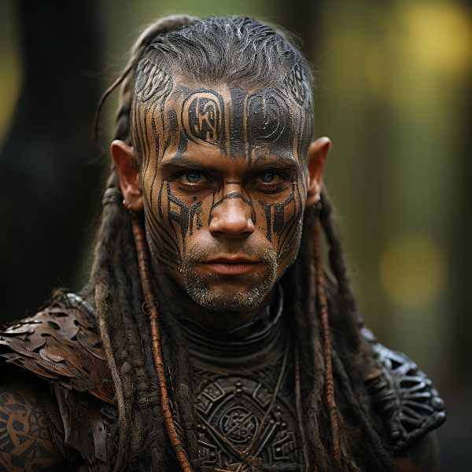

Title: Chieftan Verenar Darkthorn
Category: Characters
Faction: Vulwin Horde
Subfaction: Horde Gwennath
Race: Taurashim
Eneagram: 3

---

# Chieftan Verenar Darkthorn

<figure class="pic-banner">

<figcaption>Chieftan Verenar Darkthorn</figcaption>
</figure>

-   **Age:** Middle Aged
-   **Race:** Taurashim
-   **Occupation:** Chief of the Horde Gwennath
-   **Home:** Bellgrald Forest
-   **Eneagram Scale:** Type 3: Achiever, Performer

## Characteristics

1.  **Ambitious and Driven:** Verenar is a highly ambitious individual who sets lofty goals for himself and his tribe. He is relentless in his pursuit of success and is not easily deterred by obstacles.

2.  **Image-Conscious:** He pays great attention to the image and reputation of Hord Caelithra. Verenar strives to project an impressive and successful image to gain the respect and admiration of other hordes.

3.  **Adaptable:** Verenar possesses a natural ability to adapt to different situations and environments. He is skilled at making quick decisions to ensure the prosperity of his tribe.

4.  **Eloquent and Persuasive:** He is a skilled communicator and can persuade others effectively. Verenar often takes on the role of diplomat and negotiator on behalf of Hord Caelithra.

5.  **Competitive:** Verenar thrives in competitive situations and enjoys the thrill of competition. He believes that healthy competition is a driving force for improvement.

-   **Background:** 

Verenar Darkthorn was born into Hord Caelithra and displayed leadership qualities from an early age. As he grew, his ambition and desire for success became evident to those around him. When the previous chieftain stepped down, Verenar was chosen to lead Hord Caelithra due to his charisma and determination.

Under his leadership, Hord Caelithra has become a thriving and influential force within the Vulwin Horde. Verenar&rsquo;s adaptability and eloquence have allowed the tribe to establish beneficial alliances and trade agreements with neighboring hordes, contributing to their prosperity.

Despite his competitive nature, Verenar values the well-being of his tribe and strives to maintain a harmonious balance between ambition and the welfare of his people. As Chieftain, he continues to set high standards for Hord Caelithra, ensuring that they achieve success and recognition in the challenging landscape of Naurrnen.

 

