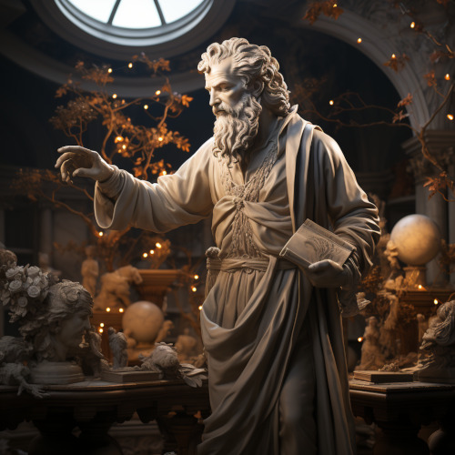

# Legend of Naethanor

## Elira Naethanor

<figure class="pic-banner">

<figcaption>Statue of Elirandel Naethanor in the library of the University of Naethanor</figcaption>
</figure>

Born to the prestigious royal line of Eärendelion in the second era, Elirandel was a prodigy among Elven scholars. She attended the estarts of magic. Her future seemed predestined to be one of comfort and high standing within the Elven Empire of Áyliaremma.

Gifted in history, philosophy, and magical arts, she was poised for a future of influence and leadership within the empire. However, her life took a drastic turn when she befriended Cormac, an Adama slave serving at the institution. Intrigued by his curiosity about the Elven texts he couldn&rsquo;t read and drawn by his quiet yet profound intelligence, Elirandel made the daring decision to teach him how to read the Elven script.

This act was not merely taboo but considered treasonous, a rebellion against the very social fabric of Elven society. Teaching Cormac elevated him from a mere laborer to an intellectual peer, breaking longstanding racial and social barriers. As their friendship deepened into love and intellectual partnership, Elirandel began to question the ethics of the empire she was destined to serve.

Through secret meetings hidden amongst the labyrinthine library shelves, the pair discussed not just literature and history, but strategies for social reform. They shared dreams of an empire where Elven wisdom didn&rsquo;t oppress but uplifted all races. Cormac&rsquo;s intellectual prowess grew, and in turn, his political and strategic ideas began to shape Elirandel&rsquo;s understanding of justice and equality.

When it became increasingly clear that their intellectual pursuits and growing emotional bond could no longer be hidden, Elirandel had to make a life-altering choice. She chose love and justice over her secure, predetermined life. Faced with the threat of discovery, torture, and perhaps death, Elirandel and Cormac fled Laurië Citime to join an underground movement that aided slaves and political prisoners.

Elirandel&rsquo;s departure sent ripples through Elven society, marking her both as a traitor and a revolutionary icon. It was a price she was willing to pay. Together with Cormac, she would go on to challenge the might of Aerithia and lay the groundwork for what would become the Gran Imperio, forever changing the course of Naurrnen&rsquo;s history.

 

## Cormac Naethanor

<figure class="pic-banner">

<figcaption>Statue of Cormac Naethanor in the Auditorium at the University of Naethanor</figcaption>
</figure>

Cormac was born into slavery, an Adama living under the oppressive rule of the Elven empire Aerithia. However, his life would diverge from the path of servitude most of his people walked when he was assigned to work at Laurië Citime, the foremost academic institution among the Elves. Although he started as a mere custodian of ancient tomes and scrolls, Cormac possessed an unquenchable thirst for knowledge and an innate intelligence that couldn&rsquo;t be ignored.

It was at Laurië Citime that Cormac met Elirandel Elenariel, a young Elven scholar of royal descent. Intrigued by his persistent questions and drawn to his untapped intellect, Elirandel took the risky step of teaching him how to read the Elven script. As he learned to decipher the intricate letters and understand complex philosophies, Cormac&rsquo;s worldview expanded, fueling his desire for social reform and justice for his people. He began to formulate innovative ideas that would later shape revolutionary strategies, greatly influencing Elirandel in return.

When their secret friendship blossomed into a forbidden romance and intellectual partnership, the risk of discovery grew ever more dangerous. Given Elirandel&rsquo;s high social status, their relationship was a volatile secret that could get them both killed. However, their intellectual and emotional connection couldn&rsquo;t be easily severed.

Faced with impending discovery, Cormac had to make an agonizing choice—stay and face almost certain execution, or flee with Elirandel to seek out the freedom fighters dedicated to the overthrow of Aerithia. Choosing the latter, he fled with the woman who had opened the world of letters to him, and whom he had enlightened in the ethics of justice and equality.

Together, they joined an underground movement that would eventually topple the mighty Elven empire and give rise to the Gran Imperio, a new realm founded on the principles they had dreamed of together. In doing so, Cormac would become not just a freed slave but a revolutionary leader, strategist, and one half of an iconic partnership that would change the course of history in Naurrnen.

 

