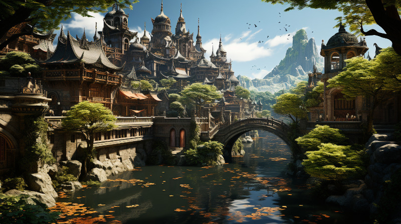

# City of Tanquende

<figure class="pic-banner">

<figcaption>City of Tanquende, the capital of Tanquende</figcaption>
</figure>

City of Tanquende

The city of Tanquende is the capital city of the Elven Kingdom of Tanquende. The Kingdom is ruled by the Mother Monarch, the Elven queen of Tanquende. The city is also a trade center within the kingdom, only a few hundred kilometers west from Ponte Cidade and the border of the Gran Imperio. The city also hosts the oldest library in Naurrnen, [Laurië Citime](laurie-citime.md).

