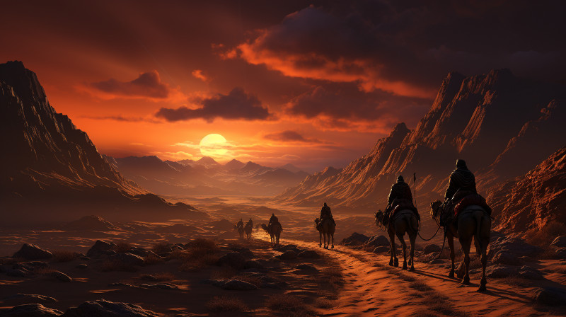

Title: Kaukloutan Desert
Category: Places

---
# Kaukloutan Desert

<figure class="pic-banner">

<figcaption>Main port of the city Ponte Cidade</figcaption>
</figure>

The Kaukloutan Desert, often referred to as the &ldquo;Sea of Cursed Silence,&rdquo; is a sprawling expanse of arid land that stretches across the heart of Naurrnen. It is a place wrapped in legend, whispered about in hushed tones in the far corners of bustling bazaars and ancient libraries. Thought to be a remnant of a long-gone civilization, perhaps even the elusive Amearans, its barren landscape is punctuated by arcane ruins and incomprehensible inscriptions.

The name &ldquo;Kaukloutan&rdquo; in the Old Tongue means &ldquo;Death&rsquo;s Cradle,&rdquo; and the desert has earned its forbidding name. The shifting sands are not just a physical challenge but also a metaphysical one, said to test the very soul of those who dare to cross. Many traders and explorers have vanished without a trace, swallowed by its insatiable appetite for life. Mysterious storms can arise out of nowhere, the wind howling like tormented spirits, disorienting even the most experienced navigators.

Yet, the Kaukloutan is not devoid of life. Hardy nomadic tribes eke out an existence near its fringes, their lore rich with tales of the desert&rsquo;s vengeful spirits and elusive treasures. These tribes serve as the last remnants of a once-flourishing civilization, their culture a haunting melody sung against the silence of the desert. They are the reluctant guardians of Kaukloutan&rsquo;s many secrets, including the locations of ancient tombs and magical oases that are said to hold the wisdom and riches of ages past.

To venture into the Kaukloutan is to confront the unknown, to wrestle with forces ancient and mystical. It is a place that promises either oblivion or enlightenment, a challenge that few can resist.

Northeast of the Kaukloutan desert lies the Umra mountians and the oasis city, [Vaabhath](vaabhath.md).

