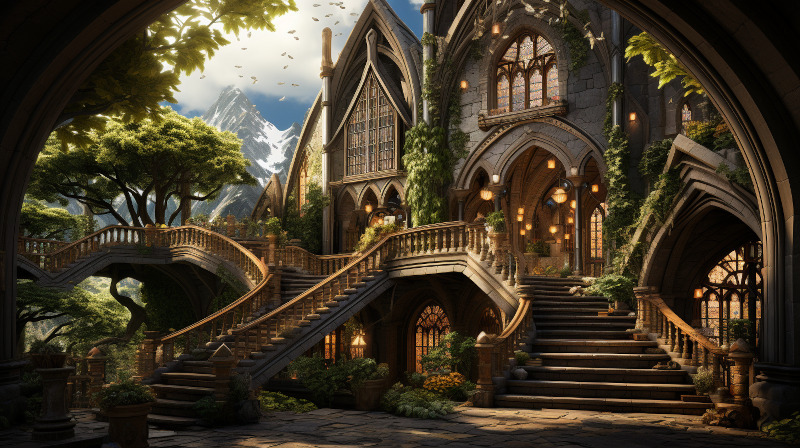

# Laurië Citime

<figure class="pic-banner">

<figcaption>The Main Entrance to the Library Laurië Citime</figcaption>
</figure>

Welcome to Laurië Citime, the hallowed repository of knowledge in the heart of Naurrnen. This ancient library stands as a testament to the enduring thirst for wisdom and the preservation of history. With its towering spires and labyrinthine corridors, Laurië Citime is more than just a collection of books; it is a living testament to the boundless curiosity of the inhabitants of Naurrnen.

Founded eons ago during the Second Era, Laurië Citime has been a guardian of knowledge for millennia. It was established by the High Elves of Áyliaremma, who sought to record the wisdom of their own civilization and safeguard the ancient texts of the enigmatic Ameara. These scholars and sages, proficient in the Amearan language, embarked on a mission to decode and preserve the secrets of a bygone era.

The library&rsquo;s name, Laurië Citime, translates to &ldquo;The Citadel of Eternal Knowledge&rdquo; in the Elven tongue. It stands as a testament to the elves&rsquo; commitment to preserving the past while striving for a better future. The sprawling citadel houses countless tomes, scrolls, and manuscripts, some of which are considered the oldest volumes known to Naurrnen&rsquo;s civilizations.

Within Laurië Citime&rsquo;s walls, the Transcript Guild toils diligently, their mission to meticulously transcribe ancient texts into new volumes. This painstaking work ensures that the wisdom contained in the aging manuscripts endures for generations to come.

As you wander through its hallowed halls, you&rsquo;ll discover not only a treasure trove of knowledge but also a sense of reverence for the past and the insatiable curiosity that drives the scholars of Naurrnen. Laurië Citime is a place where history lives and breathes, where the past and the present converge, and where the pursuit of knowledge is an eternal flame that burns brightly.

