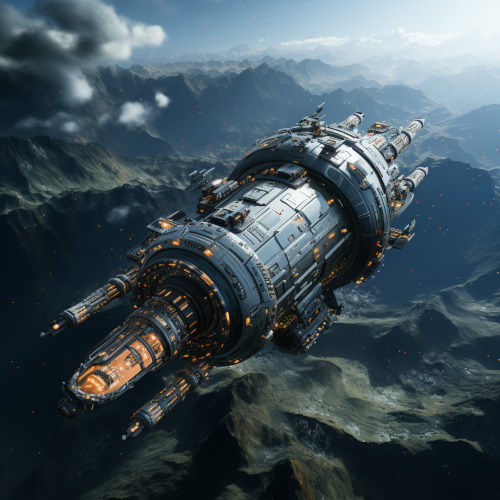
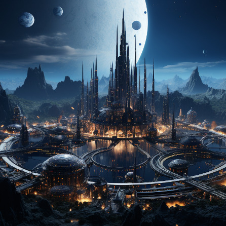

# Naurrnen&rsquo;s Forgotten Past

<figure class="pic-banner">

<figcaption>The great city of Terconi, where Syscon 37221 project was birthed.</figcaption>
</figure>

This part of the site contains spoilers for the world of Naurrnen. What is the difference between science and magic? The difference, I believe, is far more subtle and blurry than one in our modern age might be willing to admit. Science is being able to explain phenomenon as a form of a satisfactory answer as to the what and how of what happens, and formulating that explanation as a consistent repeatable system. Magic is simply the exceptions to the known models of science, that have not yet received an explanation, or appropriate model of how the phenomenon fits the larger explainable scientific world. Beyond that, magic and science are hardly distinguishable. Men and women&rsquo;s conquest to learn more, I believe, is an infinite journey that never arrives to its destination. Given that, there will ever be both the phenomenal and noumenal.

# Once Upon a Time

<button type="button" class="collapsible">
Once Upon a Time
</button>

<figure class="pic-banner">

<figcaption>Small Commerce Spacestation in low orbit.</figcaption>
</figure>

A long, long time ago&#x2026; or was that a long, long time from now? Anyways, in a universe far, far away&#x2026; or is it a paralell universe that is very near? Anyways, our story begins with an intergalactic civilization, the Setsafar Commonwealth, that has open trade between multiple galaxies, multiple star systems, and multiple intellegent species. The trade routes between galaxies are generally fixed, but every few centuries, there is an economic boom that makes traveling even further distances to further reaches of the universe to find resources for profitable trade.

 

# Interstellar Commerce

<button type="button" class="collapsible">
Interstellar Commerce
</button>

<figure class="pic-banner">

<figcaption>Cargo ship in orbit with synthetic moon</figcaption>
</figure>

Given the distance between solar systems, it became expedient to send space stations to un-inhabitable systems for the purpose of refueling, and maintenance of cargo ships. Initially, these stations were sent to orbit various planets in these systems. Profitable enterprises would build these stations, and sell fuel, maintenance and entertainment.

As demand grew for waypoints with lots of trade traffic, these stations would be expanded. Often, in many high traffic stations, these stations were expanded to the size of small moons. As even more traffic, and greater profits abound, they would expand to the size of planets, and eventually need to be relocated from a planetary orbit to a solar orbit. Thus the beginning of synthetic planetary systems. The progression was something like space station to synthetic moon, to synthetic planet.

# The Terraform Projects

<button type="button" class="collapsible">
The Terraform Projects
</button>

<figure class="pic-banner">

<figcaption>Colonialization pod entering into Syscon 37221&rsquo;s atmosphere.</figcaption>
</figure>

Building synthetic moons and planets is costly business. So, when inter-galactic trade routes extended beyond what was convenient, a less costly alternative was formed for creating way points along the trade routes. This gave way to terraforming planets to make them habitable. It was far more economic to start a populace on a terraformed planet using incubation pods. Where literally hundreds of thousands of fertilized human and alien embryos could, with the help of non-sentient automotons, be nurtured and grown.

The automotons only covered the biological care of the embryos. Prior to embryo hatching, tutors and educators would arrive and prepare for instructing the new life in how to build its own unique culture and participate in interstellar trade.

The alien races are what the high fantasy reader might identify as men, dwarves, elves, and orcs. There are no explicitly evil races, just very different species each with their own unique gifts, talents, and culture over time.

 

# Syscon 37221

<button type="button" class="collapsible">
Syscon 37221
</button>

<figure class="pic-banner">

<figcaption>Terraform pod plant in initializing stage.</figcaption>
</figure>

Our story begins with the Trade company, Terconi Inc., based on the planet Mercatorma. Terconi named their planet&rsquo;s capital city after the company. They started a risky terraform project on a planet within a system of questionable stability. Terconi&rsquo;s terraform department was named &ldquo;Syscon&rdquo; and it was their practice to prefix Syscon to the number associated with the actual project. Thus the project was named &ldquo;Syscon 37221&rdquo;. The actual official naming of the planet would be left to its new inhabitants after they had matured to the point where they could conduct trade.

When the trade route dried up, the populace was relocated and the planet abandoned. Or so it was thought. Records indicate that there were numerous pods abandoned to the automotons to raise without any monitoring at all. It looks like a bureaucratic cover-up in order to avoid costly relocation of equipment. When the coverup was discovered, a recovery mission was sent in order to re-assume the hatched embryos into society, and possibly recover any equipment that might be salvageable. The system in which the planet was part of was no more. Swallowed up by a neighboring worm hole for sure, it would seem. If the planet still existed, it was unreachable, now.

 

