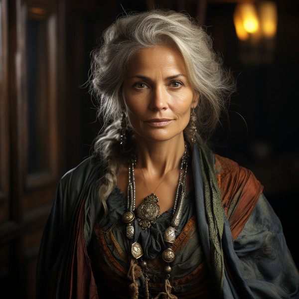

# Aravenna Leafwhisper

<figure class="pic-banner">

<figcaption>Aravenna Leafwhisper</figcaption>
</figure>

-   **Age:** Middle Aged
-   **Race:** Taurashim
-   **Occupation:** Chief of the Horde Caelithra
-   **Home:** [Silvethra](../Places/silvethra.md)
-   **Eneagram Scale:** Type 5: The Investigator

## Characteristics

1.  **Intellectual and Curious:** Aravenna has a deep thirst for knowledge and is constantly seeking to expand her understanding of the world. She is known for her inquisitive nature and insatiable curiosity.
2.  **Observant:** She has a keen eye for details and is skilled at observing her surroundings. Aravenna often notices things that others might overlook.
3.  **Reserved and Independent:** While she values her tribe and community, Aravenna also cherishes her independence and enjoys spending time in solitude to pursue her intellectual interests.
4.  **Calm and Collected:** She maintains a calm demeanor even in challenging situations. Aravenna&rsquo;s ability to stay composed is a source of reassurance for those around her.
5.  **Analytical and Thoughtful:** Aravenna approaches problems with a methodical and analytical mindset. She thoroughly examines issues from multiple angles before making decisions.

-   **Background:** 

Aravenna Leafwhisper was born into Hord Gwennath and displayed an early aptitude for learning and observation. As she grew, her insatiable curiosity led her to explore the depths of the Great Forest, gaining a profound knowledge of its flora and fauna.

Her intellectual pursuits eventually drew her to the ancient texts and scrolls of the forest-dwelling tribes, where she delved into subjects ranging from herbalism to the lore of the woods. Aravenna became a self-taught naturalist and a repository of knowledge about the forest and its resources.

As a respected member of Hord Gwennath, she plays a crucial role in providing valuable insights into the forest&rsquo;s bounty and sharing her expertise in foraging and survival. Aravenna&rsquo;s calm and thoughtful nature also makes her an ideal mediator in times of conflict within the tribe.

While Aravenna is deeply connected to her tribe and its traditions, she values her independence and often embarks on solo expeditions into the Bellgrald Forest to further her understanding of its mysteries. Her dedication to learning and her unique perspective have earned her the admiration and trust of her fellow tribe members, who rely on her wisdom and knowledge in their nomadic way of life.

 
