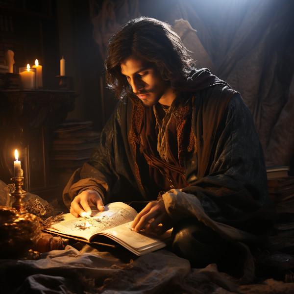

# Thalion Veyreth

<figure class="pic-banner">

<figcaption>Thalion Veyreth</figcaption>
</figure>

-   **Age:** Deceased late Second Era
-   **Race:** Edema
-   **Occupation:** 

-   **Home:** Second Era Capital City Aeritha
-   **Eneagram Scale:** Enneagram scale 1: The Reformer

## Background

Thalion was born into slavery but showed a remarkable gift for storytelling and a keen memory from a young age. Realizing that the history and stories of his people were getting lost or twisted under Anashim rule, he decided to memorize them, essentially becoming a living archive.

### Initial Actions

He first starts the Archivist Guild as a covert operation. Thalion and a few other intellectuals collect and memorize important texts, teachings, and histories. They also copy down Anashim laws and regulations, not just to keep records but to look for loopholes and contradictions that could be used against the Anashim rulers later.

### The Citadel of Ornasion:

Thalion hears tales of Ornasion, an ancient citadel with a labyrinthine library. Taking a risk, he relocates the guild there. The citadel is hard to find and reach, offering a hidden sanctuary for the guild members.

### Role in History:

Thalion may have passed away generations before Elira and Cormac come onto the scene, but his influence is felt. The Archivist Guild and the haven of Ornasion that he helped establish serve as critical infrastructure in the eventual overthrow of the Anashim empire.

### Legacy:

Thalion is revered as a visionary who saw the power of knowledge as a tool for both preserving culture and enabling change. Statues or monuments in his honor might be found in Ornasion, and perhaps Elira and Cormac even find some of his original writings during their time there.

