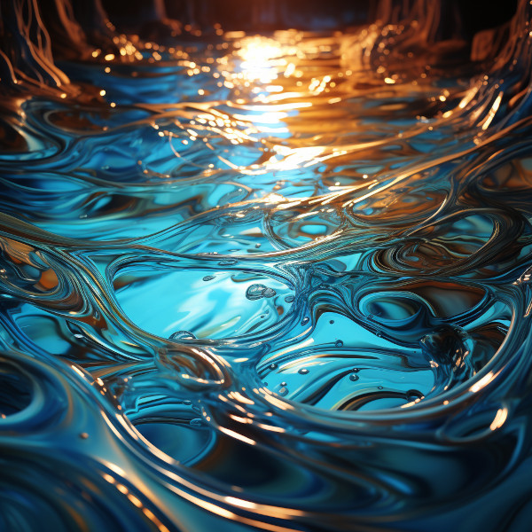

# Materials of Naurrnen

## Garunzal

<figure class="pic-banner">

<figcaption>Pool of Garunzal in the Kaukloutan Desert</figcaption>
</figure>

1.  Color is silver with streaks of blue light
2.  Primary source of magicka
3.  Primary source of energy
4.  Is mined
5.  Sometimes used as currency, but since it is generally softer than gold, it is not ideal for coinage.

Garunzal is a soft metal and is an extremely efficient energy source for magic and mechanical contraptions. This means that cultures will view the resource as scarce. Of course, the wizard guilds will want an unlimited supply of the resource so they can explore and learn more about magic.

 

## Sangorn

<figure class="pic-banner">

<figcaption>Deposits of Sangorn near a dormant lava flow in the Kaukloutan Desert</figcaption>
</figure>

A hard and heavy metal. Can be used as armor but is too heavy to make full suits of armor. Usually a plate of the metal will be used in conjunction with steel. It is most commonly used in constructs for production that need sturdy materials in order to function.

 

## Valmaur

<figure class="pic-banner">

<figcaption>Statue made of Valmaur</figcaption>
</figure>

Valmaur is a unique stone-like metal, as malleable as clay yet as durable as steel. Despite its high melting point, it cools rapidly, making it ideal for both craftsmanship and magical use. Its poor heat conductivity means it&rsquo;s slow to melt but quick to solidify, lending itself to a wide array of applications.

 

