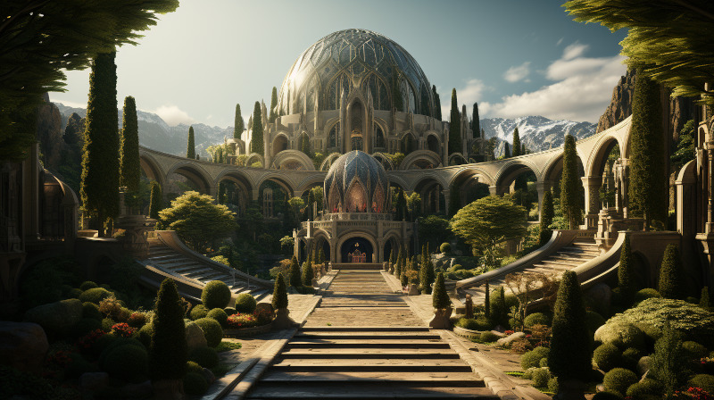

# Athelorion Ruins

<figure class="pic-banner">

<figcaption>The Main Entrance to the ancient city Aeritha (a.k.a the Athelorion ruins)</figcaption>
</figure>

Áyliaremma Aelves made an ancient [Amearen](../History/first-era.md) ruin, now known as the Athelorion ruins, their capital city named Aeritha. [Bayetti Falasha](../Characters/bayetti-falasha.md)&rsquo;s [&ldquo;The Ancient Ones&rdquo;](../Books/the-ancient-ones.md) speaks much of the ancient city, and is believed to have encrypted much of the ancient Aelven knowledge of the Amearans in her poetic stanzas. There is a rumor that there is a vast transporter within that can leeds to the place of the dead.

