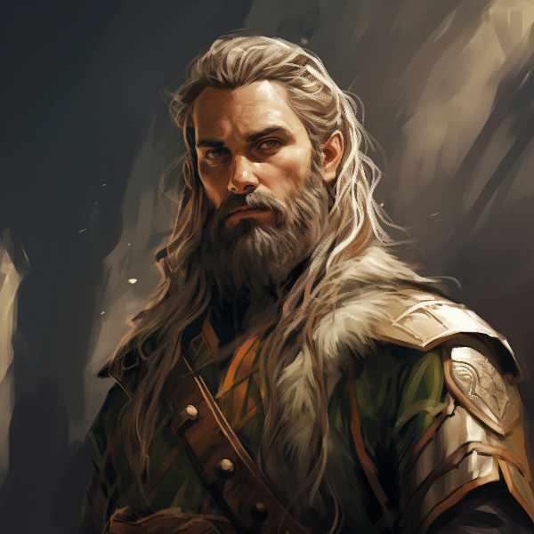
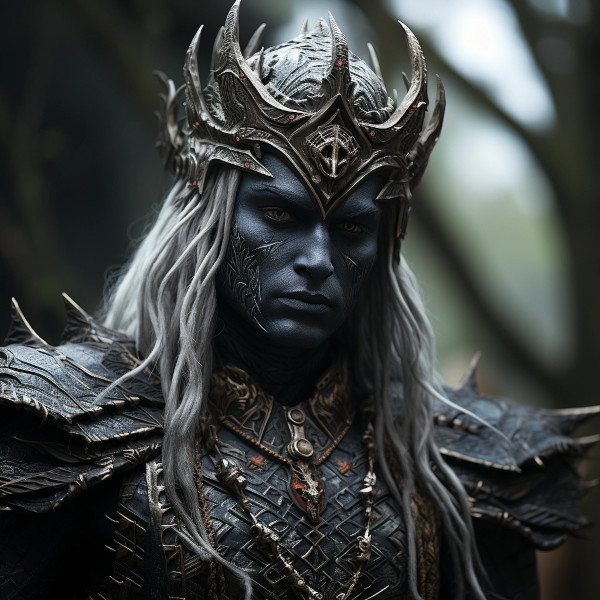

# Anashim or Aelf

The Anashim is one of the primary races in Naurrnen. 

<figure class="pic-banner">

<figcaption>Hallishim man at arms</figcaption>
</figure>

1.  Language
    
    Anashim language has several dialects. The most common being that of the Hallashim.

2.  Anashim Sub-races

    1.  High Anashim: Hallashim
    2.  Wood Anashim: Taurashim
    3.  Dark Anashim: Durashim
    4.  Cavern Anashim: Gathashim

3.  Strengths

    1.  Magic
    2.  Art
    3.  Architecture
    4.  Music
    5.  Crafts
        -   Magical items
        -   Musical instruments
    

 

<figure class="pic-banner">

<figcaption>Taurashim Ranger</figcaption>
</figure>

4.  Pantheon

<table border="2" cellspacing="0" cellpadding="6" rules="groups" frame="hsides">
<colgroup>
<col  class="org-left" />
<col  class="org-left" />
</colgroup>
<tbody>
<tr>
<td class="org-left"><b>Anor</b></td>
<td class="org-left">Highest father of vengeance.</td>
</tr>
<tr>
<td class="org-left"><b>Ithil</b></td>
<td class="org-left">Highest mother of justice. The great protector.</td>
</tr>
<tr>
<td class="org-left"><b>Gladys</b></td>
<td class="org-left">Goddess of nature.</td>
</tr>
<tr>
<td class="org-left"><b>Gurth</b></td>
<td class="org-left">God of the underworld. Friend of the dead.</td>
</tr>
<tr>
<td class="org-left"><b>Nostia</b></td>
<td class="org-left">Goddess of fertility.</td>
</tr>
</tbody>
</table>

While Anashim orthodoxy equally recognizes all five deities, each subrace is entrusted with special care for recognizing and appeasing two deities apart from the others, with, of course, some overlap. 

## Hallashim: Anor and Ithil
Caretakers of the highest father and mother's temples and places of worship are taken very seriously among the Hallashim. What comes with this care, and stewardship, on behalf og the other Anashim, sometimes, and arrogant supremacy. The Hallashim are a proud and majestic race, but also one that must overcome some of the justifiable prejudice and bitterness that arose from their mighty empire in the second era. The god titles are also borne by the ruling Hallashim emperor or emperess.

## Taurashim: Gladys and Nostia
Nature and nurture. The Taurashim take as their own, the care and growth for the other Anashim races. The Taurashim are known for their annual festivals, where the three hordes of the Taurashim teach and train the other hordes in areas where their students, by the cultural limitations, are in need of training. They see this their duty to offer these same services to their neighboring Anashim. Others do come, but rarely, are these "others" noblemen or women or anyone of high social status within their own home nation.

 

<figure class="pic-banner">

<figcaption>Durashim mercenary in ceremonial attire</figcaption>
</figure>

## Durashim: Gurth and Nostia
The cult of Gurth and Nostia, is a recognition of the cycle of life and death. Unlike their Anashim brothers, the Durashim take ancestral recognition above and beyond the other races. Fear of death is seen as almost sacreligious. But so is the fear of life. The Durashim hold bravery, and loyalty very highly. At least for all those within the mainline cult of Gurth and Nostia.

## The great apostacy
With the second era's Hallashim empire's rise to primacy and dominance, within the last three hundred years of the second era, the Aeritha empire enslaved all the other non-Hallashim Aelves. And in doing so, greatly disrupted the assigned religious rights of the Anashim. What came of this, is the Hallashim designed rights and rituals for the other gods on their own, and forbade the practice of the old rights. Many of the enslaved Aelves began practicing their religion in secret. These practices ended with the overthrow of Aeritha at the end of the second era.

### Aenerim

**Etymology:** Derived from a combination of words in an ancient tongue of Naurrnen, 'Aen' meaning 'eternal' and 'Arim' signifying 'guardians' or 'keepers'.

**Origins:** The Aenarim could trace their roots back to the earliest days of Anashim history when Gurth was first revered as the Friend of the Dead. They are the keepers of traditional funeral rites, historians of the afterlife, and spiritual guides for the living.

### The Veiled Thaerith
**Etymology:** 'Thaerith' could come from the words 'Thae', meaning 'hidden' or 'secret', and 'Rith', relating to 'knowledge' or 'lore'.

**Origins:** The Veiled Thaerith might have originated during a turbulent period in the Second Era, perhaps as a group of scholars and mages who discovered esoteric aspects of Gurth's worship through forbidden texts or during a time of exile.

 

