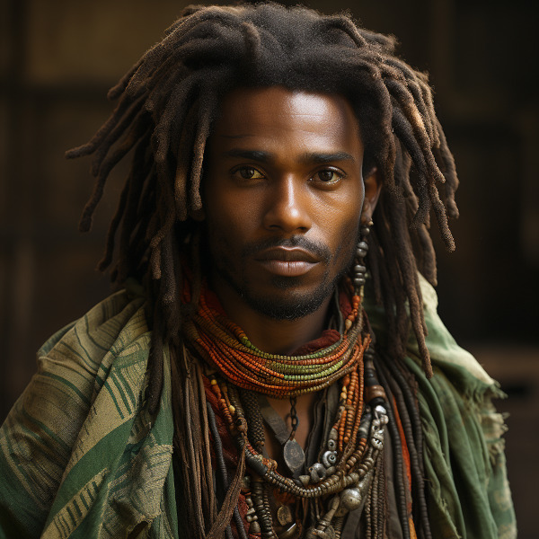
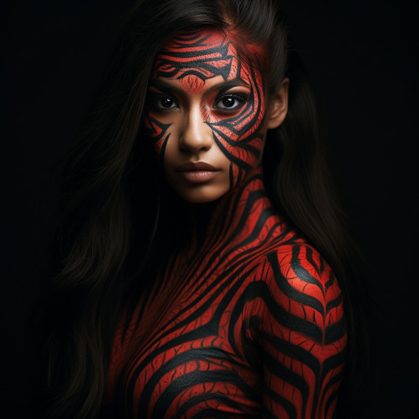

# Races
## Primary Races
The races within Naurrnen are fairly equal. Although the Anashim are known for their skills in magic, music, and crafting instruments and enchanted items, that does not mean one will find the Anashim doing hard labor, exercising what strength they have. Orpa are generally favored for that sort of labor, as they tend to be more physically suited for the task. But not every Orpa is physically built for this task, as not every Anashim is well suited to the arts. There are Orpas who take an interest in magic or music, as well. They are generally not as well suited as the Anashim, but that is not to say, there are not Orpas that have better ears, or eyes than many Anashim, or better minds for magic. These exceptions are generally blamed on half-breeds. Half-breeding has become so common in the age of man, no one really knows for sure who is a half-breed, or if one, who might think themselves as a pure-bred, is really a fourth or fifth generation mixed breed. What separates the races more than anything are their cultural identities.

### Adama or Man

<figure class="pic-banner">

<figcaption>Edema Merchant</figcaption>
</figure>

1.  Language

    Men&rsquo;s language had been historically Hallashim, as man had been the slaves of certain Hallashim empires. But they did have a language of their own that differentiated them from their captors. That slave language evolved into a full-blown Adaman language or language of man. That language became known by the early third era as Malairt or &ldquo;trade&rdquo; language.

2.  Sub-races

    1.  Dark man: Durama
    2.  Red man: Edama
    3.  Pale man: Palama

3.  Strengths

    1.  Multi-purpose
    2.  Rational
    
     
    
    

    <figure class="pic-banner">
    
    <figcaption>A Durama scout</figcaption>
    </figure>
    

    

4.  Pantheon

    <table border="2" cellspacing="0" cellpadding="6" rules="groups" frame="hsides">
    <colgroup>
    <col  class="org-left" />
    <col  class="org-left" />
    </colgroup>
    <tbody>
    <tr>
    <td class="org-left"><b>Dagda</b></td>
    <td class="org-left">Highest father vengeance and justice.</td>
    </tr>
    <tr>
    <td class="org-left"><b>Morrigaan</b></td>
    <td class="org-left">Highest mother, nuture and nature.</td>
    </tr>
    <tr>
    <td class="org-left"><b>Orown</b></td>
    <td class="org-left">God of the underworld.</td>
    </tr>
    <tr>
    <td class="org-left"><b>Brigid</b></td>
    <td class="org-left">Goddess of art, beauty, and fertility.</td>
    </tr>
    <tr>
    <td class="org-left"><b>Bres</b></td>
    <td class="org-left">Man king who was exalted to the pantheon.</td>
    </tr>
    </tbody>
    </table>
    
     

### Orpa

<figure class="pic-banner">

<figcaption>Orc chieftan</figcaption>
</figure>

Known in Hallashim as Osunus, and to the humans as Orpas.

1.  Strengths

    1.  Fighters
    2.  Manual labor
    3.  Crafts
        -   Blacksmithing
        -   Metal/ore work

2.  Pantheon

    <table border="2" cellspacing="0" cellpadding="6" rules="groups" frame="hsides">
    <colgroup>
    <col  class="org-left" />
    <col  class="org-left" />
    </colgroup>
    <tbody>
    <tr>
    <td class="org-left"><b>Gadajok</b></td>
    <td class="org-left">Highest god. God of vengeance.</td>
    </tr>
    <tr>
    <td class="org-left"><b>Hann</b></td>
    <td class="org-left">Highest mother. Goddess of nature and fertility.</td>
    </tr>
    <tr>
    <td class="org-left"><b>Vras</b></td>
    <td class="org-left">God of the dead.</td>
    </tr>
    <tr>
    <td class="org-left"><b>Beatrice</b></td>
    <td class="org-left">Goddess of fertility.</td>
    </tr>
    <tr>
    <td class="org-left"><b>Nadgaj</b></td>
    <td class="org-left">God of war. God of combat.</td>
    </tr>
    </tbody>
    </table>
    
     

## Secondary Races
### Mochveneba

<figure class="pic-banner">

<figcaption>Mochveneba warrior</figcaption>
</figure>

Mochveneba or &ldquo;ghost people&rdquo; are a minority ethnicity within Naurrnen. They are anashim-like, in that they share many of the features that Anashim folk have, but they are well known for their physical prowness. Their skin is a deep red, with stripes. Similar to tiger stripes. In fact, legend outside the Mochveneba tribes, say they are crossbred Anashim with tigers. In reality, they are more than likely half-breeds. More than likely, half-anashim, and half-something else. They have unusual stamina, so some speculate half-orpa, though their uncommon beauty seems to indicate otherwise.

The Mochveneba tribes are religious, and perhaps to most of the civilized world, somewhat superstitious. Mochveneba are spiritual and do not generally pursue material wealth. Those that do, are coveted for their beauty and brute strength.

1.  Strengths

    1.  Enchanting weapons and items.
    2.  Known for physical strength.
    3.  Warlike, but peace-loving.

2.  Pantheon

    1.  Animism: They believe spirit is in all things. But they also believe that consciousness is a higher form of spirit.
    2.  Believe in balance betweem &ldquo;pah&rdquo; and &ldquo;foh&rdquo;. Good/Evil. Hot/Cold, etc.
    3.  Believe their ancestors live beyond the vale, and they will one day join them in death.
    4.  Presence, meditation, seeking inner peace and clarity is essential. Past and future, do not matter. Only the present.
    5.  Cycle of life:  spirit lives and dies, and is renewed again. Consciousness, on the other hand, goes to the ancestral grove, the spirit world, after death, and does not return.
    
     

## Languages
### Adaman, the trade tongue

Adaman is the (almost) universal tongue of Naurrnen. It is used amongst merchants, and mostly widely spoken in everyday communication within the Gran Imperio.

### Hallashim, language of the Aelves

