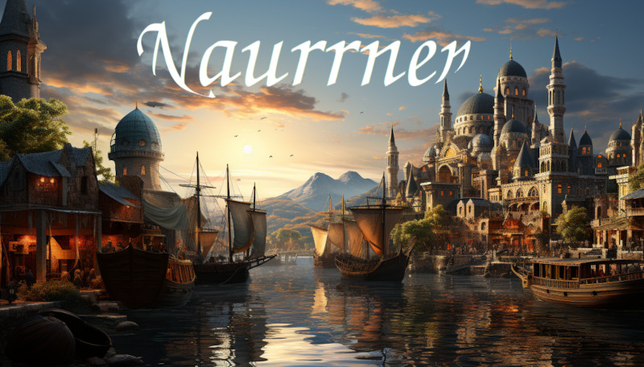

# Welcome to Naurrnen

<figure class="pic-banner">

<figcaption>Main port of the city Ponte Cidade</figcaption>
</figure>

Step into Naurrnen, a realm shrouded in enigmas and ancient lore, a landscape at once fantastical and unnervingly mysterious. Here, the whispering winds carry tales of long-lost civilizations, cities built on the foundations of unknown ancestors, and heroes whose names echo across time. Naurrnen is an uncharted playground that beckons storytellers, and game designers alike to unearth its arcane secrets, be they buried in the cryptic riddles of Aelven poems or in the metallic sheen of an unfamiliar mineral.

The land is an amalgam of cultures and societies, some flourishing in their renaissance and others clinging to the relics of bygone eras. From the grand metropolis of [Ponte Cidade](Places/ponte-cidade.md) to the perlous [desert of Kaukloutan](Places/kaukloutan-desert.md), Naurrnen is a setting begging to be explored, researched, and brought to life through your narratives and game mechanics. Yet, for all its surface-level splendors, what lies underneath is even more compelling. The elusive [Amearans](History/first-era.md), the first era's almost mythical people, have left a legacy buried not in earth but in obscurity. Will your adventurers find one of the teleporters said to link Naurrnen to celestial enigmas?

Naurrnen is a world of contrasts, where the boundaries between science and magic blur. Here, enchantments coexist with relics that defy the traditional dichotomy of arcane versus empirical, pushing the boundaries of what is known, and what can be known. The Aelven halls are as rich in lore as they are in the mysterious substance known as ['Garunzal'](Materials/index.md#garunzal), which defies categorization and challenges our very understanding of material science. Such a world naturally beckons scholars and arcanists, tacticians, and poets to test the limits of their creativity.

But this is not just a world for the sagely or the mystical; it's a realm ripe for political intrigue, military strategy, and tales of survival and rebellion. The rise and fall of empires serve as both a warning and an invitation. Will you build a new regime rooted in justice, or will the lust for power corrupt your adventurers? Could they perhaps uncover the true story behind the famed [Elirandel](Characters/legend-of-naethanor.md#elira-naethanor) and her husband [Cormac](Characters/legend-of-naethanor.md#cormac-naethanor), heroes or traitors depending on who tells the tale?

As you pen your stories or devise your campaigns, know that Naurrnen offers an abundance of inspiration. Its multi-layered history, rich in triumph and tragedy, offers endless possibilities for complex characters and intricate plotlines. Your tales could range from uncovering scholarly secrets within the [University of Naethanor](Places/university-of-naethanor.md) to navigating the political labyrinth of [Ponte Cidade](Places/ponte-cidade.md). Or perhaps your focus will be the existential, exploring themes of identity and morality in a world where nothing is quite as it seems.

Take up the quill, roll the dice, and let your imagination roam free. Welcome to Naurrnen. Your journey has just begun.

